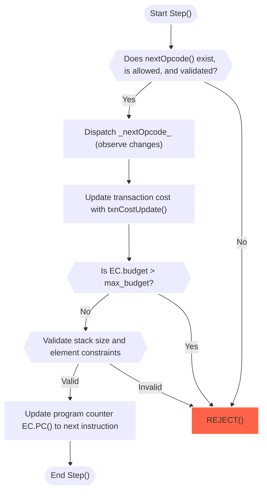
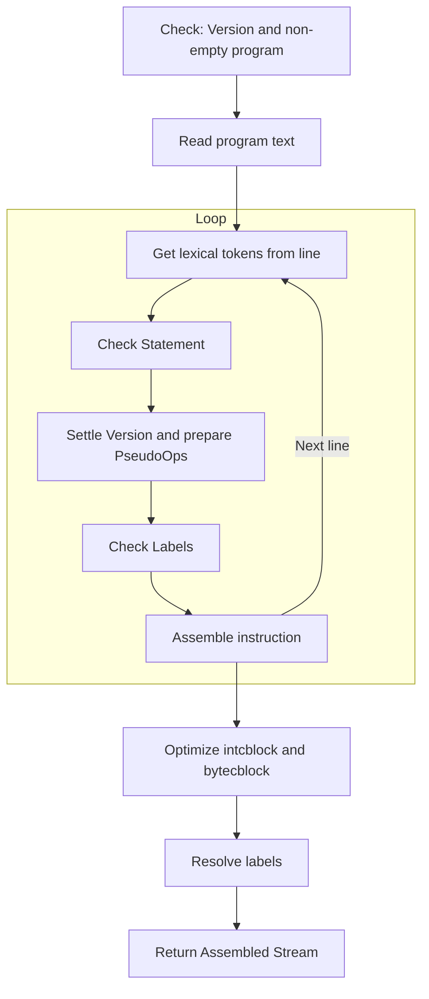

import avmArchImg from '@images/avm_architecture_cusma.excalidraw.png';

# Algorand Virtual Machine Overview

The following document provides a non-normative overview of some key aspects of the Algorand Virtual Machine (AVM). This is a companion document for the [Algorand Virtual Machine Formal Specification](AVM.md). Together they provide a solid basis for readers and implementers to get a holistic grasp of the AVM as a whole.

# Full Architecture Diagram

The following diagram provides an overview of the full AVM architecture.

<Image src={avmArchImg} alt='Architecture diagram' />

There are four main components to the AVM architecture:

- [Transactions](ledger.md#transactions), that may be conceptualized as an input, providing several fields and arguments for programs. In the case of Logic Signatures, arguments may be passed as byte arrays. This constitutes "stateless" runtime.
- The app call context, which provides [Ledger](ledger.md) references for data that must be prefetched (boxes, ASA's, foreign apps and accounts). This constitues "stateful" runtime.
- The [Ledger State](ledger.md) which provides global information that may be accesed at runtime.
- A Processing component, which is responsible for actually running the program.

All of these elements are represented in an _Evaluation Context_ $EC$.
Outside of the diagram, an _Assembler_ component handles program compilation.

# Evaluation Context

As defined in the [formal spec.](AVM.md#evaluation-context), an _Evaluation Context_ ($EC$) is a key structure in the execution of a TEAL program, as it keeps track of all necessary execution data at runtime.

What follows is a suggested interface for the data construct, inspired by the reference implementation:

- Static property getters ($EC$ properties that are invariant through the whole execution of a given transaction in a group):

  - `RunMode() -> {SmartSignature, Application}`\
    Returns the evaluation context's mode.

  - `GroupIndex() -> int`\
    Returns the group index of the transaction being evaluated.

  - `PastScratch(past_group_index int) -> map[int, StackValue]`\
    Returns the final scratch space state of a past transactions inside the currently executing group (by group index).

  - `GetProgram() -> []byte`\
    Returns the currently executing program ($EC_P$ in the formal state definition). Some program specific information retrieval functions are:
    - `getCreatorAddress() -> []byte`\
      Returns the address that created the running application.
    - `AppID() -> uint64`\
      Returns the ID of the currently executing app. Note that `LogicSigs` do not have an ID, so it should be handled (e.g. it could return 0 or a special value like `UINT64_MAX`).
    - `ProgramVersion() -> uint64`\
      Returns the AVM version of the current program.
    - `GetOpSpec() -> OpSpec`\
      Returns the `OpSpec`, [Opcode Specification](TEAL_opcodes.md) for the opcode in the line pointed at by the current program counter ($EC_{pc}$ or `PC()` below).
    - `begin(program []byte) -> bool`\
      Checks if the program version is supported and could be executed within the transaction group

- Dynamic property getters ($EC$ properties that may change dynamically as the execution of a transaction progresses):

  - `PC() -> int`\
    Returns the program counter of the current application being evaluated ($EC_{pc}$ in the formal state definition).

  - Budget measuring functions:

    - `Cost() -> int`\
      Returns the cost incurred so far during execution.

    - `remainingBudget() -> int`\
      Returns the remaining budget at the moment of the call.

- Inner transaction specific functions:

  - `InnerTxnPending() -> []Transaction`\
    Returns the remaining inner transactions at the moment of the call.

  - `addInnerTxn()`\
    Handles the addition of new inner transactions to the group checking
    the lenght of the transaction group, its fees, sender address, etc.\
    This function is used in both opcodes `itxn_begin` and `itxn_next`.

- `step()`\
  The _transition function_ where a given program $P$ is actually evaluated line by line. See the [dedicated section](#step-transition-function) in this document for more detail. Also see a formal definition in the [AVM Specification](AVM.md#step-function).

- Ledger access functions:

  - `getRound() -> uint64`\
    Returns the Ledger current [round](ledger.md#round).

  - `getLatestTimestamp() -> uint64`\
    Returns the Ledger [latest timestamp](ledger.md#timestamp) (that is, the timestamp in the last commited block).

  - Prefetched Ledger access functions: `accountRetrieval()`, `assetRetrieval()`, `BoxRetrieval()`, `applicationRetrieval()`. These should be defined according to how Ledger access is implemented. Generally speaking they provide runtime access to items declared in the transaction foreign arrays.

## Transition Function `step()` and the Evaluation Cycle

The Evaluation Cycle is the core process by which, given a starting Evaluation Context $EC$ and through succesive application of the `step()` function, a program $EC_P$ is executed; and by this program's logic, a transaction is _REJECTED_ (and discarded) or _APPROVED_ (and pushed into the [Transaction Pool](ledger.md#transaction-pool) or deemed as valid in the context of a [Block](ledger.md#blocks) being assembled or verified).

The following diagram provides a schematic overview of `step()`, a function that allows the AVM State Machine to transition in between different $EC$ states:



[Link to reference implementation](https://github.com/algorand/go-algorand/blob/7e562c35b02289ca95114b4b3a20a7dc2df79018/data/transactions/logic/eval.go#L1525C24-L1525C28).

As the diagram shows, the transition function starts by performing certain preliminary validations on the next opcode to execute, that is, the opcode pointed by the program counter `PC()`(see [above](#evaluation-context)).

It then dispatches the [handling routine](AVM.md#operations) for the opcode and observes produced changes. Each handler performs their own specific checks to ensure correct operation, immediately _rejecting_ the transaction on failure.

The tracked transaction cost is updated, and a _rejection_ is ensued if the cost incurred surpasses the available budget.

A Stack size check is performed, as it may have been modified after observing the opcode results. All freshly pushed elements are also subject to a sanity check; as they are `StackValue` types, they either should be _uint64_ or _bytearray_ whose length is less than 4096 bytes.

Finally, the program counter `PC()` is updated and the next instruction will be processed on the following execution of `Step()`.

After each transition, a check for a final state is performed. The evaluation cycle will only consider that a final state has been achieved if:

- There is an error during an execution of `step()` (in which case, the transaction is _REJECTED_), or
- The `PC()` value is "out of bounds", a line number greater than the amount of entries in the program's code bytearray $EC_P$. In this last case:
  - a Stack $E_S$ containing a _single_ non-zero value will cause the transaction to be _APPROVED_,
  - any other state will cause the transaction to be _REJECTED_.

Note that instructions that allow a succesful approval without clearing the Stack like the `return` opcode handle this Stack sanitization internally before continuing the execution of the Evaluation Cycle, as this construct applies only the simple checks outlined above.

# Compilation and Assembler

In this section we present, through diagrams and explanations, what a compilation for a full TEAL program looks like.

## Assembler constants

- `AssemblerDefaultVersion`, the default version of the Assembler. Functions as a fallback when no explicit version is found in program code. Set to 1 in the reference implementation.

- `LogicVersion`, defines default Assembler and maximum evaluation versions. It is set to 12 in the reference implementation.

- `AssemblerMaxVersion`, the maximum supported Assembler version. Set to be equal to the `LogicVersion`.

- `assemblerNoVersion`, a useful constant that functions as a placeholder until an explicit version directive is read. If none is found, this gets converted into the `AssemblerDefaultVersion`. Currently set to `UINT64_MAX`.

## Assembler Syntax

The assembler parses line by line. Opcodes that only take stack arguments
appear on a line by themselves. For opcodes that take immediate arguments, the arguments follow the opcode on the same line, separated by whitespace.

A `#` character at the start of a line is used for preprocessor directives.

The first line may contain a special version directive `#pragma version X`, (where `X` is an unsigned integer), which directs the assembler to generate bytecode targeting a certain version. For instance, `#pragma version 2` produces bytecode targeting `v2`. By default, the assembler targets `v1`.\
Note that it is syntactically invalid to have a `#pragma` definition after the first program opcode.\
[Link to reference implementation](https://github.com/algorand/go-algorand/blob/df0613a04432494d0f437433dd1efd02481db838/data/transactions/logic/assembler.go#L2277).

A `#define Y Y_def` directive (where `Y` is an identifier and `Y_def` is a valid TEAL expression) is used to define a macro. This is syntactically equivalent to replacing each occurence of the `Y` identifier for the corresponding definition `Y_def`.\
[Link to reference implementation](https://github.com/algorand/go-algorand/blob/df0613a04432494d0f437433dd1efd02481db838/data/transactions/logic/assembler.go#L2252C2-L2252C35).

Subsequent lines may contain other pragma declarations (i.e., `#pragma <some-specification>`), pertaining to checks that the assembler should perform before agreeing to emit the program bytes, specific optimizations, etc. Those declarations are optional and cannot alter the semantics as described in this document.

`//` prefixes a line comment. Also both `;` and `/n` may be used interchangeably to separate statements.

## Constants and Pseudo-Ops

A few pseudo-ops simplify writing code. `int` and `byte` and `addr` and `method` followed by a constant record the constant to a `intcblock` or `bytecblock` at the beginning of code and insert an `intc` or `bytec` reference where the instruction appears to load that value. `addr` parses an Algorand account address in `base32` and converts it to a regular bytes constant. `method` is passed a method signature and takes the first four bytes of the hash to convert it to the standard method selector defined in [ARC4](https://github.com/algorandfoundation/ARCs/blob/main/ARCs/arc-0004.md)

`byte` constants may be declared using any of the following syntactic variants:

```
byte base64 AAAA...
byte b64 AAAA...
byte base64(AAAA...)
byte b64(AAAA...)
byte base32 AAAA...
byte b32 AAAA...
byte base32(AAAA...)
byte b32(AAAA...)
byte 0x0123456789abcdef...
byte "\x01\x02"
byte "string literal"
```

`int` constants may be `0x` prefixed for hex, `0o` or `0` prefixed for
octal, `0b` for binary, or decimal numbers.

`intcblock` may be explicitly assembled. It will conflict with the assembler gathering `int` pseudo-ops into a `intcblock` program prefix, but may be used if code only has explicit `intc` references. `intcblock` should be followed by space separated integer constants all on one line.

`bytecblock` may be explicitly assembled. It will conflict with the assembler if there are any `byte` pseudo-ops but may be used if only explicit `bytec` references are used. `bytecblock` should be followed with byte constants all on one line: either 'encoding value' pairs (`b64 AAA...`), `0x` prefix or function-style values (`base64(...)`), or string literal values.

## Labels and Branches

A label is defined by any string (that is a valid identifier string and is not already some other opcode or keyword) ending in `:`. A label without the trailing `:` can be an argument to a branching instruction.

Here is an example of code that uses a `bnz` opcode with the `safe` label as argument. Since a 1 is pushed into the stack, it jumps to the `pop` instruction after the `safe:` label every time:

```
int 1
bnz safe
err
safe:
pop
```

## Program Compilation

A TEAL program is compiled through the usage of the `POST /v2/teal/compile` endpoint (see the non-normative [API Overview](API-overview.md)).\
In this API call taken from [Go Algorand](https://github.com/algorand/go-algorand), after reading and decoding the TEAL code sent as text, the majority of the work is done in the `assemble(.)` function.

[Link to reference implementation](https://github.com/algorand/go-algorand/blob/df0613a04432494d0f437433dd1efd02481db838/data/transactions/logic/assembler.go#L2039-L2158).

The following diagram provides detail on the process:



The first check is to perform a preliminary version validation. See the [TEAL Opcode Reference](TEAL_opcodes.md) for a full list of all available opcodes by version number.\ Generally, at this point a special `assemblerNoVersion` value is used as a placeholder. This value will be replaced either by the default compiler version, or by an explicit version once a `#pragma` directive is processed.
Afterwards, a trivial check to exclude empty strings is performed (as empty strings are _not_ valid programs in TEAL).

The program text is then read, and for each line:

- Lexical tokens are extracted: if the special `#` character is at the start, it is a preprocessor directive. In that case the following token must be one of $\{pragma, define\}$ directives.

- Otherwise, statements are extracted. This stage also strips comments. Note that lines may be terminated by `\n` or by `;` characters.

- Statements may be opcodes (with their corresponding immediate arguments if any), pseudo-opcodes, or labels. For each of these:
  - Opcode statements are assembled according to the opcode table,
  - pseudo-opcodes are replaced by the corresponding opcodes and assembled in the same fashion, and
  - labels (jump targets) are recorded into a mapping, and their processing is delayed to the end of the assembly. A special case is the `callsub` instruction, which is treated as a label.

The next step is constant optimization. The `intcblock` optimization rewrites the existing `intcblock`s and the opcodes that reference it to reduce code size. This is done by ordering them from most to least frequently used, since the first four constants can use the `intc_X` opcodes to save space. This only affects constants introduced by the `int` pseudo-op.

Similarly, the `bytecblock` optimization rewrites the existing `bytecblock`s and the opcodes that reference it to reduce code size. The ordering is the same, since the first four constants can use the `bytec_X` opcodes. This only affects constants introduced by the `byte` or `addr` pseudo-ops.

Afterwards, the assembler performs label resolution. Branch targets are encoded as 2 offset bytes. The destination is relative to the end of the instruction they appear in.

Once the assembly is done, back in the API call side of things, the assembled stream buffer is hashed. These two elements (buffer and hash) are sent in the API response for a succesful compilation.

# Appendix

## How to implement a new opcode in the [Go-Algorand](https://github.com/algorand/go-algorand) AVM

- Define the operator function. These functions are defined in the file
  `data/transactions/logic/eval.go` and should be of type `evalFunc`.

  ```go
  type evalFunc funcerror
  ```

- Add a new `OpSpec` value in the [`OpSpec` array](https://github.com/algorand/go-algorand/blob/b7b3e5e3c9a83cbd6bd038f4f1856039d941b958/data/transactions/logic/opcodes.go#L492).\
  the format should be e.g. `{0x01, "sha256", opSHA256, proto("b:b{32}"), 2, costly(35)}`.\
  The arguments may be interpreted as follows:
  - A `byte` indicating the op number.
  - A `string` with the identifier of the opcode.
  - A function of `evalFunc` type that handles opcode execution.
  - A `Proto` structure usually defined through the `proto()` function.
    This indicates the actual signature of our opcode: the part before `:`
    indicates the values to be removed from the top of the stack, and the part after `:`
    indicates the values to be pushed to the stack; the letter identifies the type of arguments,
    and in case of byte arrays the length could be expressed as a number between curly braces.
  - The version of the protocol where this opcode is introduced.
  - The opcode cost.
