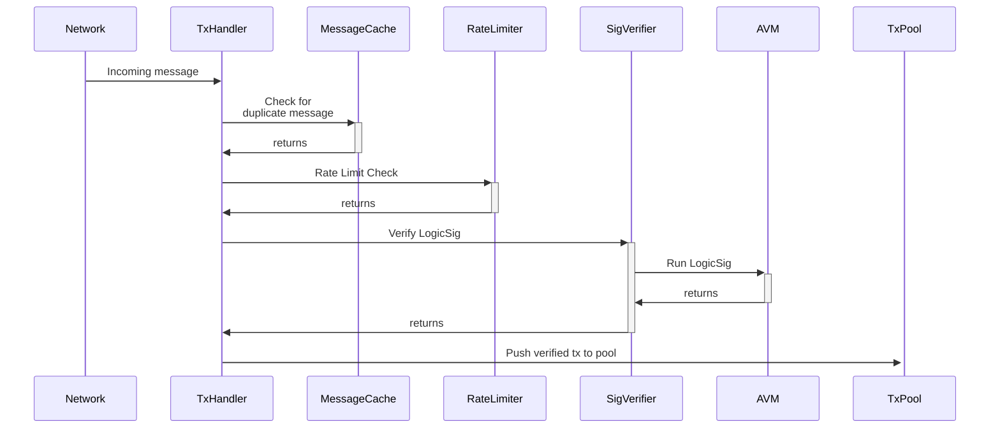
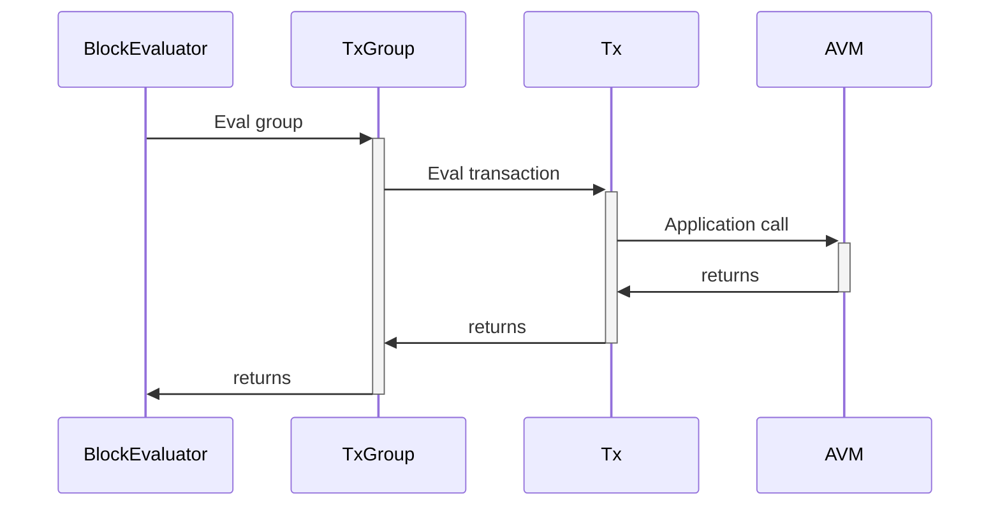
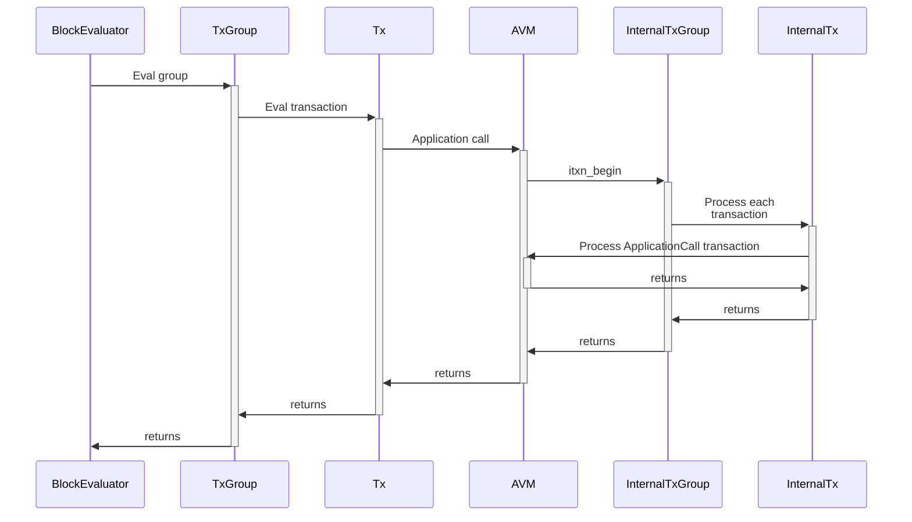
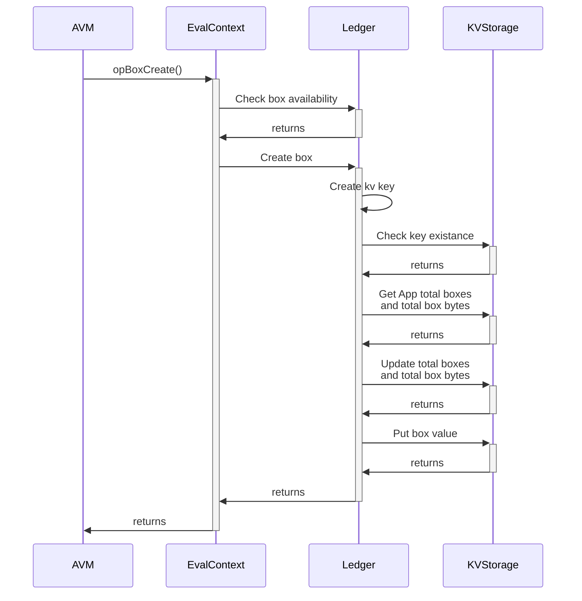
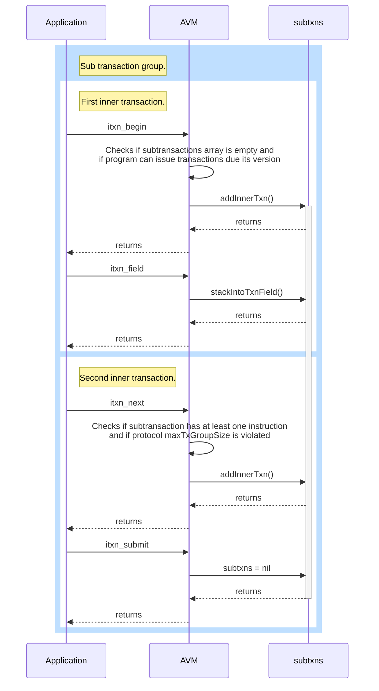

# The Algorand Virtual Machine (AVM)

The AVM is a bytecode based stack interpreter that executes programs
associated with Algorand transactions. TEAL (Transaction Execution Approval Language) is an assembly language
syntax for specifying a program that is ultimately converted to AVM
bytecode. These programs can be executed in one of two modes:

- One format is to check the parameters of a
  transaction and approve it as if by a signature. This mode
  is called a _Smart Signature_, is stateless and has limited opcode availability.
- Starting with AVM `v2`, programs may
  also be executed as full _Smart Contracts_. This mode is called _Application_, and the programs that may be run in this way are often times called _Applications_ throughout this document. Contract executions are invoked with explicit
  application call transactions, have state and full opcode availability.

Programs have read-only access to the transaction they are attached
to, the other transactions in their atomic transaction group, and a
few global values. In addition, _Smart Contracts_ have access to
limited state that is global to the application, per-account local
state for each account that has opted-in to the application, and
additional per-application arbitrary state in named _boxes_. For both types of
program, approval is signaled by finishing with the stack containing a
single non-zero integer value, though `return` can be used to signal an
early approval (which approves based only upon the _top_ stack value
being a non-zero integer, disregarding the rest of the stack).

## AVM parameters and constants

| Parameter            | Value        | Explanation                                                                                                                          |
| -------------------- | ------------ | ------------------------------------------------------------------------------------------------------------------------------------ |
| $MaxStackDepth$      | 1000 entries | Maximum stack depth, in number of entries.                                                                                           |
| $MaxByteArrayLength$ | 4096 bytes   | Maximum length of a byte array pushed into the Stack.                                                                                |
| $ScratchSize$        | 256 entries  | Size of the Scratch Space mapping, in number of entries.                                                                             |
| $MinForeignAccessID$ | 256          | The minimum number for which a resource may be interpreted as an ID when accessing it through one of the transaction foreign arrays. |
| $LogicSigMaxCost$    | 20,000       | Consensus parameter involved in the maximum allowed budget expenditure calculation for a Logic Signature program.                    |
| $LogicSigMaxSize$    | 1000 bytes   | Consensus parameter involved in the maximum allowed size (in bytes) for a Logic Signature program.                                   |
| $MaxAppProgramCost$  | 700          | Consensus parameter involved in the maximum allowed budget expenditure calculation for an Application program.                       |

## The Stack

The _Stack_ is core structure for the execution of the interpreter. It is constructed and used as a regular stack data structure.\
[Link to reference implementation.](https://github.com/algorand/go-algorand/blob/b7b3e5e3c9a83cbd6bd038f4f1856039d941b958/data/transactions/logic/eval.go#L675)

On a new program execution, the stack starts empty. After running an opcode, it may contain an arbitrary value of either:

- An unsigned 64 bit integer type (refered to as `uint64` from now on), or
- A byte array not exceeding $MaxByteArrayLength$ bytes in length (refered to indistinctly as `bytes` or `[]byte` from now on). The maximum length is set to 4096 bytes.
  A variable that may contain an arbitrary value of either one of these types, but never both simultaneously, is refered to as a `StackValue` in this document.

Most operations act on the stack, popping
arguments from it and pushing results to it. Some operations have
_immediate_ arguments that are encoded directly into the instruction,
rather than coming from the stack.

The maximum stack depth is $MaxStackDepth$. If the stack depth is exceeded or if
a byte-array element exceeds its maximum allowed length, the program fails. If an
opcode is documented to access a position in the stack that does not
exist, the operation fails. Most often, this is an attempt to access
an element below the stack -- the simplest example is an operation
like `concat` which expects two arguments on the stack. If the stack
has fewer than two elements, the operation fails. Some operations, like
`frame_dig` and `proto` could fail because of an attempt to access
above the current stack.

In order to prevent adversarial or wrongful executions, several checks are performed to ensure the integrity of these values and their adherence to the specified bounds. See the non-normative [Algorand AVM Overview](avm-overview.md) for more details on when and how these checks are performed in the reference implementation.

## Stack Types

While every element of the stack, as it is a `StackValue`, is restricted to either `uint64` or `bytes` types,
the values of these types may be known to be bounded. The more common bounded types are
named to provide more semantic information in the documentation. They're also used during
assembly time to do type checking and to provide more informative error messages.

#### Definitions

| Name     | Bound                          | AVM Type |
| -------- | ------------------------------ | -------- |
| [32]byte | len(x) == 32                   | []byte   |
| [64]byte | len(x) == 64                   | []byte   |
| [80]byte | len(x) == 80                   | []byte   |
| []byte   | len(x) <= $MaxByteArrayLength$ | []byte   |
| address  | len(x) == 32                   | []byte   |
| any      |                                | any      |
| bigint   | len(x) <= 64                   | []byte   |
| bool     | x <= 1                         | uint64   |
| boxName  | 1 <= len(x) <= 64              | []byte   |
| method   | len(x) == 4                    | []byte   |
| none     |                                | none     |
| stateKey | len(x) <= 64                   | []byte   |
| uint64   | x <= 18446744073709551615      | uint64   |

## Scratch Space

In addition to the stack, there are $ScratchSize$ (set to 256 in the reference implementation) positions that may hold a `StackValue`, indexed by integers (going from 0 to $ScratchSize - 1$) that function as a mapping. This structure is called _Scratch Space_, and it acts as extra arbitrary runtime storage space, useful for easy access to values that may be needed several times throughout execution and may remain unchanged for long portions of code since it is not involved in most opcode resolutions.

[Link to reference implementation.](https://github.com/algorand/go-algorand/blob/b7b3e5e3c9a83cbd6bd038f4f1856039d941b958/data/transactions/logic/eval.go#L650)

Scratch locations are initialized as zeroed out `uint64` values. Scratch space is accessed by the `load(s)` and `store(s)` opcodes which move data from or to scratch space, respectively. Application calls may inspect the final scratch space of earlier application calls in the same group using `gload(s')(s)` (where `s` is an integer that represents an index in the range available for scratch indexing, and `s'` is an integer that represents an index into the current transaction group of an already executed application call).

## Evaluation Context

Given an AVM instance and a valid TEAL program, we now define an evaluation context $EC$ as a tuple that represents the current state of execution of an arbitrary program.

$$
EC := (S, S_{sp}, gr_i, txn, m, P, c, pc, pc_{next}, cs)
$$

The elements in an $EC$ tuple represent, in order

- A _Stack_ of `stackValue` elements, as defined previously, which we denote by $S$.

- A _Scratch Space_, a mapping of `stackValue` elements to integers, as defined in its corresponding section, which we denote by $S_{sp}$.

- A _group index_, an unsigned 64 bit integer indexing into the currently executing transaction group, that represents the index of the currently executing transaction. It is denoted by $gr_i$.

- The _transaction_ currently being evaluated, denoted by $txn$. For the purpose of this document, the transaction will be an opaque object, save for a small set of fields that will be of relevance. For more information on this specific construct, refer to the transaction reference section in the [Algorand Ledger Specification](ledger.md). For some details on how these are constructed from an implementation point of view, you may refer to the non-normative [Algorand Ledger Overview](ledger-overview.md).

- A _mode_, which may only be an element of the set $\{LogicSignature, Application\}$, and represents the way in which the program may be run (as defined above). The mode will be denoted $m$.
  The different attributions and functionalities of the two execution modes are outlined below in the [Execution Modes section.](#execution-modes)

- A _program_, defined as an ordered indexable list of valid, well formed, and _mode_ $m$ conforming TEAL instructions, in the form of a byte array. We denote this program with $P$ throughout.
  For extra details on the general anatomy of an opcode refer to the [opcodes](TODO_LINK?) section in this document.

- A _cost_, defined as an integer and denoted by $c$. It represents the cost incurred during program $P$ execution up to the current point. Generally speaking most opcodes have a cost of $1$, although some are higher. Refer to the [TEAL Opcode Reference](TEAL_opcodes.md) for further details on the cost for each opcode.

- A _program counter_ and a _next program counter_, defined as integers that index into the byte array of program instructions (that is, the program $P$), and denoted by $pc$ and $pc_{next}$ respectively. Conceptually they reference the last and next instructions to be executed in the running program.

- A _sub-transactions list_ (also called _inner transactions_ throughout) notated $txn_{sub}$, that in the current execution context have begun, but that have not been submitted yet.

- A _callstack_, notated $cs$. For the purpose of this document, the callstack is an opaque construct that contains all necessary information to return to restore the previous value of a $pc$ in case of a returning instruction (see `retsub`, in the [Operations](#operations) section).

[Link to reference implementation.](https://github.com/algorand/go-algorand/blob/7e562c35b02289ca95114b4b3a20a7dc2df79018/data/transactions/logic/eval.go#L655)

For a more implementation focused overview of this key data structure, please refer to the non-normative [Algorand Virtual Machine Overview](AVM-overview.md).

Assuming a syntactically valid program $b$, we define $EC^f$ for $b$ as the set of _final states_, containing valid $EC$ tuples $e$ where

- the program counter for the next instruction is greater than the length of the program.
  That is,
  $e.pc > |b| \implies e \in EC^f$.
- the execution of the Step Function (see the following section) fails by breaking any of the rules
  outlined in this document; whether its stack overflow, exceeding budget limits,
  exceeding inner transaction limits, attempting to access undefined storage, etc.
  In other words, any of the elements in the tuple $e$ assumes an invalid state.

Whenever the Step Function produces a final state, the program execution may not advance any further.

## Step Function

We define now a transition function $Step(EC \ e)$ which, given a valid evaluation context tuple $EC_b$ for a valid TEAL bytecode $b$ it either:

- produces a new state change tuple $e'$ through the execution of the next line in $b$ given by
  the current value of $e.PC$,
- same as above, but it also happens to be that $e \in EC_b^f$, so the stepper can no longer be
  applied to the same state as we are in a _final state_, or
- execution terminates by failure of any internal syntactic or semantic validation checks.

We say that a program $b$ has been _REJECTED_ iff the succesive execution of $Step(.)$ either failed or
reached a final state with a 0 value on top of the stack, and it has been _APPROVED_ if the application of $Step(.)$ produced a valid final state, and a single non-zero value is on top of the stack at the end.

A pseudocode interpretation of the $Step()$ function is as follows

\begin{algorithm}
\caption{Ingest Function}
\begin{algorithmic}[1]
\Function{$Step$}{$ec, nextOpcode, max\_budget$}

    \State A $\gets$ $nextOpcode.exists()$
    \State B $\gets$ $ec.mode.allows(nextOpcode)$
    \State C $\gets$ $validate(nextOpcode.args)$
    \State D $\gets$ $validate(EC.stack.size)$
    \State E $\gets$ $validate(nextOpcode.immediates)$

    \If{$A \land  B \land C \land D \land E$}
        \State $dispatch(nextOpcode)$
    \EndIf

    \If{$ec.budget$ $>$ $max\_budget$}
        \State REJECT()
    \EndIf

    \State $ec.txnCostUpdate(nextOpcode)$

    \State cA $\gets$ $\|ec.stack.prevSize() - ec.stack.size()\|$
    \State cB $\gets$ $nextOpcode.stackElemDelta()$

    \State $assert(checkConsistency(cA, cB))$
    \State $\textbf{for}\ elem\ \textbf{in} \ ec.stack$
        \State \textit{\qquad is\_uint64} $\gets$ $elem.type\ == uint64$
        \State \textit{\qquad is\_bytearray} $\gets$ $elem.type\ == \ bytearray $
        \State \textit{\qquad size\_4k} $\gets$ $elem.len < 4096\ bytes$

        \State \qquad $assert(is\_uint64 \lor (is\_bytearray\ \land size\_4k))$
    \State $\textbf{end for}$
    \State $assert(validate(EC.stack.size))$
    \State $ec.updatePC()$

\EndFunction
\end{algorithmic}
\end{algorithm}

[Link to reference implementation](https://github.com/algorand/go-algorand/blob/b7b3e5e3c9a83cbd6bd038f4f1856039d941b958/data/transactions/logic/eval.go#L1525).

This means, given a valid $EC$, and a `nextOpcode` (obtained from reading the bytecode under the current program counter $EC.pc$), the step transition function:

1. Checks if the opcode exists.
2. Checks if it's allowed in the current mode (there are opcodes valid only in $Application$ or $LogicSignature$ mode).
3. Checks the opcode arguments and the stack size for stack overflows.
4. Checks the validity of immediate values.
5. Computes the opcode and observes its changes.
6. Checks that the remaining budget was not exceeded during the execution.
7. Updates the transaction cost.
8. Verifies that the operation used up to the correct amount of stack values (by measuring the stack height).
9. Verifies that pushed byte arrays don't exceed 4096 bytes.
10. Verifies the stack size was not exceeded.
11. Updates the program counter to the next instruction.

## Versions

In order to maintain existing semantics for previously written
programs, AVM code is versioned. When new opcodes are introduced, or
behavior is changed, a new version is introduced. Programs carrying
old versions are executed with their original semantics. In the AVM
bytecode, the version is an incrementing integer
denoted `vX` throughout this document (where `X` is the version number).

The AVM is currently at `v11`.

See the [TEAL Opcodes Reference](TEAL_opcodes.md) for an exhaustive list
of all available opcodes per version.

## Execution Modes

Starting from v2, the AVM can run programs in two modes:

1. `LogicSig` or _stateless_ mode, used to execute Smart Signatures.
2. `Application` or _stateful_ mode, used to execute Smart Contracts.

The following diagram shows the general flow when a `LogicSig` is executed,
starting from a transaction message reception in the [Network Layer](network-overview.md),
going through the AVM for program execution and all the way up to the transaction approval
and subsequent push into the [Transaction Pool](ledger.md#transaction-pool), to be added
into an upcoming block's [payset](ledger.md#blocks).

Analogously, the following diagram shows the execution path of a transaction
containing a call to an `Application`. Note that code execution is done in
a different pipeline; applications being stateful, a full block context
is needed to evaluate their correctness, and so code execution happens
at block evaluation time.\
For more detail on the block evaluation stage, see the non-normative [Algorand Ledger Overview](ledger-overview.md#block-evaluation-function).

A special way of executing an application is trough an internal cross application call using the `itxn_begin` opcode. Note that the beginning of the flow is the same as in the previous case, as this constitutes a sub-case of an `Application` mode call (note that `LogicSig` mode does not allow for inner transactions to be issued).

Differences between modes include:

- The maximum allowed program size.

- The maximum allowed program cost.

- Opcode availability. Refer to the [TEAL Opcodes Reference](TEAL_opcodes.md) for details.

- Some global values, such as `LatestTimestamp`, are only available in stateful mode.

- Only Applications can observe transaction effects, such as Logs or IDs allocated to ASAs or new Applications.

## Execution Environment for Smart Signatures

Smart Signatures execute as part of testing a proposed transaction to
see if it is valid and authorized to be committed into a block. If an
authorized program executes and finishes with a single non-zero uint64
value on the stack then that program has validated the transaction it
is attached to.

The program has access to data from the transaction it is attached to
(`txn` op), any transactions in a transaction group it is part of
(`gtxn` op), and a few global values like consensus parameters
(`global` op). Some arguments (`Args`) may be attached to a transaction being
validated by a program. `Args` are an array of byte strings. A common
pattern would be to have the key to unlock some contract as an `Arg`.\
Smart Signature `Args` are recorded on the blockchain and
publicly visible when the transaction is submitted to the network,
even before the transaction has been included in a block. These `Args`
are _not_ part of the transaction ID nor of the _TxGroup_ hash. They
also cannot be read from other programs in the group of transactions.

A program can either authorize some delegated action on a normal
signature-based or multisignature-based account or be wholly in charge
of a contract account.

- If the account has signed the program (by providing a valid [ed25519](crypto.md#ed25519)
  signature or valid multisignature for the authorizer address on the
  string "Program" concatenated with the program bytecode) then: if the
  program returns true the transaction is authorized as if the account
  had signed it. This allows an account to hand out a signed program
  so that other users can carry out delegated actions which are
  approved by the program. Note that Smart Signature `Args` are _not_
  signed.

- If the [SHA512_256](crypto.md#sha512256) hash of the program (prefixed by "Program") is
  equal to the authorizer address of the transaction sender then this is a
  contract account wholly controlled by the program. No other
  signature is necessary or possible. The only way to execute a
  transaction against the contract account is for the program to
  approve it.

The bytecode plus the length of all Args must add up to no more than
$LogicSigMaxSize$ bytes (consensus parameter, see the [reference implementation](https://github.com/algorand/go-algorand/blob/b7b3e5e3c9a83cbd6bd038f4f1856039d941b958/config/consensus.go#L1095)).
Each opcode has an associated cost, usually 1, but a few slow operations have
higher costs. Prior to `v4`, the program's cost was estimated as the static sum
of all the opcode costs in the program (whether they were actually
executed or not).

Beginning with `v4`, which allows jumping to a previous instruction permitting
looping patterns, the program's cost is tracked
dynamically, while it is being evaluated. Exceeding its budget is a cause
for failure and therefore transaction rejection.

The total program cost of all Smart Signatures in a group must not
exceed $LogicSigMaxCost$ (a consensus parameter, see the [reference implementation](https://github.com/algorand/go-algorand/blob/b7b3e5e3c9a83cbd6bd038f4f1856039d941b958/config/consensus.go#L1096))
times the number of transactions in the group.

[Link to budget calculation in the reference implementation](https://github.com/algorand/go-algorand/blob/7e562c35b02289ca95114b4b3a20a7dc2df79018/data/transactions/logic/eval.go#L1491).

## Execution Environment for Smart Contracts (Applications)

Smart Contracts are executed in `ApplicationCall` transactions (see the
[Algorand Ledger Specification](ledger.md#applicationcall-transaction-semantics)). Like
Smart Signatures, contracts indicate success by leaving a single
non-zero integer on the stack. A failed Smart Contract call to an
`ApprovalProgram` is not a valid transaction, thus not written to the
blockchain. An `ApplicationCall` with the `OnComplete` field set to `ClearState`
invokes the `ClearStateProgram`, rather than the usual
`ApprovalProgram`. If the `ClearStateProgram` fails, application state
changes are rolled back, but the transaction still succeeds, and the
Sender's local state for the called application is removed.

Smart Contracts have access to everything a Smart Signature may access
(see previous section), as well as the ability to examine blockchain
state such as balances and contract state (their own state and the
state of other contracts). They also have access to some global
values that are not visible to Smart Signatures because the values
change over time. Since Smart Contracts access changing state, nodes
must rerun their code to determine if the `ApplicationCall` transactions
in their [Transaction Pool](ledger.md#transaction-pool) would still succeed each time a new block is added to the blockchain.

Smart contracts have limits on their execution cost ($MaxAppProgramCost$, consensus
parameter in the [reference implementation](https://github.com/algorand/go-algorand/blob/b7b3e5e3c9a83cbd6bd038f4f1856039d941b958/config/consensus.go#L1217)).
Before `v4`, this was a static limit on
the cost of all the instructions in the program. Starting in `v4`, the cost
is tracked dynamically during execution and must not exceed
$MaxAppProgramCost$. Beginning with `v5`, programs costs are pooled and
tracked dynamically across app executions in a group. If $n$
application invocations appear in a group, then the total execution
cost of all such calls must not exceed $n*MaxAppProgramCost$.
Note that the maximum amount of transactions in a group is currently 16 as defined by $MaxTxGroupSize$ (see its definition in the Parameters section of the [Algorand Ledger Specification](ledger.md#parameters)). In `v6`, inner
application calls become possible, and each such call increases the
pooled budget by $MaxAppProgramCost$ at the time the inner group is submitted
with `itxn_submit` allowing a maximum execution cost of:

$$
MaxTxGroupSize + MaxAppProgramCost * MaxTxGroupSize * MaxInnerTxns = 190400
$$

Executions of the `ClearStateProgram` are more stringent, in order to
ensure that applications may be closed out, but that applications also
are assured a chance to clean up their internal state. At the
beginning of the execution of a `ClearStateProgram`, the pooled budget
available must be $MaxAppProgramCost$ or higher. If it is not, the
containing transaction group fails without clearing the app's
state. During the execution of the `ClearStateProgram`, no more than
$MaxAppProgramCost$ may be drawn. If further execution is attempted, the
`ClearStateProgram` fails, and the app's state _is cleared_.

### Resource availability

Smart contracts have limits on the amount of blockchain state they
may examine. Opcodes may only access blockchain resources such as
Accounts, Assets, Boxes, and contract state if the given resource is
_available_.

- A resource in the "foreign array" fields of the `ApplicationCall`
  transaction (`txn.Accounts`, `txn.ForeignAssets`, and
  `txn.ForeignApplications`) is _available_.

- The `txn.Sender`, `global CurrentApplicationID`, and `global CurrentApplicationAddress` are _available_.

- Prior to `v4`, all assets were considered _available_ to the
  `asset_holding_get` opcode, and all applications were _available_
  to the `app_local_get_ex` opcode.

- Since `v6`, any asset or contract that was created earlier in the
  same transaction group (whether by a top-level or inner
  transaction) is _available_. In addition, any account that is the
  associated account of a contract that was created earlier in the
  group is _available_.

- Since `v7`, the account associated with any contract present in the
  `txn.ForeignApplications` field is _available_.
- Since `v9`, there is group-level resource sharing. Any resource that
  is available in _some_ top-level transaction in a transaction group
  is available in _all_ `v9` or later application calls in the group,
  whether those application calls are top-level or inner.

- When considering whether an asset holding or application local
  state is available by group-level resource sharing, the holding or
  local state must be available in a top-level transaction without
  considering group sharing. \
  For example, if account _A_ is made
  available in one transaction, and asset _X_ is made available in
  another, group resource sharing does _not_ make _A_'s _X_ holding
  available.

- Top-level transactions that are not application calls also make
  resources available to group-level resource sharing. The following
  resources are made available by other transaction types. Refer to
  the [Algorand Ledger Specification](ledger.md#transactions) for more details
  on these transaction types' semantics.

  1.  `pay` - `txn.Sender`, `txn.Receiver`, and
      `txn.CloseRemainderTo` (if set).

  1.  `keyreg` - `txn.Sender`

  1.  `acfg` - `txn.Sender`, `txn.ConfigAsset`, and the
      `txn.ConfigAsset` holding of `txn.Sender`.

  1.  `axfer` - `txn.Sender`, `txn.AssetReceiver`, `txn.AssetSender`
      (if set), `txnAssetCloseTo` (if set), `txn.XferAsset`, and the
      `txn.XferAsset` holding of each of those accounts.

  1.  `afrz` - `txn.Sender`, `txn.FreezeAccount`, `txn.FreezeAsset`,
      and the `txn.FreezeAsset` holding of `txn.FreezeAccount`. The
      `txn.FreezeAsset` holding of `txn.Sender` is _not_ made
      available.

- A Box is _available_ to an Approval Program if _any_ transaction in
  the same group contains a box reference (`txn.Boxes`) that denotes
  the box. A box reference contains an index `i`, and name `n`. The
  index refers to the `ith` application in the transaction's
  `ForeignApplications` array, with the usual convention that 0
  indicates the application ID of the app called by that
  transaction. No box is ever _available_ to a `ClearStateProgram`.

Regardless of _availability_, any attempt to access an Asset or
Application with an ID less than $MinForeignAccessID$ (set to 256)
from within a Contract will fail
immediately. This avoids any ambiguity in opcodes that interpret their
integer arguments as resource IDs _or_ indexes into the
`txn.ForeignAssets` or `txn.ForeignApplications` arrays.

It is recommended that contract authors avoid supplying array indexes
to these opcodes, and always use explicit resource IDs. By using
explicit IDs, contracts will better take advantage of group resource
sharing. The array indexing interpretation may be deprecated in a
future version.

## Constants

Constants can be pushed onto the stack in two different ways:

1. The first method is directly with `pushint` or
   `pushbytes`. This is more efficient for constants that are
   only used once.

2. The second method is loading them into storage separate from the Stack and
   Scratch Space, allocated in the AVM Evaluation Context (see the detailed definition of the data structure in the [AVM Overview Document](avm-overview.md)), using two opcodes: `intcblock` and
   `bytecblock`. Then, constants in this storage scheme can be
   pushed onto the Stack by referring to the type and index using
   `intc`, `intc_[0,1,2,3]`, `bytec`, and `bytec_[0,1,2,3]`. This is
   more efficient for constants that are used multiple times.\
   [Link to reference implementation](https://github.com/algorand/go-algorand/blob/7e562c35b02289ca95114b4b3a20a7dc2df79018/data/transactions/logic/eval.go#L683C1-L684C18).

The assembler will hide most of this, for example allowing simple use of `int 1234`
and `byte 0xcafed00d`. Constants introduced via `int` and `byte` will
be assembled into appropriate uses of `pushint|pushbytes` and
`{int|byte}c, {int|byte}c_[0,1,2,3]` to minimize program size.

The opcodes `intcblock` and `bytecblock` use proto-buf style variable length unsigned int,
reproduced [here](#varuint). The `intcblock` opcode is followed by a
`varuint` specifying the number of integer constants and then that
number of `varuints`. The `bytecblock` opcode is followed by a `varuint`
specifying the number of byte constants, and then that number of pairs
of `(varuint, bytes)` length prefixed byte strings.

### Named Constant: OnComplete

An application transaction must indicate the action to be taken following the execution of its `approvalProgram` or `clearStateProgram`. The constants below describe the available actions.

| Value | Name              | Description                                                                                                                                                                                                                             |
| ----- | ----------------- | --------------------------------------------------------------------------------------------------------------------------------------------------------------------------------------------------------------------------------------- |
| 0     | NoOp              | Only execute the `ApprovalProgram` associated with this application ID, with no additional effects.                                                                                                                                     |
| 1     | OptIn             | Before executing the `ApprovalProgram`, allocate local state for this application into the sender's account data.                                                                                                                       |
| 2     | CloseOut          | After executing the `ApprovalProgram`, clear any local state for this application out of the sender's account data.                                                                                                                     |
| 3     | ClearState        | Don't execute the `ApprovalProgram`, and instead execute the `ClearStateProgram` (which may not reject this transaction). Additionally, clear any local state for this application out of the sender's account data as in `CloseOutOC`. |
| 4     | UpdateApplication | After executing the `ApprovalProgram`, replace the `ApprovalProgram` and `ClearStateProgram` associated with this application ID with the programs specified in this transaction.                                                       |
| 5     | DeleteApplication | After executing the `ApprovalProgram`, delete the application parameters from the account data of the application's creator.                                                                                                            |

### Named Constant: TypeEnum constants

The transaction expresses its type as following:

| Value | Name      | Description                       |
| ----- | --------- | --------------------------------- |
| 0     | `unknown` | Unknown type. Invalid transaction |
| 1     | `pay`     | Payment                           |
| 2     | `keyreg`  | KeyRegistration                   |
| 3     | `acfg`    | AssetConfig                       |
| 4     | `axfer`   | AssetTransfer                     |
| 5     | `afrz`    | AssetFreeze                       |
| 6     | `appl`    | ApplicationCall                   |

## Operations

Most operations work with only one type of argument, uint64 or bytes, and fail if the wrong type value is on the stack.

Many instructions accept values to designate Accounts, Assets, or Applications. Beginning with `v4`, these values may be given as an _offset_ in the corresponding Txn fields (`Txn.Accounts`, `Txn.ForeignAssets`, `Txn.ForeignApps`) _or_ as the value itself (a byte-array address for Accounts, or a uint64 ID). The values, however, must still be present in the Txn fields. Before `v4`, most opcodes required the use of an offset, except for reading account local values of assets or applications, which accepted the IDs directly and did not require the ID to be present in the corresponding _Foreign_ array. (Note that beginning with `v4`, those IDs _are_ required to be present in their corresponding _Foreign_ array). See individual opcodes for details. In the case of account offsets or application offsets, 0 is specially defined to `Txn.Sender` or the ID of the current application, respectively.

In the following summary we document each opcode, adding a link to the implementing function in [Go-Algorand](https://github.com/algorand/go-algorand).\
This summary is supplemented by more detail in the [opcodes document](TEAL_opcodes.md).\

Some operations immediately fail the program.
A transaction checked by a program that fails is not valid.

In the documentation for each opcode, the stack arguments that are
popped are referred to alphabetically, beginning with the deepest
argument as `A`. These arguments are shown in the opcode description,
and if the opcode must be of a specific type, it is noted there. All
opcodes fail if a specified type is incorrect.

If an opcode pushes more than one result, the values are named for
ease of exposition and clarity concerning their stack positions. When
an opcode manipulates the stack in such a way that a value changes
position but is otherwise unchanged, the name of the output on the
return stack matches the name of the input value.

### Arithmetic and Logic Operations

| Opcode    | Description                                                                                                                                              | Link to implementation                                                                                                                      |
| --------- | -------------------------------------------------------------------------------------------------------------------------------------------------------- | ------------------------------------------------------------------------------------------------------------------------------------------- |
| `+`       | A plus B. Fail on overflow.                                                                                                                              | [opPlus](https://github.com/algorand/go-algorand/blob/7e562c35b02289ca95114b4b3a20a7dc2df79018/data/transactions/logic/eval.go#L1770)       |
| `-`       | A minus B. Fail if B > A.                                                                                                                                | [opMinus](https://github.com/algorand/go-algorand/blob/7e562c35b02289ca95114b4b3a20a7dc2df79018/data/transactions/logic/eval.go#L1826)      |
| `/`       | A divided by B (truncated division). Fail if B == 0.                                                                                                     | [opDiv](https://github.com/algorand/go-algorand/blob/7e562c35b02289ca95114b4b3a20a7dc2df79018/data/transactions/logic/eval.go#L1837)        |
| `*`       | A times B. Fail on overflow.                                                                                                                             | [opMul](https://github.com/algorand/go-algorand/blob/7e562c35b02289ca95114b4b3a20a7dc2df79018/data/transactions/logic/eval.go#L1859)        |
| `<`       | A less than B => {0 or 1}                                                                                                                                | [opLt](https://github.com/algorand/go-algorand/blob/7e562c35b02289ca95114b4b3a20a7dc2df79018/data/transactions/logic/eval.go#L1901)         |
| `>`       | A greater than B => {0 or 1}                                                                                                                             | [opGt](https://github.com/algorand/go-algorand/blob/7e562c35b02289ca95114b4b3a20a7dc2df79018/data/transactions/logic/eval.go#L1912)         |
| `<=`      | A less than or equal to B => {0 or 1}                                                                                                                    | [opLe](https://github.com/algorand/go-algorand/blob/7e562c35b02289ca95114b4b3a20a7dc2df79018/data/transactions/logic/eval.go#L1917)         |
| `>=`      | A greater than or equal to B => {0 or 1}                                                                                                                 | [opGe](https://github.com/algorand/go-algorand/blob/7e562c35b02289ca95114b4b3a20a7dc2df79018/data/transactions/logic/eval.go#L1922)         |
| `&&`      | A is not zero and B is not zero => {0 or 1}                                                                                                              | [opAnd](https://github.com/algorand/go-algorand/blob/7e562c35b02289ca95114b4b3a20a7dc2df79018/data/transactions/logic/eval.go#L1927)        |
| `\|\|`    | A is not zero or B is not zero => {0 or 1}                                                                                                               | [opOr](https://github.com/algorand/go-algorand/blob/7e562c35b02289ca95114b4b3a20a7dc2df79018/data/transactions/logic/eval.go#L1936)         |
| `shl`     | A times 2^B, modulo 2^64                                                                                                                                 | [opShiftLeft](https://github.com/algorand/go-algorand/blob/7e562c35b02289ca95114b4b3a20a7dc2df79018/data/transactions/logic/eval.go#L2041)  |
| `shr`     | A divided by 2^B                                                                                                                                         | [opShiftRight](https://github.com/algorand/go-algorand/blob/7e562c35b02289ca95114b4b3a20a7dc2df79018/data/transactions/logic/eval.go#L2052) |
| `sqrt`    | The largest integer I such that I^2 <= A                                                                                                                 | [opSqrt](https://github.com/algorand/go-algorand/blob/7e562c35b02289ca95114b4b3a20a7dc2df79018/data/transactions/logic/eval.go#L2063)       |
| `bitlen`  | The highest set bit in A. If A is a byte-array, it is interpreted as a big-endian unsigned integer. bitlen of 0 is 0, bitlen of 8 is 4                   | [opBitLen](https://github.com/algorand/go-algorand/blob/7e562c35b02289ca95114b4b3a20a7dc2df79018/data/transactions/logic/eval.go#L2091)     |
| `exp`     | A raised to the Bth power. Fail if A == B == 0 and on overflow                                                                                           | [opExp](https://github.com/algorand/go-algorand/blob/7e562c35b02289ca95114b4b3a20a7dc2df79018/data/transactions/logic/eval.go#L2139)        |
| `==`      | A is equal to B => {0 or 1}                                                                                                                              | [opEq](https://github.com/algorand/go-algorand/blob/7e562c35b02289ca95114b4b3a20a7dc2df79018/data/transactions/logic/eval.go#L1945)         |
| `!=`      | A is not equal to B => {0 or 1}                                                                                                                          | [opNeq](https://github.com/algorand/go-algorand/blob/7e562c35b02289ca95114b4b3a20a7dc2df79018/data/transactions/logic/eval.go#L1964)        |
| `!`       | A == 0 yields 1; else 0                                                                                                                                  | [opNot](https://github.com/algorand/go-algorand/blob/7e562c35b02289ca95114b4b3a20a7dc2df79018/data/transactions/logic/eval.go#L1972)        |
| `itob`    | converts uint64 A to big-endian byte array, always of length 8                                                                                           | [opItob](https://github.com/algorand/go-algorand/blob/7e562c35b02289ca95114b4b3a20a7dc2df79018/data/transactions/logic/eval.go#L1985)       |
| `btoi`    | converts big-endian byte array A to uint64. Fails if len(A) > 8. Padded by leading 0s if len(A) < 8.                                                     | [opBtoi](https://github.com/algorand/go-algorand/blob/7e562c35b02289ca95114b4b3a20a7dc2df79018/data/transactions/logic/eval.go#L1995)       |
| `%`       | A modulo B. Fail if B == 0.                                                                                                                              | [opModulo](https://github.com/algorand/go-algorand/blob/7e562c35b02289ca95114b4b3a20a7dc2df79018/data/transactions/logic/eval.go#L1848)     |
| `\|`      | A bitwise-or B                                                                                                                                           | [opBitOr](https://github.com/algorand/go-algorand/blob/7e562c35b02289ca95114b4b3a20a7dc2df79018/data/transactions/logic/eval.go#L2011)      |
| `&`       | A bitwise-and B                                                                                                                                          | [opBitAnd](https://github.com/algorand/go-algorand/blob/7e562c35b02289ca95114b4b3a20a7dc2df79018/data/transactions/logic/eval.go#L2019)     |
| `^`       | A bitwise-xor B                                                                                                                                          | [opBitXor](https://github.com/algorand/go-algorand/blob/7e562c35b02289ca95114b4b3a20a7dc2df79018/data/transactions/logic/eval.go#L2027)     |
| `~`       | bitwise invert value A                                                                                                                                   | [opBitNot](https://github.com/algorand/go-algorand/blob/7e562c35b02289ca95114b4b3a20a7dc2df79018/data/transactions/logic/eval.go#L2035)     |
| `mulw`    | A times B as a 128-bit result in two uint64s. X is the high 64 bits, Y is the low                                                                        | [opMulw](https://github.com/algorand/go-algorand/blob/7e562c35b02289ca95114b4b3a20a7dc2df79018/data/transactions/logic/eval.go#L1871)       |
| `addw`    | A plus B as a 128-bit result. X is the carry-bit, Y is the low-order 64 bits.                                                                            | [opAddw](https://github.com/algorand/go-algorand/blob/7e562c35b02289ca95114b4b3a20a7dc2df79018/data/transactions/logic/eval.go#L1782)       |
| `divw`    | A,B / C. Fail if C == 0 or if result overflows.                                                                                                          | [opDivw](https://github.com/algorand/go-algorand/blob/7e562c35b02289ca95114b4b3a20a7dc2df79018/data/transactions/logic/eval.go#L1880)       |
| `divmodw` | W,X = (A,B / C,D); Y,Z = (A,B modulo C,D)                                                                                                                | [opDivModw](https://github.com/algorand/go-algorand/blob/7e562c35b02289ca95114b4b3a20a7dc2df79018/data/transactions/logic/eval.go#L1809)    |
| `expw`    | A raised to the Bth power as a 128-bit result in two uint64s. X is the high 64 bits, Y is the low. Fail if A == B == 0 or if the results exceeds 2^128-1 | [opExpw](https://github.com/algorand/go-algorand/blob/7e562c35b02289ca95114b4b3a20a7dc2df79018/data/transactions/logic/eval.go#L2183)       |

### Byte Array Manipulation

| Opcode            | Description                                                                                                                                                                                    | Link to implementation                                                                                                                         |
| ----------------- | ---------------------------------------------------------------------------------------------------------------------------------------------------------------------------------------------- | ---------------------------------------------------------------------------------------------------------------------------------------------- |
| `getbit`          | Bth bit of (byte-array or integer) A. If B is greater than or equal to the bit length of the value (8\*byte length), the program fails                                                         | [opGetBit](https://github.com/algorand/go-algorand/blob/7e562c35b02289ca95114b4b3a20a7dc2df79018/data/transactions/logic/eval.go#L3950)        |
| `setbit`          | Copy of (byte-array or integer) A, with the Bth bit set to (0 or 1) C. If B is greater than or equal to the bit length of the value (8\*byte length), the program fails                        | [opSetBit](https://github.com/algorand/go-algorand/blob/7e562c35b02289ca95114b4b3a20a7dc2df79018/data/transactions/logic/eval.go#L3986)        |
| `getbyte`         | Bth byte of A, as an integer. If B is greater than or equal to the array length, the program fails                                                                                             | [opGetByte](https://github.com/algorand/go-algorand/blob/7e562c35b02289ca95114b4b3a20a7dc2df79018/data/transactions/logic/eval.go#L4036)       |
| `setbyte`         | Copy of A with the Bth byte set to small integer (between 0..255) C. If B is greater than or equal to the array length, the program fails                                                      | [opSetByte](https://github.com/algorand/go-algorand/blob/7e562c35b02289ca95114b4b3a20a7dc2df79018/data/transactions/logic/eval.go#L4052)       |
| `concat`          | join A and B                                                                                                                                                                                   | [opConcat](https://github.com/algorand/go-algorand/blob/7e562c35b02289ca95114b4b3a20a7dc2df79018/data/transactions/logic/eval.go#L3902)        |
| `len`             | yields length of byte value A                                                                                                                                                                  | [opLen](https://github.com/algorand/go-algorand/blob/7e562c35b02289ca95114b4b3a20a7dc2df79018/data/transactions/logic/eval.go#L1978)           |
| `substring s e`   | A range of bytes from A starting at S up to but not including E. If E < S, or either is larger than the array length, the program fails                                                        | [opSubstring](https://github.com/algorand/go-algorand/blob/7e562c35b02289ca95114b4b3a20a7dc2df79018/data/transactions/logic/eval.go#L3926)     |
| `substring3`      | A range of bytes from A starting at B up to but not including C. If C < B, or either is larger than the array length, the program fails                                                        | [opSubstring3](https://github.com/algorand/go-algorand/blob/7e562c35b02289ca95114b4b3a20a7dc2df79018/data/transactions/logic/eval.go#L3935)    |
| `extract s l`     | A range of bytes from A starting at S up to but not including S+L. If L is 0, then extract to the end of the string. If S or S+L is larger than the array length, the program fails            | [opExtract](https://github.com/algorand/go-algorand/blob/7e562c35b02289ca95114b4b3a20a7dc2df79018/data/transactions/logic/eval.go#L4083)       |
| `extract3`        | A range of bytes from A starting at B up to but not including B+C. If B+C is larger than the array length, the program fails `extract3` can be called using `extract` with no immediates. | [opExtract3](https://github.com/algorand/go-algorand/blob/7e562c35b02289ca95114b4b3a20a7dc2df79018/data/transactions/logic/eval.go#L4097)      |
| `extract_uint16`  | A uint16 formed from a range of big-endian bytes from A starting at B up to but not including B+2. If B+2 is larger than the array length, the program fails                                   | [opExtract16Bits](https://github.com/algorand/go-algorand/blob/7e562c35b02289ca95114b4b3a20a7dc2df79018/data/transactions/logic/eval.go#L4194) |
| `extract_uint32`  | A uint32 formed from a range of big-endian bytes from A starting at B up to but not including B+4. If B+4 is larger than the array length, the program fails                                   | [opExtract32Bits](https://github.com/algorand/go-algorand/blob/7e562c35b02289ca95114b4b3a20a7dc2df79018/data/transactions/logic/eval.go#L4198) |
| `extract_uint64`  | A uint64 formed from a range of big-endian bytes from A starting at B up to but not including B+8. If B+8 is larger than the array length, the program fails                                   | [opExtract64Bits](https://github.com/algorand/go-algorand/blob/7e562c35b02289ca95114b4b3a20a7dc2df79018/data/transactions/logic/eval.go#L4202) |
| `replace2 s`      | Copy of A with the bytes starting at S replaced by the bytes of B. Fails if S+len(B) exceeds len(A) `replace2` can be called using `replace` with 1 immediate.                            | [opReplace2](https://github.com/algorand/go-algorand/blob/7e562c35b02289ca95114b4b3a20a7dc2df79018/data/transactions/logic/eval.go#L4134)      |
| `replace3`        | Copy of A with the bytes starting at B replaced by the bytes of C. Fails if B+len(C) exceeds len(A) `replace3` can be called using `replace` with no immediates.                          | [opReplace3](https://github.com/algorand/go-algorand/blob/7e562c35b02289ca95114b4b3a20a7dc2df79018/data/transactions/logic/eval.go#L4151)      |
| `base64_decode e` | decode A which was base64-encoded using _encoding_ E. Fail if A is not base64 encoded with encoding E                                                                                          | [opBase64Decode](https://github.com/algorand/go-algorand/blob/7e562c35b02289ca95114b4b3a20a7dc2df79018/data/transactions/logic/eval.go#L5865)  |
| `json_ref r`      | key B's value, of type R, from a [valid](jsonspec.md) utf-8 encoded json object A                                                                                                              | [opJSONRef](https://github.com/algorand/go-algorand/blob/7e562c35b02289ca95114b4b3a20a7dc2df79018/data/transactions/logic/eval.go#L5934)       |

The following opcodes take byte-array values that are interpreted as
big-endian unsigned integers. For mathematical operators, the
returned values are the shortest byte-array that can represent the
returned value. For example, the zero value is the empty
byte-array. For comparison operators, the returned value is a uint64.

Input lengths are limited to a maximum length of 64 bytes,
representing a 512 bit unsigned integer. Output lengths are not
explicitly restricted, though only `b*` and `b+` can produce a larger
output than their inputs, so there is an implicit length limit of 128
bytes on outputs.

| Opcode  | Description                                                                                                      | Link to implementation                                                                                                                       |
| ------- | ---------------------------------------------------------------------------------------------------------------- | -------------------------------------------------------------------------------------------------------------------------------------------- |
| `b+`    | A plus B. A and B are interpreted as big-endian unsigned integers                                                | [opBytesPlus](https://github.com/algorand/go-algorand/blob/7e562c35b02289ca95114b4b3a20a7dc2df79018/data/transactions/logic/eval.go#L2220)   |
| `b-`    | A minus B. A and B are interpreted as big-endian unsigned integers. Fail on underflow.                           | [opBytesMinus](https://github.com/algorand/go-algorand/blob/7e562c35b02289ca95114b4b3a20a7dc2df79018/data/transactions/logic/eval.go#L2225)  |
| `b/`    | A divided by B (truncated division). A and B are interpreted as big-endian unsigned integers. Fail if B is zero. | [opBytesDiv](https://github.com/algorand/go-algorand/blob/7e562c35b02289ca95114b4b3a20a7dc2df79018/data/transactions/logic/eval.go#L2230)    |
| `b*`    | A times B. A and B are interpreted as big-endian unsigned integers.                                              | [opBytesMul](https://github.com/algorand/go-algorand/blob/7e562c35b02289ca95114b4b3a20a7dc2df79018/data/transactions/logic/eval.go#L2247)    |
| `b<`    | 1 if A is less than B, else 0. A and B are interpreted as big-endian unsigned integers                           | [opBytesLt](https://github.com/algorand/go-algorand/blob/7e562c35b02289ca95114b4b3a20a7dc2df79018/data/transactions/logic/eval.go#L2274)     |
| `b>`    | 1 if A is greater than B, else 0. A and B are interpreted as big-endian unsigned integers                        | [opBytesGt](https://github.com/algorand/go-algorand/blob/7e562c35b02289ca95114b4b3a20a7dc2df79018/data/transactions/logic/eval.go#L2298)     |
| `b<=`   | 1 if A is less than or equal to B, else 0. A and B are interpreted as big-endian unsigned integers               | [opBytesLe](https://github.com/algorand/go-algorand/blob/7e562c35b02289ca95114b4b3a20a7dc2df79018/data/transactions/logic/eval.go#L2303)     |
| `b>=`   | 1 if A is greater than or equal to B, else 0. A and B are interpreted as big-endian unsigned integers            | [opBytesGe](https://github.com/algorand/go-algorand/blob/7e562c35b02289ca95114b4b3a20a7dc2df79018/data/transactions/logic/eval.go#L2311)     |
| `b==`   | 1 if A is equal to B, else 0. A and B are interpreted as big-endian unsigned integers                            | [opBytesEq](https://github.com/algorand/go-algorand/blob/7e562c35b02289ca95114b4b3a20a7dc2df79018/data/transactions/logic/eval.go#L2319)     |
| `b!=`   | 0 if A is equal to B, else 1. A and B are interpreted as big-endian unsigned integers                            | [opBytesNeq](https://github.com/algorand/go-algorand/blob/7e562c35b02289ca95114b4b3a20a7dc2df79018/data/transactions/logic/eval.go#L2335)    |
| `b%`    | A modulo B. A and B are interpreted as big-endian unsigned integers. Fail if B is zero.                          | [opBytesModulo](https://github.com/algorand/go-algorand/blob/7e562c35b02289ca95114b4b3a20a7dc2df79018/data/transactions/logic/eval.go#L2343) |
| `bsqrt` | The largest integer I such that I^2 <= A. A and I are interpreted as big-endian unsigned integers                | [opBytesSqrt](https://github.com/algorand/go-algorand/blob/7e562c35b02289ca95114b4b3a20a7dc2df79018/data/transactions/logic/eval.go#L2252)   |

These opcodes operate on the bits of byte-array values. The shorter
input array is interpreted as though left padded with zeros until it is the
same length as the other input. The returned values are the same
length as the longer input. Therefore, unlike array arithmetic,
these results may contain leading zero bytes.

| Opcode | Description                                                                     | Link to implementation                                                                                                                       |
| ------ | ------------------------------------------------------------------------------- | -------------------------------------------------------------------------------------------------------------------------------------------- |
| `b\|`  | A bitwise-or B. A and B are zero-left extended to the greater of their lengths  | [opBytesBitOr](https://github.com/algorand/go-algorand/blob/7e562c35b02289ca95114b4b3a20a7dc2df79018/data/transactions/logic/eval.go#L2389)  |
| `b&`   | A bitwise-and B. A and B are zero-left extended to the greater of their lengths | [opBytesBitAnd](https://github.com/algorand/go-algorand/blob/7e562c35b02289ca95114b4b3a20a7dc2df79018/data/transactions/logic/eval.go#L2397) |
| `b^`   | A bitwise-xor B. A and B are zero-left extended to the greater of their lengths | [opBytesBitXor](https://github.com/algorand/go-algorand/blob/7e562c35b02289ca95114b4b3a20a7dc2df79018/data/transactions/logic/eval.go#L2405) |
| `b~`   | A with all bits inverted                                                        | [opBytesBitNot](https://github.com/algorand/go-algorand/blob/7e562c35b02289ca95114b4b3a20a7dc2df79018/data/transactions/logic/eval.go#L2413) |

### Cryptographic Operations

| Opcode                  | Description                                                                                                                                       | Link to implementation                                                                                                                              |
| ----------------------- | ------------------------------------------------------------------------------------------------------------------------------------------------- | --------------------------------------------------------------------------------------------------------------------------------------------------- |
| `sha256`                | SHA256 hash of value A, yields [32]byte                                                                                                           | [opSHA256](https://github.com/algorand/go-algorand/blob/7e562c35b02289ca95114b4b3a20a7dc2df79018/data/transactions/logic/crypto.go#L35)             |
| `keccak256`             | Keccak256 hash of value A, yields [32]byte                                                                                                        | [opKeccak256](https://github.com/algorand/go-algorand/blob/7e562c35b02289ca95114b4b3a20a7dc2df79018/data/transactions/logic/crypto.go#L51)          |
| `sha512_256`            | SHA512_256 hash of value A, yields [32]byte                                                                                                       | [opSHA512_256](https://github.com/algorand/go-algorand/blob/7e562c35b02289ca95114b4b3a20a7dc2df79018/data/transactions/logic/crypto.go#L67)         |
| `sha3_256`              | SHA3_256 hash of value A, yields [32]byte                                                                                                         | [opSHA3_256](https://github.com/algorand/go-algorand/blob/7e562c35b02289ca95114b4b3a20a7dc2df79018/data/transactions/logic/crypto.go#L43)           |
| `ed25519verify`         | for (data A, signature B, pubkey C) verify the signature of ("ProgData" \|\| program_hash \|\| data) against the pubkey => {0 or 1}               | [opEd25519Verify](https://github.com/algorand/go-algorand/blob/7e562c35b02289ca95114b4b3a20a7dc2df79018/data/transactions/logic/crypto.go#L123)     |
| `ed25519verify_bare`    | for (data A, signature B, pubkey C) verify the signature of the data against the pubkey => {0 or 1}                                               | [opEd25519VerifyBare](https://github.com/algorand/go-algorand/blob/7e562c35b02289ca95114b4b3a20a7dc2df79018/data/transactions/logic/crypto.go#L146) |
| `ecdsa_verify v`        | for (data A, signature B, C and pubkey D, E) verify the signature of the data against the pubkey => {0 or 1}                                      | [opEcdsaVerify](https://github.com/algorand/go-algorand/blob/7e562c35b02289ca95114b4b3a20a7dc2df79018/data/transactions/logic/crypto.go#L185)       |
| `ecdsa_pk_recover v`    | for (data A, recovery id B, signature C, D) recover a public key                                                                                  | [opEcdsaPkRecover](https://github.com/algorand/go-algorand/blob/7e562c35b02289ca95114b4b3a20a7dc2df79018/data/transactions/logic/crypto.go#L290)    |
| `ecdsa_pk_decompress v` | decompress pubkey A into components X, Y                                                                                                          | [opEcdsaPkDecompress](https://github.com/algorand/go-algorand/blob/7e562c35b02289ca95114b4b3a20a7dc2df79018/data/transactions/logic/crypto.go#L246) |
| `vrf_verify s`          | Verify the proof B of message A against pubkey C. Returns vrf output and verification flag.                                                       | [opVrfVerify](https://github.com/algorand/go-algorand/blob/7e562c35b02289ca95114b4b3a20a7dc2df79018/data/transactions/logic/crypto.go#L349)         |
| `ec_add g`              | for curve points A and B, return the curve point A + B                                                                                            | [opEcAdd](https://github.com/algorand/go-algorand/blob/7e562c35b02289ca95114b4b3a20a7dc2df79018/data/transactions/logic/pairing.go#L45)             |
| `ec_scalar_mul g`       | for curve point A and scalar B, return the curve point BA, the point A multiplied by the scalar B.                                                | [opEcScalarMul](https://github.com/algorand/go-algorand/blob/7e562c35b02289ca95114b4b3a20a7dc2df79018/data/transactions/logic/pairing.go#L80)       |
| `ec_pairing_check g`    | 1 if the product of the pairing of each point in A with its respective point in B is equal to the identity element of the target group Gt, else 0 | [opEcPairingCheck](https://github.com/algorand/go-algorand/blob/7e562c35b02289ca95114b4b3a20a7dc2df79018/data/transactions/logic/pairing.go#L120)   |
| `ec_multi_scalar_mul g` | for curve points A and scalars B, return curve point B0A0 + B1A1 + B2A2 + ... + BnAn                                                              | [opEcMultiScalarMul](https://github.com/algorand/go-algorand/blob/7e562c35b02289ca95114b4b3a20a7dc2df79018/data/transactions/logic/pairing.go#L157) |
| `ec_subgroup_check g`   | 1 if A is in the main prime-order subgroup of G (including the point at infinity) else 0. Program fails if A is not in G at all.                  | [opEcSubgroupCheck](https://github.com/algorand/go-algorand/blob/7e562c35b02289ca95114b4b3a20a7dc2df79018/data/transactions/logic/pairing.go#L191)  |
| `ec_map_to g`           | maps field element A to group G                                                                                                                   | [opEcMapTo](https://github.com/algorand/go-algorand/blob/7e562c35b02289ca95114b4b3a20a7dc2df79018/data/transactions/logic/pairing.go#L223)          |
| `mimc c`                | MiMC hash of scalars A, using curve and parameters specified by configuration C                                                                   |

### Loading Values

Opcodes for getting data onto the stack.

Some of these have immediate data in the byte or bytes after the opcode.

| Opcode                 | Description                                                                                                                               | Link to implementation                                                                                                                          |
| ---------------------- | ----------------------------------------------------------------------------------------------------------------------------------------- | ----------------------------------------------------------------------------------------------------------------------------------------------- |
| `intcblock uint ...`   | prepare block of uint64 constants for use by intc                                                                                         | [opIntConstBlock](https://github.com/algorand/go-algorand/blob/7e562c35b02289ca95114b4b3a20a7dc2df79018/data/transactions/logic/eval.go#L2434)  |
| `intc i`               | Ith constant from intcblock                                                                                                               | [opIntConstLoad](https://github.com/algorand/go-algorand/blob/7e562c35b02289ca95114b4b3a20a7dc2df79018/data/transactions/logic/eval.go#L2447)   |
| `intc_0`               | constant 0 from intcblock                                                                                                                 | [opIntConst0](https://github.com/algorand/go-algorand/blob/7e562c35b02289ca95114b4b3a20a7dc2df79018/data/transactions/logic/eval.go#L2451)      |
| `intc_1`               | constant 1 from intcblock                                                                                                                 | [opIntConst1](https://github.com/algorand/go-algorand/blob/7e562c35b02289ca95114b4b3a20a7dc2df79018/data/transactions/logic/eval.go#L2454)      |
| `intc_2`               | constant 2 from intcblock                                                                                                                 | [opIntConst2](https://github.com/algorand/go-algorand/blob/7e562c35b02289ca95114b4b3a20a7dc2df79018/data/transactions/logic/eval.go#L2457)      |
| `intc_3`               | constant 3 from intcblock                                                                                                                 | [opIntConst3](https://github.com/algorand/go-algorand/blob/7e562c35b02289ca95114b4b3a20a7dc2df79018/data/transactions/logic/eval.go#L2460)      |
| `pushint uint`         | immediate UINT                                                                                                                            | [opPushInt](https://github.com/algorand/go-algorand/blob/7e562c35b02289ca95114b4b3a20a7dc2df79018/data/transactions/logic/eval.go#L2464)        |
| `pushints uint ...`    | push sequence of immediate uints to stack in the order they appear (first uint being deepest)                                             | [opPushInts](https://github.com/algorand/go-algorand/blob/7e562c35b02289ca95114b4b3a20a7dc2df79018/data/transactions/logic/eval.go#L2476)       |
| `bytecblock bytes ...` | prepare block of byte-array constants for use by bytec                                                                                    | [opByteConstBlock](https://github.com/algorand/go-algorand/blob/7e562c35b02289ca95114b4b3a20a7dc2df79018/data/transactions/logic/eval.go#L2491) |
| `bytec i`              | Ith constant from bytecblock                                                                                                              | [opByteConstLoad](https://github.com/algorand/go-algorand/blob/7e562c35b02289ca95114b4b3a20a7dc2df79018/data/transactions/logic/eval.go#L2504)  |
| `bytec_0`              | constant 0 from bytecblock                                                                                                                | [opByteConst0](https://github.com/algorand/go-algorand/blob/7e562c35b02289ca95114b4b3a20a7dc2df79018/data/transactions/logic/eval.go#L2508)     |
| `bytec_1`              | constant 1 from bytecblock                                                                                                                | [opByteConst1](https://github.com/algorand/go-algorand/blob/7e562c35b02289ca95114b4b3a20a7dc2df79018/data/transactions/logic/eval.go#L2511)     |
| `bytec_2`              | constant 2 from bytecblock                                                                                                                | [opByteConst2](https://github.com/algorand/go-algorand/blob/7e562c35b02289ca95114b4b3a20a7dc2df79018/data/transactions/logic/eval.go#L2514)     |
| `bytec_3`              | constant 3 from bytecblock                                                                                                                | [opByteConst3](https://github.com/algorand/go-algorand/blob/7e562c35b02289ca95114b4b3a20a7dc2df79018/data/transactions/logic/eval.go#L2517)     |
| `pushbytes bytes`      | immediate BYTES                                                                                                                           | [opPushBytes](https://github.com/algorand/go-algorand/blob/7e562c35b02289ca95114b4b3a20a7dc2df79018/data/transactions/logic/eval.go#L2521)      |
| `pushbytess bytes ...` | push sequences of immediate byte arrays to stack (first byte array being deepest)                                                         | [opPushBytess](https://github.com/algorand/go-algorand/blob/7e562c35b02289ca95114b4b3a20a7dc2df79018/data/transactions/logic/eval.go#L2538)     |
| `bzero`                | zero filled byte-array of length A                                                                                                        | [opBytesZero](https://github.com/algorand/go-algorand/blob/7e562c35b02289ca95114b4b3a20a7dc2df79018/data/transactions/logic/eval.go#L2424)      |
| `arg n`                | Nth LogicSig argument                                                                                                                     | [opArg](https://github.com/algorand/go-algorand/blob/7e562c35b02289ca95114b4b3a20a7dc2df79018/data/transactions/logic/eval.go#L2562)            |
| `arg_0`                | LogicSig argument 0                                                                                                                       | [opArg0](https://github.com/algorand/go-algorand/blob/7e562c35b02289ca95114b4b3a20a7dc2df79018/data/transactions/logic/eval.go#L2566)           |
| `arg_1`                | LogicSig argument 1                                                                                                                       | [opArg1](https://github.com/algorand/go-algorand/blob/7e562c35b02289ca95114b4b3a20a7dc2df79018/data/transactions/logic/eval.go#L2569)           |
| `arg_2`                | LogicSig argument 2                                                                                                                       | [opArg2](https://github.com/algorand/go-algorand/blob/7e562c35b02289ca95114b4b3a20a7dc2df79018/data/transactions/logic/eval.go#L2572)           |
| `arg_3`                | LogicSig argument 3                                                                                                                       | [opArg3](https://github.com/algorand/go-algorand/blob/7e562c35b02289ca95114b4b3a20a7dc2df79018/data/transactions/logic/eval.go#L2575)           |
| `args`                 | Ath LogicSig argument                                                                                                                     | [opArgs](https://github.com/algorand/go-algorand/blob/7e562c35b02289ca95114b4b3a20a7dc2df79018/data/transactions/logic/eval.go#L2578)           |
| `txn f`                | field F of current transaction                                                                                                            | [opTxn](https://github.com/algorand/go-algorand/blob/7e562c35b02289ca95114b4b3a20a7dc2df79018/data/transactions/logic/eval.go#L3374)            |
| `gtxn t f`             | field F of the Tth transaction in the current group                                                                                       | [opGtxn](https://github.com/algorand/go-algorand/blob/7e562c35b02289ca95114b4b3a20a7dc2df79018/data/transactions/logic/eval.go#L3417)           |
| `txna f i`             | Ith value of the array field F of the current transaction `txna` can be called using `txn` with 2 immediates.                        | [opTxna](https://github.com/algorand/go-algorand/blob/7e562c35b02289ca95114b4b3a20a7dc2df79018/data/transactions/logic/eval.go#L3387)           |
| `txnas f`              | Ath value of the array field F of the current transaction                                                                                 | [opTxnas](https://github.com/algorand/go-algorand/blob/7e562c35b02289ca95114b4b3a20a7dc2df79018/data/transactions/logic/eval.go#L3401)          |
| `gtxna t f i`          | Ith value of the array field F from the Tth transaction in the current group `gtxna` can be called using `gtxn` with 3 immediates.   | [opGtxna](https://github.com/algorand/go-algorand/blob/7e562c35b02289ca95114b4b3a20a7dc2df79018/data/transactions/logic/eval.go#L3430)          |
| `gtxnas t f`           | Ath value of the array field F from the Tth transaction in the current group                                                              | [opGtxnas](https://github.com/algorand/go-algorand/blob/7e562c35b02289ca95114b4b3a20a7dc2df79018/data/transactions/logic/eval.go#L3444)         |
| `gtxns f`              | field F of the Ath transaction in the current group                                                                                       | [opGtxns](https://github.com/algorand/go-algorand/blob/7e562c35b02289ca95114b4b3a20a7dc2df79018/data/transactions/logic/eval.go#L3460)          |
| `gtxnsa f i`           | Ith value of the array field F from the Ath transaction in the current group `gtxnsa` can be called using `gtxns` with 2 immediates. | [opGtxnsa](https://github.com/algorand/go-algorand/blob/7e562c35b02289ca95114b4b3a20a7dc2df79018/data/transactions/logic/eval.go#L3475)         |
| `gtxnsas f`            | Bth value of the array field F from the Ath transaction in the current group                                                              | [opGtxnsas](https://github.com/algorand/go-algorand/blob/7e562c35b02289ca95114b4b3a20a7dc2df79018/data/transactions/logic/eval.go#L3491)        |
| `global f`             | global field F                                                                                                                            | [opGlobal](https://github.com/algorand/go-algorand/blob/7e562c35b02289ca95114b4b3a20a7dc2df79018/data/transactions/logic/eval.go#L3776)         |
| `load i`               | Ith scratch space value. All scratch spaces are 0 at program start.                                                                       | [opLoad](https://github.com/algorand/go-algorand/blob/7e562c35b02289ca95114b4b3a20a7dc2df79018/data/transactions/logic/eval.go#L3795)           |
| `loads`                | Ath scratch space value. All scratch spaces are 0 at program start.                                                                       | [opLoads](https://github.com/algorand/go-algorand/blob/7e562c35b02289ca95114b4b3a20a7dc2df79018/data/transactions/logic/eval.go#L3801)          |
| `store i`              | store A to the Ith scratch space                                                                                                          | [opStore](https://github.com/algorand/go-algorand/blob/7e562c35b02289ca95114b4b3a20a7dc2df79018/data/transactions/logic/eval.go#L3811)          |
| `stores`               | store B to the Ath scratch space                                                                                                          | [opStores](https://github.com/algorand/go-algorand/blob/7e562c35b02289ca95114b4b3a20a7dc2df79018/data/transactions/logic/eval.go#L3819)         |
| `gload t i`            | Ith scratch space value of the Tth transaction in the current group                                                                       | [opGload](https://github.com/algorand/go-algorand/blob/7e562c35b02289ca95114b4b3a20a7dc2df79018/data/transactions/logic/eval.go#L3852)          |
| `gloads i`             | Ith scratch space value of the Ath transaction in the current group                                                                       | [opGloads](https://github.com/algorand/go-algorand/blob/7e562c35b02289ca95114b4b3a20a7dc2df79018/data/transactions/logic/eval.go#L3864)         |
| `gloadss`              | Bth scratch space value of the Ath transaction in the current group                                                                       | [opGloadss](https://github.com/algorand/go-algorand/blob/7e562c35b02289ca95114b4b3a20a7dc2df79018/data/transactions/logic/eval.go#L3880)        |
| `gaid t`               | ID of the asset or application created in the Tth transaction of the current group                                                        | [opGaid](https://github.com/algorand/go-algorand/blob/7e562c35b02289ca95114b4b3a20a7dc2df79018/data/transactions/logic/eval.go#L3646)           |
| `gaids`                | ID of the asset or application created in the Ath transaction of the current group                                                        | [opGaids](https://github.com/algorand/go-algorand/blob/7e562c35b02289ca95114b4b3a20a7dc2df79018/data/transactions/logic/eval.go#L3657)          |

#### Transaction Fields

##### Scalar Fields

| Index | Name                      | Type     | In  | Notes                                                                                                                                                                        |
| ----- | ------------------------- | -------- | --- | ---------------------------------------------------------------------------------------------------------------------------------------------------------------------------- |
| 0     | Sender                    | address  |     | 32 byte address                                                                                                                                                              |
| 1     | Fee                       | uint64   |     | microalgos                                                                                                                                                                   |
| 2     | FirstValid                | uint64   |     | round number                                                                                                                                                                 |
| 3     | FirstValidTime            | uint64   | v7  | UNIX timestamp of block before txn.FirstValid. Fails if negative                                                                                                             |
| 4     | LastValid                 | uint64   |     | round number                                                                                                                                                                 |
| 5     | Note                      | []byte   |     | Any data up to 1024 bytes                                                                                                                                                    |
| 6     | Lease                     | [32]byte |     | 32 byte lease value                                                                                                                                                          |
| 7     | Receiver                  | address  |     | 32 byte address                                                                                                                                                              |
| 8     | Amount                    | uint64   |     | microalgos                                                                                                                                                                   |
| 9     | CloseRemainderTo          | address  |     | 32 byte address                                                                                                                                                              |
| 10    | VotePK                    | [32]byte |     | 32 byte address                                                                                                                                                              |
| 11    | SelectionPK               | [32]byte |     | 32 byte address                                                                                                                                                              |
| 12    | VoteFirst                 | uint64   |     | The first round that the participation key is valid.                                                                                                                         |
| 13    | VoteLast                  | uint64   |     | The last round that the participation key is valid.                                                                                                                          |
| 14    | VoteKeyDilution           | uint64   |     | Dilution for the 2-level participation key                                                                                                                                   |
| 15    | Type                      | []byte   |     | Transaction type as bytes                                                                                                                                                    |
| 16    | TypeEnum                  | uint64   |     | Transaction type as integer                                                                                                                                                  |
| 17    | XferAsset                 | uint64   |     | Asset ID                                                                                                                                                                     |
| 18    | AssetAmount               | uint64   |     | value in Asset's units                                                                                                                                                       |
| 19    | AssetSender               | address  |     | 32 byte address. Source of assets if Sender is the Asset's Clawback address.                                                                                                 |
| 20    | AssetReceiver             | address  |     | 32 byte address                                                                                                                                                              |
| 21    | AssetCloseTo              | address  |     | 32 byte address                                                                                                                                                              |
| 22    | GroupIndex                | uint64   |     | Position of this transaction within an atomic transaction group. A stand-alone transaction is implicitly element 0 in a group of 1                                           |
| 23    | TxID                      | [32]byte |     | The computed ID for this transaction. 32 bytes.                                                                                                                              |
| 24    | ApplicationID             | uint64   | v2  | ApplicationID from ApplicationCall transaction                                                                                                                               |
| 25    | OnCompletion              | uint64   | v2  | ApplicationCall transaction on completion action                                                                                                                             |
| 27    | NumAppArgs                | uint64   | v2  | Number of ApplicationArgs                                                                                                                                                    |
| 29    | NumAccounts               | uint64   | v2  | Number of Accounts                                                                                                                                                           |
| 30    | ApprovalProgram           | []byte   | v2  | Approval program                                                                                                                                                             |
| 31    | ClearStateProgram         | []byte   | v2  | Clear state program                                                                                                                                                          |
| 32    | RekeyTo                   | address  | v2  | 32 byte Sender's new AuthAddr                                                                                                                                                |
| 33    | ConfigAsset               | uint64   | v2  | Asset ID in asset config transaction                                                                                                                                         |
| 34    | ConfigAssetTotal          | uint64   | v2  | Total number of units of this asset created                                                                                                                                  |
| 35    | ConfigAssetDecimals       | uint64   | v2  | Number of digits to display after the decimal place when displaying the asset                                                                                                |
| 36    | ConfigAssetDefaultFrozen  | bool     | v2  | Whether the asset's slots are frozen by default or not, 0 or 1                                                                                                               |
| 37    | ConfigAssetUnitName       | []byte   | v2  | Unit name of the asset                                                                                                                                                       |
| 38    | ConfigAssetName           | []byte   | v2  | The asset name                                                                                                                                                               |
| 39    | ConfigAssetURL            | []byte   | v2  | URL                                                                                                                                                                          |
| 40    | ConfigAssetMetadataHash   | [32]byte | v2  | 32 byte commitment to unspecified asset metadata                                                                                                                             |
| 41    | ConfigAssetManager        | address  | v2  | 32 byte address                                                                                                                                                              |
| 42    | ConfigAssetReserve        | address  | v2  | 32 byte address                                                                                                                                                              |
| 43    | ConfigAssetFreeze         | address  | v2  | 32 byte address                                                                                                                                                              |
| 44    | ConfigAssetClawback       | address  | v2  | 32 byte address                                                                                                                                                              |
| 45    | FreezeAsset               | uint64   | v2  | Asset ID being frozen or un-frozen                                                                                                                                           |
| 46    | FreezeAssetAccount        | address  | v2  | 32 byte address of the account whose asset slot is being frozen or un-frozen                                                                                                 |
| 47    | FreezeAssetFrozen         | bool     | v2  | The new frozen value, 0 or 1                                                                                                                                                 |
| 49    | NumAssets                 | uint64   | v3  | Number of Assets                                                                                                                                                             |
| 51    | NumApplications           | uint64   | v3  | Number of Applications                                                                                                                                                       |
| 52    | GlobalNumUint             | uint64   | v3  | Number of global state integers in ApplicationCall                                                                                                                           |
| 53    | GlobalNumByteSlice        | uint64   | v3  | Number of global state byteslices in ApplicationCall                                                                                                                         |
| 54    | LocalNumUint              | uint64   | v3  | Number of local state integers in ApplicationCall                                                                                                                            |
| 55    | LocalNumByteSlice         | uint64   | v3  | Number of local state byteslices in ApplicationCall                                                                                                                          |
| 56    | ExtraProgramPages         | uint64   | v4  | Number of additional pages for each of the application's approval and clear state programs. An ExtraProgramPages of 1 means 2048 more total bytes, or 1024 for each program. |
| 57    | Nonparticipation          | bool     | v5  | Marks an account nonparticipating for rewards                                                                                                                                |
| 59    | NumLogs                   | uint64   | v5  | Number of Logs (only with `itxn` in v5). Application mode only                                                                                                               |
| 60    | CreatedAssetID            | uint64   | v5  | Asset ID allocated by the creation of an ASA (only with `itxn` in v5). Application mode only                                                                                 |
| 61    | CreatedApplicationID      | uint64   | v5  | ApplicationID allocated by the creation of an application (only with `itxn` in v5). Application mode only                                                                    |
| 62    | LastLog                   | []byte   | v6  | The last message emitted. Empty bytes if none were emitted. Application mode only                                                                                            |
| 63    | StateProofPK              | []byte   | v6  | 64 byte state proof public key                                                                                                                                               |
| 65    | NumApprovalProgramPages   | uint64   | v7  | Number of Approval Program pages                                                                                                                                             |
| 67    | NumClearStateProgramPages | uint64   | v7  | Number of ClearState Program pages                                                                                                                                           |

##### Array Fields

| Index | Name                   | Type    | In  | Notes                                                                                       |
| ----- | ---------------------- | ------- | --- | ------------------------------------------------------------------------------------------- |
| 26    | ApplicationArgs        | []byte  | v2  | Arguments passed to the application in the ApplicationCall transaction                      |
| 28    | Accounts               | address | v2  | Accounts listed in the ApplicationCall transaction                                          |
| 48    | Assets                 | uint64  | v3  | Foreign Assets listed in the ApplicationCall transaction                                    |
| 50    | Applications           | uint64  | v3  | Foreign Apps listed in the ApplicationCall transaction                                      |
| 58    | Logs                   | []byte  | v5  | Log messages emitted by an application call (only with `itxn` in v5). Application mode only |
| 64    | ApprovalProgramPages   | []byte  | v7  | Approval Program as an array of pages                                                       |
| 66    | ClearStateProgramPages | []byte  | v7  | ClearState Program as an array of pages                                                     |

Additional details in the [opcodes document](TEAL_opcodes.md#txn) on the `txn` op.
See also the [Algorand Ledger Specification](ledger.md#transactions).

**Global Fields**

Global fields are fields that are common to all the transactions in the group. In particular it includes consensus parameters.

| Index | Name                      | Type     | In  | Notes                                                                                                                                                |
| ----- | ------------------------- | -------- | --- | ---------------------------------------------------------------------------------------------------------------------------------------------------- |
| 0     | MinTxnFee                 | uint64   |     | microalgos                                                                                                                                           |
| 1     | MinBalance                | uint64   |     | microalgos                                                                                                                                           |
| 2     | MaxTxnLife                | uint64   |     | rounds                                                                                                                                               |
| 3     | ZeroAddress               | address  |     | 32 byte address of all zero bytes                                                                                                                    |
| 4     | GroupSize                 | uint64   |     | Number of transactions in this atomic transaction group. At least 1                                                                                  |
| 5     | LogicSigVersion           | uint64   | v2  | Maximum supported version                                                                                                                            |
| 6     | Round                     | uint64   | v2  | Current round number. Application mode only.                                                                                                         |
| 7     | LatestTimestamp           | uint64   | v2  | Last confirmed block UNIX timestamp. Fails if negative. Application mode only.                                                                       |
| 8     | CurrentApplicationID      | uint64   | v2  | ID of current application executing. Application mode only.                                                                                          |
| 9     | CreatorAddress            | address  | v3  | Address of the creator of the current application. Application mode only.                                                                            |
| 10    | CurrentApplicationAddress | address  | v5  | Address that the current application controls. Application mode only.                                                                                |
| 11    | GroupID                   | [32]byte | v5  | ID of the transaction group. 32 zero bytes if the transaction is not part of a group.                                                                |
| 12    | OpcodeBudget              | uint64   | v6  | The remaining cost that can be spent by opcodes in this program.                                                                                     |
| 13    | CallerApplicationID       | uint64   | v6  | The application ID of the application that called this application. 0 if this application is at the top-level. Application mode only.                |
| 14    | CallerApplicationAddress  | address  | v6  | The application address of the application that called this application. ZeroAddress if this application is at the top-level. Application mode only. |
| 15    | AssetCreateMinBalance     | uint64   | v10 | The additional minimum balance required to create (and opt-in to) an asset.                                                                          |
| 16    | AssetOptInMinBalance      | uint64   | v10 | The additional minimum balance required to opt-in to an asset.                                                                                       |
| 17    | GenesisHash               | [32]byte | v10 | The Genesis Hash for the network.                                                                                                                    |
| 18    | PayoutsEnabled            | bool     | v11 | Whether block proposal payouts are enabled.                                                                                                          |
| 19    | PayoutsGoOnlineFee        | uint64   | v11 | The fee required in a keyreg transaction to make an account incentive eligible.                                                                      |
| 20    | PayoutsPercent            | uint64   | v11 | The percentage of transaction fees in a block that can be paid to the block proposer.                                                                |
| 21    | PayoutsMinBalance         | uint64   | v11 | The minimum algo balance an account must have in the agreement round to receive block payouts in the proposal round.                                 |
| 22    | PayoutsMaxBalance         | uint64   | v11 | The maximum algo balance an account can have in the agreement round to receive block payouts in the proposal round.                                  |

**Asset Fields**

Asset fields include `AssetHolding` and `AssetParam` fields that are used in the `asset_holding_get` and `asset_params_get` opcodes.

| Index | Name         | Type   | Notes                                         |
| ----- | ------------ | ------ | --------------------------------------------- |
| 0     | AssetBalance | uint64 | Amount of the asset unit held by this account |
| 1     | AssetFrozen  | bool   | Is the asset frozen or not                    |

| Index | Name               | Type     | In  | Notes                                    |
| ----- | ------------------ | -------- | --- | ---------------------------------------- |
| 0     | AssetTotal         | uint64   |     | Total number of units of this asset      |
| 1     | AssetDecimals      | uint64   |     | See AssetParams.Decimals                 |
| 2     | AssetDefaultFrozen | bool     |     | Frozen by default or not                 |
| 3     | AssetUnitName      | []byte   |     | Asset unit name                          |
| 4     | AssetName          | []byte   |     | Asset name                               |
| 5     | AssetURL           | []byte   |     | URL with additional info about the asset |
| 6     | AssetMetadataHash  | [32]byte |     | Arbitrary commitment                     |
| 7     | AssetManager       | address  |     | Manager address                          |
| 8     | AssetReserve       | address  |     | Reserve address                          |
| 9     | AssetFreeze        | address  |     | Freeze address                           |
| 10    | AssetClawback      | address  |     | Clawback address                         |
| 11    | AssetCreator       | address  | v5  | Creator address                          |

**App Fields**

App fields used in the `app_params_get` opcode.

| Index | Name                  | Type    | Notes                                               |
| ----- | --------------------- | ------- | --------------------------------------------------- |
| 0     | AppApprovalProgram    | []byte  | Bytecode of Approval Program                        |
| 1     | AppClearStateProgram  | []byte  | Bytecode of Clear State Program                     |
| 2     | AppGlobalNumUint      | uint64  | Number of uint64 values allowed in Global State     |
| 3     | AppGlobalNumByteSlice | uint64  | Number of byte array values allowed in Global State |
| 4     | AppLocalNumUint       | uint64  | Number of uint64 values allowed in Local State      |
| 5     | AppLocalNumByteSlice  | uint64  | Number of byte array values allowed in Local State  |
| 6     | AppExtraProgramPages  | uint64  | Number of Extra Program Pages of code space         |
| 7     | AppCreator            | address | Creator address                                     |
| 8     | AppAddress            | address | Address for which this application has authority    |

**Account Fields**

Account fields used in the `acct_params_get` opcode.

| Index | Name                   | Type    | In  | Notes                                                                                       |
| ----- | ---------------------- | ------- | --- | ------------------------------------------------------------------------------------------- |
| 0     | AcctBalance            | uint64  |     | Account balance in microalgos                                                               |
| 1     | AcctMinBalance         | uint64  |     | Minimum required balance for account, in microalgos                                         |
| 2     | AcctAuthAddr           | address |     | Address the account is rekeyed to.                                                          |
| 3     | AcctTotalNumUint       | uint64  | v8  | The total number of uint64 values allocated by this account in Global and Local States.     |
| 4     | AcctTotalNumByteSlice  | uint64  | v8  | The total number of byte array values allocated by this account in Global and Local States. |
| 5     | AcctTotalExtraAppPages | uint64  | v8  | The number of extra app code pages used by this account.                                    |
| 6     | AcctTotalAppsCreated   | uint64  | v8  | The number of existing apps created by this account.                                        |
| 7     | AcctTotalAppsOptedIn   | uint64  | v8  | The number of apps this account is opted into.                                              |
| 8     | AcctTotalAssetsCreated | uint64  | v8  | The number of existing ASAs created by this account.                                        |
| 9     | AcctTotalAssets        | uint64  | v8  | The numbers of ASAs held by this account (including ASAs this account created).             |
| 10    | AcctTotalBoxes         | uint64  | v8  | The number of existing boxes created by this account's app.                                 |
| 11    | AcctTotalBoxBytes      | uint64  | v8  | The total number of bytes used by this account's app's box keys and values.                 |
| 12    | AcctIncentiveEligible  | bool    | v11 | Has this account opted into block payouts                                                   |
| 13    | AcctLastProposed       | uint64  | v11 | The round number of the last block this account proposed.                                   |
| 14    | AcctLastHeartbeat      | uint64  | v11 | The round number of the last block this account sent a heartbeat.                           |

### Flow Control

| Opcode              | Description                                                                                                                                  | Link to implementation                                                                                                                     |
| ------------------- | -------------------------------------------------------------------------------------------------------------------------------------------- | ------------------------------------------------------------------------------------------------------------------------------------------ |
| `err`               | Fail immediately.                                                                                                                            | [opErr](https://github.com/algorand/go-algorand/blob/7e562c35b02289ca95114b4b3a20a7dc2df79018/data/transactions/logic/eval.go#L1727)       |
| `bnz target`        | branch to TARGET if value A is not zero                                                                                                      | [opBnz](https://github.com/algorand/go-algorand/blob/7e562c35b02289ca95114b4b3a20a7dc2df79018/data/transactions/logic/eval.go#L2690)       |
| `bz target`         | branch to TARGET if value A is zero                                                                                                          | [opBz](https://github.com/algorand/go-algorand/blob/7e562c35b02289ca95114b4b3a20a7dc2df79018/data/transactions/logic/eval.go#L2705)        |
| `b target`          | branch unconditionally to TARGET                                                                                                             | [opB](https://github.com/algorand/go-algorand/blob/7e562c35b02289ca95114b4b3a20a7dc2df79018/data/transactions/logic/eval.go#L2720)         |
| `return`            | use A as success value; end                                                                                                                  | [opReturn](https://github.com/algorand/go-algorand/blob/7e562c35b02289ca95114b4b3a20a7dc2df79018/data/transactions/logic/eval.go#L1731)    |
| `pop`               | discard A                                                                                                                                    | [opPop](https://github.com/algorand/go-algorand/blob/7e562c35b02289ca95114b4b3a20a7dc2df79018/data/transactions/logic/eval.go#L2833)       |
| `popn n`            | remove N values from the top of the stack                                                                                                    | [opPopN](https://github.com/algorand/go-algorand/blob/7e562c35b02289ca95114b4b3a20a7dc2df79018/data/transactions/logic/frames.go#L102)     |
| `dup`               | duplicate A                                                                                                                                  | [opDup](https://github.com/algorand/go-algorand/blob/7e562c35b02289ca95114b4b3a20a7dc2df79018/data/transactions/logic/eval.go#L2839)       |
| `dup2`              | duplicate A and B                                                                                                                            | [opDup2](https://github.com/algorand/go-algorand/blob/7e562c35b02289ca95114b4b3a20a7dc2df79018/data/transactions/logic/eval.go#L2846)      |
| `dupn n`            | duplicate A, N times                                                                                                                         | [opDupN](https://github.com/algorand/go-algorand/blob/7e562c35b02289ca95114b4b3a20a7dc2df79018/data/transactions/logic/frames.go#L112)     |
| `dig n`             | Nth value from the top of the stack. dig 0 is equivalent to dup                                                                              | [opDig](https://github.com/algorand/go-algorand/blob/7e562c35b02289ca95114b4b3a20a7dc2df79018/data/transactions/logic/eval.go#L2853)       |
| `bury n`            | replace the Nth value from the top of the stack with A. bury 0 fails.                                                                        | [opBury](https://github.com/algorand/go-algorand/blob/7e562c35b02289ca95114b4b3a20a7dc2df79018/data/transactions/logic/frames.go#L89)      |
| `cover n`           | remove top of stack, and place it deeper in the stack such that N elements are above it. Fails if stack depth <= N.                          | [opCover](https://github.com/algorand/go-algorand/blob/7e562c35b02289ca95114b4b3a20a7dc2df79018/data/transactions/logic/eval.go#L2866)     |
| `uncover n`         | remove the value at depth N in the stack and shift above items down so the Nth deep value is on top of the stack. Fails if stack depth <= N. | [opUncover](https://github.com/algorand/go-algorand/blob/7e562c35b02289ca95114b4b3a20a7dc2df79018/data/transactions/logic/eval.go#L2881)   |
| `frame_dig i`       | Nth (signed) value from the frame pointer.                                                                                                   | [opFrameDig](https://github.com/algorand/go-algorand/blob/7e562c35b02289ca95114b4b3a20a7dc2df79018/data/transactions/logic/frames.go#L40)  |
| `frame_bury i`      | replace the Nth (signed) value from the frame pointer in the stack with A                                                                    | [opFrameBury](https://github.com/algorand/go-algorand/blob/7e562c35b02289ca95114b4b3a20a7dc2df79018/data/transactions/logic/frames.go#L64) |
| `swap`              | swaps A and B on stack                                                                                                                       | [opSwap](https://github.com/algorand/go-algorand/blob/7e562c35b02289ca95114b4b3a20a7dc2df79018/data/transactions/logic/eval.go#L1751)      |
| `select`            | selects one of two values based on top-of-stack: B if C != 0, else A                                                                         | [opSelect](https://github.com/algorand/go-algorand/blob/7e562c35b02289ca95114b4b3a20a7dc2df79018/data/transactions/logic/eval.go#L1758)    |
| `assert`            | immediately fail unless A is a non-zero number                                                                                               | [opAssert](https://github.com/algorand/go-algorand/blob/7e562c35b02289ca95114b4b3a20a7dc2df79018/data/transactions/logic/eval.go#L1742)    |
| `callsub target`    | branch unconditionally to TARGET, saving the next instruction on the call stack                                                              | [opCallSub](https://github.com/algorand/go-algorand/blob/7e562c35b02289ca95114b4b3a20a7dc2df79018/data/transactions/logic/eval.go#L2785)   |
| `proto a r`         | Prepare top call frame for a retsub that will assume A args and R return values.                                                             | [opProto](https://github.com/algorand/go-algorand/blob/7e562c35b02289ca95114b4b3a20a7dc2df79018/data/transactions/logic/frames.go#L24)     |
| `retsub`            | pop the top instruction from the call stack and branch to it                                                                                 | [opRetSub](https://github.com/algorand/go-algorand/blob/7e562c35b02289ca95114b4b3a20a7dc2df79018/data/transactions/logic/eval.go#L2805)    |
| `switch target ...` | branch to the Ath label. Continue at following instruction if index A exceeds the number of labels.                                          | [opSwitch](https://github.com/algorand/go-algorand/blob/7e562c35b02289ca95114b4b3a20a7dc2df79018/data/transactions/logic/eval.go#L2729)    |
| `match target ...`  | given match cases from A[1] to A[N], branch to the Ith label where A[I] = B. Continue to the following instruction if no matches are found.  | [opMatch](https://github.com/algorand/go-algorand/blob/7e562c35b02289ca95114b4b3a20a7dc2df79018/data/transactions/logic/eval.go#L2742)     |

### State Access

| Opcode                | Description                                                                                                                                                                                                                                                                                                                                                                                                                                                   | Link to implementation                                                                                                                           |
| --------------------- | ------------------------------------------------------------------------------------------------------------------------------------------------------------------------------------------------------------------------------------------------------------------------------------------------------------------------------------------------------------------------------------------------------------------------------------------------------------- | ------------------------------------------------------------------------------------------------------------------------------------------------ |
| `balance`             | balance for account A, in microalgos. The balance is observed after the effects of previous transactions in the group, and after the fee for the current transaction is deducted. Changes caused by inner transactions are observable immediately following `itxn_submit`                                                                                                                                                                                     | [opBalance](https://github.com/algorand/go-algorand/blob/7e562c35b02289ca95114b4b3a20a7dc2df79018/data/transactions/logic/eval.go#L4342)         |
| `min_balance`         | minimum required balance for account A, in microalgos. Required balance is affected by ASA, App, and Box usage. When creating or opting into an app, the minimum balance grows before the app code runs, therefore the increase is visible there. When deleting or closing out, the minimum balance decreases after the app executes. Changes caused by inner transactions or box usage are observable immediately following the opcode effecting the change. | [opMinBalance](https://github.com/algorand/go-algorand/blob/7e562c35b02289ca95114b4b3a20a7dc2df79018/data/transactions/logic/eval.go#L4360)      |
| `app_opted_in`        | 1 if account A is opted in to application B, else 0                                                                                                                                                                                                                                                                                                                                                                                                           | [opAppOptedIn](https://github.com/algorand/go-algorand/blob/7e562c35b02289ca95114b4b3a20a7dc2df79018/data/transactions/logic/eval.go#L4378)      |
| `app_local_get`       | local state of the key B in the current application in account A                                                                                                                                                                                                                                                                                                                                                                                              | [opAppLocalGet](https://github.com/algorand/go-algorand/blob/7e562c35b02289ca95114b4b3a20a7dc2df79018/data/transactions/logic/eval.go#L4397)     |
| `app_local_get_ex`    | X is the local state of application B, key C in account A. Y is 1 if key existed, else 0                                                                                                                                                                                                                                                                                                                                                                      | [opAppLocalGetEx](https://github.com/algorand/go-algorand/blob/7e562c35b02289ca95114b4b3a20a7dc2df79018/data/transactions/logic/eval.go#L4413)   |
| `app_global_get`      | global state of the key A in the current application                                                                                                                                                                                                                                                                                                                                                                                                          | [opAppGlobalGet](https://github.com/algorand/go-algorand/blob/7e562c35b02289ca95114b4b3a20a7dc2df79018/data/transactions/logic/eval.go#L4466)    |
| `app_global_get_ex`   | X is the global state of application A, key B. Y is 1 if key existed, else 0                                                                                                                                                                                                                                                                                                                                                                                  | [opAppGlobalGetEx](https://github.com/algorand/go-algorand/blob/7e562c35b02289ca95114b4b3a20a7dc2df79018/data/transactions/logic/eval.go#L4480)  |
| `app_local_put`       | write C to key B in account A's local state of the current application                                                                                                                                                                                                                                                                                                                                                                                        | [opAppLocalPut](https://github.com/algorand/go-algorand/blob/7e562c35b02289ca95114b4b3a20a7dc2df79018/data/transactions/logic/eval.go#L4522)     |
| `app_global_put`      | write B to key A in the global state of the current application                                                                                                                                                                                                                                                                                                                                                                                               | [opAppGlobalPut](https://github.com/algorand/go-algorand/blob/7e562c35b02289ca95114b4b3a20a7dc2df79018/data/transactions/logic/eval.go#L4581)    |
| `app_local_del`       | delete key B from account A's local state of the current application                                                                                                                                                                                                                                                                                                                                                                                          | [opAppLocalDel](https://github.com/algorand/go-algorand/blob/7e562c35b02289ca95114b4b3a20a7dc2df79018/data/transactions/logic/eval.go#L4626)     |
| `app_global_del`      | delete key A from the global state of the current application                                                                                                                                                                                                                                                                                                                                                                                                 | [opAppGlobalDel](https://github.com/algorand/go-algorand/blob/7e562c35b02289ca95114b4b3a20a7dc2df79018/data/transactions/logic/eval.go#L4665)    |
| `asset_holding_get f` | X is field F from account A's holding of asset B. Y is 1 if A is opted into B, else 0                                                                                                                                                                                                                                                                                                                                                                         | [opAssetHoldingGet](https://github.com/algorand/go-algorand/blob/7e562c35b02289ca95114b4b3a20a7dc2df79018/data/transactions/logic/eval.go#L4904) |
| `asset_params_get f`  | X is field F from asset A. Y is 1 if A exists, else 0                                                                                                                                                                                                                                                                                                                                                                                                         | [opAssetParamsGet](https://github.com/algorand/go-algorand/blob/7e562c35b02289ca95114b4b3a20a7dc2df79018/data/transactions/logic/eval.go#L4935)  |
| `app_params_get f`    | X is field F from app A. Y is 1 if A exists, else 0                                                                                                                                                                                                                                                                                                                                                                                                           | [opAppParamsGet](https://github.com/algorand/go-algorand/blob/7e562c35b02289ca95114b4b3a20a7dc2df79018/data/transactions/logic/eval.go#L4965)    |
| `acct_params_get f`   | X is field F from account A. Y is 1 if A owns positive algos, else 0                                                                                                                                                                                                                                                                                                                                                                                          | [opAcctParamsGet](https://github.com/algorand/go-algorand/blob/7e562c35b02289ca95114b4b3a20a7dc2df79018/data/transactions/logic/eval.go#L5004)   |
| `voter_params_get f`  | X is field F from online account A as of the balance round: 320 rounds before the current round. Y is 1 if A had positive algos online in the agreement round, else Y is 0 and X is a type specific zero-value                                                                                                                                                                                                                                                | [opVoterParamsGet](https://github.com/algorand/go-algorand/blob/7e562c35b02289ca95114b4b3a20a7dc2df79018/data/transactions/logic/eval.go#L5066)  |
| `online_stake`        | the total online stake in the agreement round                                                                                                                                                                                                                                                                                                                                                                                                                 | [opOnlineStake](https://github.com/algorand/go-algorand/blob/7e562c35b02289ca95114b4b3a20a7dc2df79018/data/transactions/logic/eval.go#L5099)     |

| `log` | write A to log state of the current application | [opLog](https://github.com/algorand/go-algorand/blob/7e562c35b02289ca95114b4b3a20a7dc2df79018/data/transactions/logic/eval.go#L5108) |
| `block f` | field F of block A. Fail unless A falls between txn.LastValid-1002 and txn.FirstValid (exclusive) | [opBlock](https://github.com/algorand/go-algorand/blob/7e562c35b02289ca95114b4b3a20a7dc2df79018/data/transactions/logic/eval.go#L5764) |

### Box Access

Box opcodes that create, delete, or resize boxes affect the minimum
balance requirement of the calling application's account. The change
is immediate, and can be observed after execution by using
`min_balance`. If the account does not possess the new minimum
balance, the opcode fails.

All box related opcodes fail immediately if used in a
`ClearStateProgram`. This behavior is meant to discourage Smart Contract
authors from depending upon the availability of boxes in a `ClearState`
transaction, as accounts using `ClearState` are under no requirement to
furnish appropriate Box References. Authors would do well to keep the
same issue in mind with respect to the availability of Accounts,
Assets, and Apps though State Access opcodes _are_ allowed in
`ClearState` programs because the current application and sender account
are sure to be _available_.

The accompanying diagram illustrates how a box creation works in the full context of a node,
and how the AVM interacts with the [Ledger](ledger.md), which handles the underlying memory allocation.

| Opcode        | Description                                                                                                                                                                                       | Link to implementation                                                                                                                    |
| ------------- | ------------------------------------------------------------------------------------------------------------------------------------------------------------------------------------------------- | ----------------------------------------------------------------------------------------------------------------------------------------- |
| `box_create`  | create a box named A, of length B. Fail if the name A is empty or B exceeds 32,768. Returns 0 if A already existed, else 1                                                                        | [opBoxCreate](https://github.com/algorand/go-algorand/blob/7e562c35b02289ca95114b4b3a20a7dc2df79018/data/transactions/logic/box.go#L126)  |
| `box_extract` | read C bytes from box A, starting at offset B. Fail if A does not exist, or the byte range is outside A's size.                                                                                   | [opBoxExtract](https://github.com/algorand/go-algorand/blob/7e562c35b02289ca95114b4b3a20a7dc2df79018/data/transactions/logic/box.go#L154) |
| `box_replace` | write byte-array C into box A, starting at offset B. Fail if A does not exist, or the byte range is outside A's size.                                                                             | [opBoxReplace](https://github.com/algorand/go-algorand/blob/7e562c35b02289ca95114b4b3a20a7dc2df79018/data/transactions/logic/box.go#L181) |
| `box_splice`  | set box A to contain its previous bytes up to index B, followed by D, followed by the original bytes of A that began at index B+C.                                                                | [opBoxSplice](https://github.com/algorand/go-algorand/blob/7e562c35b02289ca95114b4b3a20a7dc2df79018/data/transactions/logic/box.go#L211)  |
| `box_del`     | delete box named A if it exists. Return 1 if A existed, 0 otherwise                                                                                                                               | [opBoxDel](https://github.com/algorand/go-algorand/blob/7e562c35b02289ca95114b4b3a20a7dc2df79018/data/transactions/logic/box.go#L239)     |
| `box_len`     | X is the length of box A if A exists, else 0. Y is 1 if A exists, else 0.                                                                                                                         | [opBoxLen](https://github.com/algorand/go-algorand/blob/7e562c35b02289ca95114b4b3a20a7dc2df79018/data/transactions/logic/box.go#L304)     |
| `box_get`     | X is the contents of box A if A exists, else ''. Y is 1 if A exists, else 0.                                                                                                                      | [opBoxGet](https://github.com/algorand/go-algorand/blob/7e562c35b02289ca95114b4b3a20a7dc2df79018/data/transactions/logic/box.go#L322)     |
| `box_put`     | replaces the contents of box A with byte-array B. Fails if A exists and len(B) != len(box A). Creates A if it does not exist                                                                      | [opBoxPut](https://github.com/algorand/go-algorand/blob/7e562c35b02289ca95114b4b3a20a7dc2df79018/data/transactions/logic/box.go#L342)     |
| `box_resize`  | change the size of box named A to be of length B, adding zero bytes to end or removing bytes from the end, as needed. Fail if the name A is empty, A is not an existing box, or B exceeds 32,768. | [opBoxResize](https://github.com/algorand/go-algorand/blob/7e562c35b02289ca95114b4b3a20a7dc2df79018/data/transactions/logic/box.go#L262)  |

### Inner Transactions

The following opcodes allow for "inner transactions". Inner
transactions allow stateful applications to have many of the effects
of a true top-level transaction, programmatically. However, they are
different in significant ways. The most important differences are
that they are not signed, duplicates are not rejected, and they do not
appear in the block in the usual away. Instead, their effects are
noted in metadata associated with their top-level application
call transaction. An inner transaction's `Sender` must be the
[SHA512/256](crypto.md#sha512256) hash of the application ID (prefixed by "appID"), or an
account that has been rekeyed to that hash.

In the $EvalContext$ structure (see section [Evaluation Context](#evaluation-context) above), the $sub-txn$ field is specifically dedicated to storing
those transactions temporarily before being submitted using `itxn_submit`.

In `v5`, inner transactions may perform `pay`, `axfer`, `acfg`, and
`afrz` effects. After executing an inner transaction with
`itxn_submit`, the effects of the transaction are visible beginning
with the next instruction with, for example, `balance` and
`min_balance` checks. In `v6`, inner transactions may also perform
`keyreg` and `appl` effects. Inner `appl` calls fail if they attempt
to invoke a program with version less than `v4`, or if they attempt to
opt-in to an app with a `ClearState` Program less than `v4`.

In `v5`, only a subset of the transaction's header fields may be set: `Type`/`TypeEnum`,
`Sender`, and `Fee`. In `v6`, header fields `Note` and `RekeyTo` may
also be set. For the specific (non-header) fields of each transaction
type, any field may be set. This allows, for example, clawback
transactions, asset opt-ins, and asset creates in addition to the more
common uses of `axfer` and `acfg`. All fields default to the zero
value, except those described under `itxn_begin`.

Fields may be set multiple times, but may not be read. The most recent
setting is used when `itxn_submit` executes. For this purpose `Type`
and `TypeEnum` are considered to be the same field. When using
`itxn_field` to set an array field (`ApplicationArgs` `Accounts`,
`Assets`, or `Applications`) each use adds an element to the end of
the array, rather than setting the entire array at once.

`itxn_field` fails immediately for unsupported fields, unsupported
transaction types, or improperly typed values for a particular
field. `itxn_field` makes acceptance decisions entirely from the field
and value provided, never considering previously set fields. Illegal
interactions between fields, such as setting fields that belong to two
different transaction types, are rejected by `itxn_submit`.

The following is a simplified sequence diagram that depicts an example as to how programs may interact with the virtual machine to build a transaction group comprised of two of these internal transactions:

| Opcode         | Description                                                                                                                                                   | Link to implementation                                                                                                                      |
| -------------- | ------------------------------------------------------------------------------------------------------------------------------------------------------------- | ------------------------------------------------------------------------------------------------------------------------------------------- |
| `itxn_begin`   | begin preparation of a new inner transaction in a new transaction group                                                                                       | [opItxnBegin](https://github.com/algorand/go-algorand/blob/7e562c35b02289ca95114b4b3a20a7dc2df79018/data/transactions/logic/eval.go#L5181)  |
| `itxn_next`    | begin preparation of a new inner transaction in the same transaction group                                                                                    | [opItxnNext](https://github.com/algorand/go-algorand/blob/7e562c35b02289ca95114b4b3a20a7dc2df79018/data/transactions/logic/eval.go#L5191)   |
| `itxn_field f` | set field F of the current inner transaction to A                                                                                                             | [opItxnField](https://github.com/algorand/go-algorand/blob/7e562c35b02289ca95114b4b3a20a7dc2df79018/data/transactions/logic/eval.go#L5533)  |
| `itxn_submit`  | execute the current inner transaction group. Fail if executing this group would exceed the inner transaction limit, or if any transaction in the group fails. | [opItxnSubmit](https://github.com/algorand/go-algorand/blob/7e562c35b02289ca95114b4b3a20a7dc2df79018/data/transactions/logic/eval.go#L5550) |
| `itxn f`       | field F of the last inner transaction                                                                                                                         | [opItxn](https://github.com/algorand/go-algorand/blob/7e562c35b02289ca95114b4b3a20a7dc2df79018/data/transactions/logic/eval.go#L3509)       |
| `itxna f i`    | Ith value of the array field F of the last inner transaction                                                                                                  | [opItxna](https://github.com/algorand/go-algorand/blob/7e562c35b02289ca95114b4b3a20a7dc2df79018/data/transactions/logic/eval.go#L3520)      |
| `itxnas f`     | Ath value of the array field F of the last inner transaction                                                                                                  | [opItxnas](https://github.com/algorand/go-algorand/blob/7e562c35b02289ca95114b4b3a20a7dc2df79018/data/transactions/logic/eval.go#L3533)     |
| `gitxn t f`    | field F of the Tth transaction in the last inner group submitted                                                                                              | [opGitxn](https://github.com/algorand/go-algorand/blob/7e562c35b02289ca95114b4b3a20a7dc2df79018/data/transactions/logic/eval.go#L3578)      |
| `gitxna t f i` | Ith value of the array field F from the Tth transaction in the last inner group submitted                                                                     | [opGitxna](https://github.com/algorand/go-algorand/blob/7e562c35b02289ca95114b4b3a20a7dc2df79018/data/transactions/logic/eval.go#L3591)     |
| `gitxnas t f`  | Ath value of the array field F from the Tth transaction in the last inner group submitted                                                                     | [opGitxnas](https://github.com/algorand/go-algorand/blob/7e562c35b02289ca95114b4b3a20a7dc2df79018/data/transactions/logic/eval.go#L3605)    |

# Encoding and Versioning

A compiled program starts with a [varuint](#varuint) declaring the version of the compiled code. Any addition, removal, or change of opcode behavior increments the version.

For version 1, subsequent bytes after the version identifier [varuint](#varuint) are program opcode bytes. Future versions could place other metadata following the version identifier.

It is important to prevent newly-introduced transaction types and
fields from breaking assumptions made by programs written before they
existed. If one of the transactions in a group will execute a program
whose version predates a transaction type or field that can violate
expectations, that transaction type or field must not be used anywhere
in the transaction group.

Concretely, the above requirement is translated as follows: A `v1`
program included in a transaction group that includes an
`ApplicationCall` transaction or a non-zero `RekeyTo` field will fail
regardless of the program itself.

This requirement is enforced in the following manner:

1. For every transaction in a group, compute the earliest version that supports
   all the fields and values in this transaction.
2. Compute `maxVerNo`, the largest version number across all the transactions in a group (of size 1 or more). If any transaction in this group has a program with a version smaller than `maxVerNo`, then that program will fail.

Note that applications must be `v4` or greater to be called in an inner transaction.

# Appendix

## Varuint

Trailing versioning information on each program, as well as `intcblock` and `bytecblock` instructions, are handled using '[proto-buf style variable length unsigned ints](https://developers.google.com/protocol-buffers/docs/encoding#varint)'.\
These are encoded with packets of 7 data bits per byte. For every packet, the high data bit is a 1 if there is a byte after the current one, and 0 for the last byte of the sequence. The lowest order 7 bits are in the first byte, followed by successively higher groups of 7 bits.

## What AVM Programs Cannot Do

Design and implementation limitations to be aware of with various versions.

- Stateless programs cannot lookup balances of Algos or other
  assets. (Standard transaction accounting will apply after the Smart
  Signature has authorized a transaction. A transaction could still be
  invalid by other accounting rules just as a standard signed
  transaction could be invalid. e.g. I can't give away money I don't
  have).
- Programs cannot access information in previous blocks. Programs
  cannot access information in other transactions in the current
  block, unless they are a part of the same atomic transaction group.
- Smart Signatures cannot know exactly what round the current transaction
  will commit in (but it is somewhere in between `FirstValid` and
  `LastValid`).
- Programs cannot know exactly what time its transaction is committed.
- Programs cannot loop prior to `v4`. In `v3` and prior, the branch
  instructions `bnz` ("branch if not zero"), `bz` ("branch if zero") and
  `b` ("branch") can only branch forward.
- Until `v4`, the AVM had no notion of subroutines (and therefore no
  recursion). As of `v4`, they are available through the opcodes `callsub` and `retsub`.
- Programs cannot make indirect jumps. `b`, `bz`, `bnz`, and `callsub`
  jump to an immediately specified address, and `retsub` jumps to the
  address currently on top of the call stack, which is manipulated
  only by previous calls to `callsub` and `retsub`.
