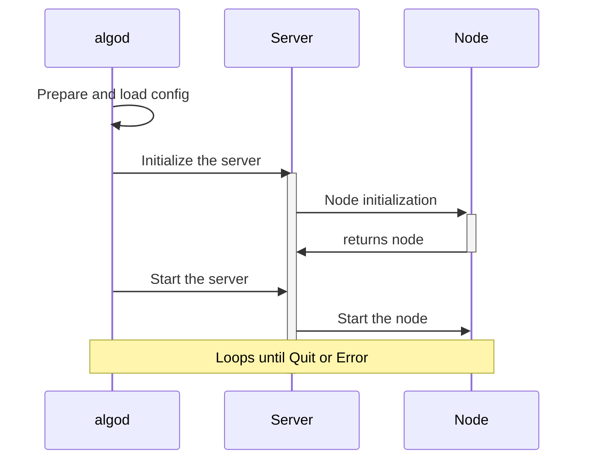
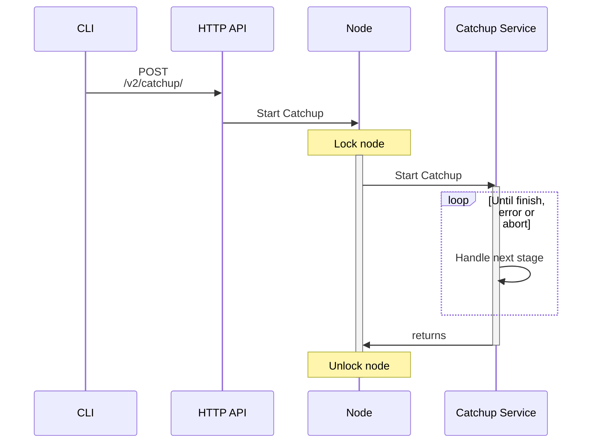

\pagebreak

# Algorand General Infrastructure Overview

The following document provides a non-normative overview of some accesorial infrastructural aspects of the Algorand node. Most of the constructs covered in here are transversal to several layers and main systems touched on the rest of the spec., and provide ways to initialize, interoperate and configure these in order for the node to be able to operate.


# Node initialization

The node initialization is the process by which the node starts all of its underlying services, based on the provided configuration file (see [below](#node-configuration-values)).\
An impactful configuration field in the context of node initialization is the flag `EnableFollowMode`, which determines whether the node will operate as a `FollowerNode` or a `FullNode`.

After initializing the node, the server calls the startup process, during which each of the previously created services is started.

The following diagram schematizes the general initialization process. Note the relevance of the Algorand Daemon `algod` (see the [Algorand External Systems Overview](API-overview.md) for more details).



In the next two sections we delve deeper into the initialization process for each of the two possible node types.

## Full Node initialization

A Full Node is a type of node that handles the validation and propagation of transactions and blocks, maintains a complete (if archival) or partial (if non-archival) copy of the blockchain [Ledger](ledger.md), and also participates in [consensus](abft.md).

[Link to reference implementation.](https://github.com/algorand/go-algorand/blob/e60d3ddd1d63e60f32bda6935554b34fdb0e1515/node/node.go#L184-L347)

The following pseudocode shows the initialization process of an Algorand Full Node:

\begin{algorithm}[H]
\caption{Algorand FullNode Initialization}
\begin{algorithmic}[1]

\Function{MakeFull}{rootDir, config, phonebookAddrs, genesis}
\State node $\gets$ \textbf{new} AlgorandFullNode
\State node.log $\gets$ InitializeLogger(config)
\State node.genesisID $\gets$ genesis.ID()
\State node.genesisHash $\gets$ genesis.Hash()

    \State \textcolor{blue}{// Network initialization}
    \If{config.EnableP2PHybridMode}
        \State node.net $\gets$ CreateHybridP2PNetwork(phonebookAddrs)
    \ElsIf{config.EnableP2P}
        \State node.net $\gets$ CreateP2PNetwork(phonebookAddrs)
    \Else
        \State node.net $\gets$ CreateWebsocketNetwork(phonebookAddrs)
    \EndIf

    \State \textcolor{blue}{// Resource pools setup}
    \State node.cryptoPool $\gets$ CreateExecutionPool()
    \State node.lowPriorityCryptoVerificationPool $\gets$ CreateBacklogPool()
    \State node.highPriorityCryptoVerificationPool $\gets$ CreateBacklogPool()

    \State \textcolor{blue}{// Ledger initialization}
    \State ledgerPaths $\gets$ ResolvePaths(rootDir, config)
    \State node.ledger $\gets$ LoadLedger(ledgerPaths, genesis)

    \State \textcolor{blue}{// Account management}
    \State registry $\gets$ InitializeParticipationRegistry()
    \State node.accountManager $\gets$ CreateAccountManager(registry)
    \State LoadParticipationKeys(node)

    \State \textcolor{blue}{// Transaction pool setup}
    \State node.transactionPool $\gets$ CreateTransactionPool(node.ledger)
    \State RegisterBlockListeners(node.transactionPool)

    \State \textcolor{blue}{// Services initialization}
    \State node.blockService $\gets$ CreateBlockService()
    \State node.ledgerService $\gets$ CreateLedgerService()
    \State node.txPoolSyncerService $\gets$ CreateTxSyncer()
    \State node.agreementService $\gets$ CreateAgreementService()
    \State node.catchupService $\gets$ CreateCatchupService()
    \State node.stateProofWorker $\gets$ CreateStateProofWorker()
    \State node.heartbeatService $\gets$ HeartbeatService()

    \State \Return node

\EndFunction
\end{algorithmic}
\end{algorithm}

### Network initialization

Creates and configures the network stack based on the node's configuration. Supports three modes: `Standard P2P`, `Hybrid P2P-WS`, or `WebSocket` networking. The Network Layer handles $Peer$ discovery using phonebook addresses, manages message routing, and maintains connection pools.

For more detail on this service and each of the modes and functionalities mentioned above, please refer to the [Algorand Network Layer Overview](network-overview.md).

### Resource pools

Creates worker pools for cryptographic operations with priority-based execution queues. The `cryptoPool` handles general cryptographic tasks, while dedicated pools manage transaction verification with different priority levels.

For more information on transaction verification, you may refer to the [Algorand Ledger Overview](ledger-overview.md). For details on the cryptographic primitives utilized themselves, see the [Algorand Cryptographic Primitives Specification](crypto.md).

### Ledger initialization

Loads the blockchain state from disk, including account balances, blocks, and protocol state. If starting from an empty ledger file, these are created instead. Validates the genesis configuration and database integrity.

See the [Algorand Ledger Overview](ledger-overview.md) for more details on this process.

### Account management

Sets up participation key handling and account tracking. Creates a registry for managing participation keys, loads existing keys from storage, and establishes the infrastructure for key registration and rotation.

You might refer to the [Algorand Participation Key Specification](partkey.md) for more details on participation key creation, handling and usage. See also the specific transaction used for protocol $players$ to register their participation keys in the [Algorand Ledger Specification](ledger.md#key-registration-transaction).

### Transaction pool

Creates the Transaction Pool ($TP$) for managing uncommited transactions. Handles transaction validation, maintains the pending transaction set, and manages transaction synchronization across the network. Includes listeners for new blocks in order to update transaction status (e.g. discard transactions that have already been commited).

For a detailed overview of this queue structure, you may refer to the non-normative [Algorand Ledger Overview](ledger-overview.md#transaction-pool).


### Services initialization

Starts the node services:

- [Catchup](#node-catchup) Service.
- [Agreement](abft.md) Service.
- [Transaction Pool](ledger-overview.md#transaction-pool) Syncer Service.
- [Block](ledger.md#blocks) Service.
- [Ledger](ledger.md) Service.
- [Transaction](ledger.md#transactions) Handler (see also the [Algorand Network Layer Overview](network-overview.md#message-handlers)).
- [State Proof](crypto.md#state-proofs) Worker.
- [Heartbeat](ledger.md#heartbeat-transaction) Service.

## Follower Node Initialization

In contrast with a `FullNode`, A `FollowerNode` is a type of Algorand node that may not participate in the consensus process or even keep a [Transaction Pool](ledger-overview.md#transaction-pool). Instead, its primary role is to synchronize with the blockchain and provide updated block data, while being able to 'wait' for certain applications to finish ingesting the new blockchain data it provides.\
These nodes are commonly used by applications, explorers, and services that require blockchain data access without contributing to block validation.

[Link to reference implementation.](https://github.com/algorand/go-algorand/blob/df0613a04432494d0f437433dd1efd02481db838/node/follower_node.go#L79-L158)

The following pseudocode shows the initialization process of this special type of node:

\begin{algorithm}
\caption{Algorand Follower Node Initialization}
\begin{algorithmic}[1]

\Function{MakeFollower}{rootDir, config, phonebookAddrs, genesis}
\State node $\gets$ \textbf{new} AlgorandFollowerNode
\State node.log $\gets$ InitializeLogger(config)
\State node.genesisID $\gets$ genesis.ID()
\State node.genesisHash $\gets$ genesis.Hash()

    \State \textcolor{blue}{// Network Configuration - WebSocket Only}
    \State p2pNode $\gets$ CreateWebsocketNetwork(phonebookAddrs)
    \State p2pNode.DeregisterMessageInterest([AgreementVoteTag, ProposalPayloadTag, VoteBundleTag])
    \State node.net $\gets$ p2pNode

    \State \textcolor{blue}{// Resource Usage - Minimal Pools}
    \State node.cryptoPool $\gets$ CreateExecutionPool()
    \State node.lowPriorityCryptoVerificationPool $\gets$ CreateBacklogPool()

    \State \textcolor{blue}{// Ledger Initialization - Same as Full Node}
    \State ledgerPaths $\gets$ ResolvePaths(rootDir, config)
    \State node.ledger $\gets$ LoadLedger(ledgerPaths, genesis)

    \State \textcolor{blue}{// Service Components - Limited Services}
    \State node.blockService $\gets$ CreateBlockService()
    \State node.catchupService $\gets$ CreateCatchupService()
    \State node.catchupBlockAuth $\gets$ CreateBlockAuthenticator()

    \State \textcolor{blue}{// Transaction Handling - Simulation Only}
    \State \textbf{disable} TransactionBroadcast()
    \State \textbf{disable} TransactionPool()

    \State \textcolor{blue}{// Participation - All Disabled}
    \State \textbf{disable} ParticipationKeyManagement()
    \State \textbf{disable} ConsensusParticipation()
    \State \textbf{disable} StateProofOperations()

    \State SetSyncRound(node.Ledger().LatestTrackerCommitted() + 1)

    \If{InCatchpointCatchupState()}
        \State InitializeCatchpointCatchup()
    \EndIf

    \State \Return node

\EndFunction

\end{algorithmic}
\end{algorithm}

The differences with a [`FullNode`](#full-node-initialization) are mainly:

- Unlike the choice of [Network Layer](network-overview.md) in a `FullNode`, only `WebSocket` mode is available for `FollowerNode` networking.

- Minimal resource pools: Only one low-priority cryptographic verification pool.

- Has services limited to:
  - Catchup Service
  - Block Service

- Transaction broadcasting is disabled, along with [consensus participation](abft.md) features.

- Maintains synchronization and [Catchup](#node-catchup) capabilities.

- Enables an API for retriving 'Ledger cache' information (see the [Algorand External Systems Overview](API-overview.md#follower-mode) for specifics).

# Node shutdown

Node shutdown is the process by which the node may be gracefully stopped. During this process active services are stopped (e.g. if a [catchup](#node-catchup) is running, it's terminated). Note that in a multithreaded architecture, the node needs to be completely locked for this operation to avoid data corruption inside and outside this function.

## Full node shutdown

[Link to reference implementation.](https://github.com/algorand/go-algorand/blob/e60d3ddd1d63e60f32bda6935554b34fdb0e1515/node/node.go#L444-L487)

The following pseudocode shows how services are stopped and all garbage collection/deallocation necessary for a `FullNode` to stop its activities in a way that is non-adversarial to the correct functioning of the Algorand network as a whole.

\begin{algorithm}
\caption{Algorand Full Node Shutdown}
\begin{algorithmic}[1]

\Function{FullNode::Stop}{}

    \State \textcolor{blue}{// Network Cleanup}
    \State node.net.ClearHandlers()
    \State node.net.ClearValidatorHandlers()
    \If{!node.config.DisableNetworking}
        \State node.net.Stop()
    \EndIf

    \State \textcolor{blue}{// Service Shutdown}
    \If{node.catchpointCatchupService != null}
        \State node.catchpointCatchupService.Stop()
    \Else
        \State \textcolor{green}{// Full Node Services}
        \State node.StopAllServices()
    \EndIf

    \State \textcolor{blue}{// Resource Cleanup}
    \State node.ShutdownAllPools()

    \State \textcolor{blue}{// Final Cleanup}
    \State node.ledger.Close()

    \State \textcolor{blue}{// Post-Shutdown Cleanup}
    \State WaitMonitoringRoutines()
    \State node.accountManager.Registry().Close()
    \ForAll{handle in node.databaseHandlers}
        \State handle.Close()
    \EndFor

\EndFunction
\end{algorithmic}
\end{algorithm}

## Follower node shutdown

[Link to reference implementation.](https://github.com/algorand/go-algorand/blob/df0613a04432494d0f437433dd1efd02481db838/node/follower_node.go#L211-L229)

Similar to the previous section, the following pseudocode outlines the shutdown process for a node running in `FollowerNode` mode. It stops every active service and deallocates all constructs in order to stop its operations gracefully, avoiding data corruption of any kind.

\begin{algorithm}
\caption{Algorand Follower Node Shutdown}
\begin{algorithmic}[1]

\Function{FollowerNode::Stop}{}

    \State \textcolor{blue}{// Network Cleanup}
    \State node.net.ClearHandlers()
    \If{!node.config.DisableNetworking}
        \State node.net.Stop()
    \EndIf

    \State \textcolor{blue}{// Service Shutdown}
    \If{node.catchpointCatchupService != null}
        \State node.catchpointCatchupService.Stop()
    \Else
        \State \textcolor{green}{// Follower Services Only}
        \State node.catchupService.Stop()
        \State node.blockService.Stop()
    \EndIf

    \State \textcolor{blue}{// Resource Cleanup}
    \State node.catchupBlockAuth.Quit()
    \State node.lowPriorityCryptoVerificationPool.Shutdown()
    \State node.cryptoPool.Shutdown()

\EndFunction

\end{algorithmic}
\end{algorithm}

\pagebreak

# Node Catchup

Node catchup is the process by which an outdated node synchronizes with a more recent point in history by requesting all necessary data from a trusted provider that maintains an up-to-date snapshot of the [Ledger](ledger.md) for a given chain (defined by its `Genesis`,aka. the initial block. See the [Algorand Ledger Specification](ledger.md#genesis)). This allows the node to become operational relatively quickly and without replaying the entire transaction history.\
The following diagram schematizes how the catchup service works and how it intercommunicates with other services and applications inside the node.



# Loopback or PseudoNode


A `PseudoNode` (also called `Loopback` in the codebase) is an intermediate layer of sorts, which allows for proposals and votes originated from this node to be "looped back" into itself. This avoids code duplication or increased complexity, as the data constructed is received as if it was coming from an external source, and thus processed and relayed by the state machine just like any other message.\
The following snippets is an example of its usage:


For example, see this snippet taken from the [reference implementation](https://github.com/algorand/go-algorand/blob/df0613a04432494d0f437433dd1efd02481db838/agreement/actions.go#L387), where a proposal is being assembled:

```go
	case assemble:
		events, err := s.loopback.MakeProposals(ctx, a.Round, a.Period)
		switch err {
		case nil:
			s.demux.prioritize(events)
		case errPseudonodeNoProposals:
			// no participation keys, do nothing.
		default:
			s.log.Errorf("pseudonode.MakeProposals call failed %v", err)
		}
```
Here we see how the `loopback` handles proposal creation and then generates events as if this was an externally received proposal, which then are prioritized.


# Protocol upgrade history

The following is a list outlining the timeline of Algorand protocol versions and the fundamental upgrades introduced in each one.

- V0: Baseline protocol.

- V1: Added [Genesis ID](ledger.md#genesis-identifier) in transactions. Useful for univocally and quickly determining the chain to which transactions belong to.

- V2: Bug fixes.

- V3: Fine-grained ephemeral keys. This version introduces the [two-level ephemeral key scheme](partkeys.md) for consensus participation.

- V4: Minimum balance requirements, account closure transaction (see usage of the closing field [here](ledger.md#payment)).

- V5: Bug fix on the balance lookback $\delta_b$ (see [here](abft.md#parameters)). Change to the [`MinTxnFee`](ledger.md).

- V6: Explicit ephemeral-key parameters (see [here](partkey.md#algorands-two-level-ephemeral-signature-scheme-for-authentication) and [here](partkey.md#one-time-signature) for details on these parameters).

- V7: $MaxBalLookback$ updated to 320 (sets an upper bound for $\delta_b$, see [here](abft.md#parameters) for details on this constant and its significance).

- V8: New _seed_ derivation policy (see [here](abft.md#seed) for the Seed computation algorithm, [here](ledger.md#cryptographic-seed) for comments on the `seed` as a block field).

- V9: Updated minimum balance requirements to 100,000 microAlgos (for consensus participation).

- V10: Fast partition recovery. See the [Algorand Byzantine Fault Tolerance Specification](abft.md#fast-recovery) for more details on this functionality.

- V11: Efficient `SignedTxn` encoding.

- V12: Increased maximum version string length.

- V13: Meaningful consensus version string.

- V14: Tracking closing amounts, introduced [GenesisHash](ledger.md#genesis-hash).

- V15: Reward distribution tracking (this rewards system is currently deprecated, see the [Algorand Ledger Specification](ledger.md)).

- V16: Domain separation in $Credentials$ (see [here](crypto.md#domain-separation)), introduced [GenesisHash](ledger.md#genesis-hash) requirement.

- V17: Final specification commit for June 2019 release (introducing updates to this specification).

- V18: Reward calculation specification commit (this rewards system is currently deprecated, see the [Algorand Ledger Specification](ledger.md)).

- V19: Final specification commit for November 2019 release (introducing updates to this specification).

- V20: Fractional field in assets.

- V21: Fix `credential.lowestOutput` bug.

- V22: Tunable upgrade delay (see [here](ledger.md#protocol-upgrade-state) for details on the upgrade process).

- V23: `Lease` transaction field behavior fix (see [here](ledger.md#transactions) for details on how this field is applied).

- V24: `Application` mode for TEAL programs (see [here](avm.md#execution-modes)), [rekeying](ledger.md#transactions) functionalities, TEAL `v2` (see opcodes labeled `v2` in the [TEAL Opcode Reference](TEAL_opcodes.md)).

- V25: `AssetCloseAmount` field added to `ApplyData` (see [here](ledger.md#applydata) for the importance of the `ApplyData` construct in observing and applying a given transaction's effects).

- V26: TEAL `v3`, rewards calculation, [merkle tree hash commitments](crypto.md#commitment).

- V27: `ApplyDelta.EvalDelta.LocalDeltas` update.

- V28: New TEAL features, larger program size, fee pooling.

- V29: App update fix, `ExtraProgramPages` size calculation (see [here](avm.md#avm-parameters-and-constants) for information on how the extra program pages increase the available size for `Application` program bytecode).

- V30: [AVM](avmd.md) 1.0, TEAL `v5` (see opcodes labeled `v5` in the [TEAL Opcode Reference](TEAL_opcodes.md)), app opt-in limit increased to 50.

- V31: Batch verification, reward calculation fix (this rewards system is currently deprecated, see the [Algorand Ledger Specification](ledger.md) for details on this as well as the new incentive mechanism), TEAL `v6` (see opcodes labeled `v6` in the [TEAL Opcode Reference](TEAL_opcodes.md)).

- V32: Unlimited assets.

- V33: Large blocks (see [here](ledger.md#blocks) for the full anatomy of a block), deeper TEAL history.

- V34: TEAL `v7` (see opcodes labeled `v7` in the [TEAL Opcode Reference](TEAL_opcodes.md)), introduction of [State Proofs](crypto.md#state-proofs), reduced the $\lambda$ timeout constant to 1.7s (see [here](abft.md#parameters) for the importance of this consensus constant).

- V35: Total stake calculation in [State Proofs](crypto.md#state-proofs).

- V36: Box storage in TEAL `v8` (see [here](ledger.md#boxes) for further details on _Boxes_ as a storage solution; also see opcodes labeled `v8` in the [TEAL Opcode Reference](TEAL_opcodes.md)).

- V37: [State Proofs](crypto.md#state-proofs) pre-upgrade. Also see the [full semantics of State Proof transactions](ledger.md#state-proof-transaction).

- V38: [State Proof verification](crypto.md#), TEAL v9 updates

- V39: Dynamic filter timeouts; an optimization to reduce the filtering step ($\mathrm{soft}$) time under certain conditions of consensus, see [here](abft.md#filtering), TEAL `v10` (see opcodes labeled `v10` in the [TEAL Opcode Reference](TEAL_opcodes.md)), [elliptic curve opcodes](ledger.md).

- V40: Consensus incentives, TEAL `v11`, `mimc` opcode (see opcodes labeled `v11` in the [TEAL Opcode Reference](TEAL_opcodes.md)).

# Appendix

## Msgpack reference

In the [go-algorand](http://github.com/algorand/go-algorand) reference implementation, all data structures that are to be sent between components of the Algorand Node are annotated with how to encode them. In the [Algorand Cryptographic Primitives Specification](crypto.md#canonical-msgpack) there is a definition of how each type should be encoded. In [this readme](https://github.com/algorand/go-algorand/blob/b6e5bcadf0ad3861d4805c51cbf3f695c38a93b7/docs/messagepack.md) you may find more information about message pack and encoding in the Algorand Node.

Some relevant rules for the codec:

- If a struct have a `\_struct struct{}` field, each `codec` "configuration" (e.g. `omitempty`, `omitemptyarray`...) applies to each field of the struct.
- The first element of the `codec` string is the name of the field in the encoding. If its empty (`codec:","` or `codec:",..."`) it means the name in the encoding is the same as the field name.

In general, [this primer](https://ugorji.net/blog/go-codec-primer) can also be used as reference to understand the _msgpack_ format.


## Node configuration values

- `Version`: It tracks the current version of the default configuration values, allowing migration from older versions to newer ones. It is particularly important when modifying default values for existing parameters.\
Any time a new version is introduced, this field must be updated accordingly.\
Default value: `35`.

- `Archival`: Enable saving a full copy of the blockchain history.
Non-archival nodes will only maintain the necessary state to validate
blockchain messages and participate in the consensus protocol. Non-archival
nodes use significantly less storage space.\
Introduced in version 0 with the default value set to `false`.

> [!NOTE]
> The `Archival` field makes the node store history from the moment it is activated, so if you want
> to have the entire blockchain state, it must be set before starting the
> node for the first time, or the databases must be deleted, and a full
> synchronization must be performed from scratch.

- `GossipFanout`: Defines the maximum number of peers the node will establish outgoing connections with. If the available peer list is smaller than this value, the node will connect to fewer peers. The node does not create multiple outgoing connections to the same peer. See the [Network Layer Overview](network-overview.md) for further details.\
Introduced in version 0.\
Default value: 4.

- `NetAddress`: Specifies the address and/or port where the node listens for incoming connections. Leaving this field blank disables incoming connections. The value can be an _IP_ and _port_ pair or just a _port_.
If no port is specified, the node defaults to port `4160`.\
Setting the port to `0` allows the system to automatically assign an available port. For example, `127.0.0.1:0` binds the node to *any available port* on localhost.\
Introduced in version 0.\
Default value: Empty string.

- `ReconnectTime`: deprecated and unused.\
Introduced in version 0 with the default value set to `60`, default value is set to
`60000000000` since version 1.

- `PublicAddress`: Defines the public address that the node advertises to other nodes for incoming connections.\
For `mainnet` relay nodes, this should include the full SRV host name and the publicly accessible port number.\
A valid entry helps prevent self-gossip and is used for identity exchange, ensuring redundant connections are de-duplicated.\
Introduced in version 0.\
Default value: Empty string.

- `MaxConnectionsPerIP`: Defines the maximum number of connections allowed per IP address.\
Introduced in version 3 with a default value of `30`.\
Updated to `15` in version 27.\
Current default value: `8` (since version 35).

- `PeerPingPeriodSeconds`: deprecated and unused.\
  Introduced in version 0 with the default value set to `0`.

- `TLSCertFile`: Is the certificate file used for the [websocket network](network-overview.md#websocket-sub-network) if provided.\
Introduced in version 0 with the default value set to an empty string.

- `TLSKeyFile`: Is the key file used for the [websocket network](network-overview.md#websocket-sub-network) if provided.\
Introduced in version 0 with the default value set to an empty string.

- `BaseLoggerDebugLevel`: Specifies the logging level for [`algod`](API-overview.md#algorand-daemon) (node.log).\
Introduced in version 0 with the default value set to `1`.\
Current default value is set to `4` since version 1.\
The levels are:
  - `0` _Panic_: highest level of severity. Logs and then calls `panic()`.
  - `1` Fatal: Logs and then calls `os.Exit(1)`. It will exit even if the
    logging level is set to _Panic_.
  - `2` _Error_: Used for errors that should definitely be noted.
    Commonly used for hooks to send errors to an error tracking service.
  - `3` _Warn_: Non-critical entries that deserve attention.
  - `4` _Info_: General operational entries.
  - `5` _Debug_: Verbose logging, usually only enabled when debugging.

- `CadaverSizeTarget`: Specifies the maximum size of the `agreement.cdv` file
  in bytes. Once full, the file will be renamed to `agreement.archive.log` and
  a new `agreement.cdv` will be created.\
  Introduced in version 0 with the default value set to `1073741824`.
  Current default value is set to `0` since version 24.

- `CadaverDirectory`: if this is not set, `MakeService` will attempt to use
  `ColdDataDir` instead.\
  Introduced in version 27 with the default value set to an empty string.

- `HotDataDir`: Is an optional directory to store data that is frequently accessed by the node. For isolation, the node will create a subdirectory in this location, named by the [`genesisID`](ledger.md#genesis-identifier) of the network. If not specified, the node uses the default data directory provided at runtime. Individual resources may override this setting. Setting `HotDataDir` to a dedicated high performance disk allows for basic disc tuning.\
Introduced in version 31 with the default value set to an empty string.

- `ColdDataDir`: Specifies an optional directory for storing infrequently accessed data. The node creates a subdirectory within this location, named after the [`genesisID`](ledger.md#genesis-identifier) of the network. If not specified, the node uses the default data directory provided at runtime. Individual resources may have their own override settings, which take precedence over this value. Using a slower disk for `ColdDataDir` can optimize storage costs and resource allocation.\
Introduced in version 31.\
Default value: Empty string.

- `TrackerDBDir`: Is an optional directory to store the tracker database.
  For isolation, the node will create a subdirectory in this location, named
  by the [`genesisID`](ledger.md#genesis-identifier) of the network. If not specified, the node will use the `HotDataDir`.\
  Introduced in version 31 with the default value set to an empty string.

- `BlockDBDir`: Is an optional directory to store the [block](ledger.md#blocks)
  database. For isolation, the node will create a subdirectory in this location,
  named by the [`genesisID`](ledger.md#genesis-identifier) of the network. If not specified, the node will use the `ColdDataDir`.\
  Introduced in version 31 with the default value set to an empty string.

- `CatchpointDir`: Is an optional directory to store catchpoint files, except
  for the in-progress temporary file, which will use the `HotDataDir` and is not
  separately configurable. For isolation, the node will create a subdirectory in
  this location, named by the [`genesisID`](ledger.md#genesis-identifier) of the network. If not specified, the node will use the `ColdDataDir`.\
  Introduced in version 31 with the default value set to an empty string.

- `StateproofDir`: Is an optional directory to persist state about observed and
  issued [state proof messages](ledger.md#state-proof-message). For isolation, the node will create a subdirectory in this location, named by the [`genesisID`](ledger.md#genesis-identifier) of the network. If not specified, the node will use the `HotDataDir`.\
  Introduced in version 31 with the default value set to an empty string.

- `CrashDBDir`: Is an optional directory to persist [agreement's consensus participation](abft.md) state. For isolation, the node will create a subdirectory in this
  location, named by the [`genesisID`](ledger.md#genesis-identifier) of the network. If not specified, the node will use the `HotDataDir`\
  Introduced in version 31 with the default value set to an empty string.

- `LogFileDir`: Is an optional directory to store the log file, `node.log`. If not
  specified, the node will use the `HotDataDir`. The `-o` command line option can
  be used to override this output location.\
  Introduced in version 31 with the default value set to an empty string.

- `LogArchiveDir`: Is an optional directory to store the log archive. If not
  specified, the node will use the `ColdDataDir`.\
  Introduced in version 31 with the default value set to an empty string.

- `IncomingConnectionsLimit`: A non-negative number that specifies the max
  number of incoming connections for the gossip protocol configured in
  `NetAddress`. A value of `0` means no connections allowed.
  Estimating 1.5 MB per incoming connection.\
  Introduced in version 0 with value `-1`, updated in version 1 to `10000`,
  updated in version 17 to `800`.\
  Current default value is set to `2400` in version 27.

- `P2PHybridIncomingConnectionsLimit`: Is used as `IncomingConnectionsLimit`
  for P2P connections in [hybrid mode](network-overview.md#hybrid-network-implementation). For [pure P2P nodes](network-overview.md#direct-p2p-network-implementation) the field `IncomingConnectionsLimit` is used instead.\
  Introduced in version 34 with the default value set to `1200`.

- `BroadcastConnectionsLimit`: This parameter defines the maximum number of peer connections that will receive broadcast (gossip) messages from your node.\
It was introduced in Version 4, with a default value of `-1`.\
For further details, please refer to the [Algorand Network Layer Overview](network.md).\
Succintly, it works in the following way:
  - If a node has more connections than the specified limit, it prioritizes broadcasting to peers in the following order:
      1. Outgoing connections: Peers a node actively connects to.
      2. Peers with higher stake: Determined by the amount of Algos held, as indicated by their [participation key](partkey.md#votingparticipation-keys).
  - Special values:
    - `0`: Disables all outgoing broadcast messages, including transaction broadcasts to peers.
    - `-1`: No limit on the number of connections receiving broadcasts (default setting).

- `AnnounceParticipationKey`: Indicates if this node should announce its [participation key](partkey.md#votingparticipation-keys) with the largest stake to its peers. In case of a _DoS_ attack, this allows peers to prioritize connections.\
Introduced in Version 4 with the default value set to `true`. 

- `PriorityPeers`: Specifies peer IP addresses that should always get outgoing
  broadcast messages from this node.\
  Introduced in version 4 with the default value set to an empty string.

- `ReservedFDs`: This configuration parameter specifies the number of reserved file descriptors (FDs) that the Algorand node will allocate. These reserved FDs are set aside for operations that require temporary file descriptors, such as _DNS_ queries, _SQLite_ database interactions, and other short-lived network operations.\
The total number of file descriptors available to the node, as specified by the node's file descriptor limit (`RLIMIT_NOFILE`), should always be greater than or equal to `IncomingConnectionsLimit` + `RestConnectionsHardLimit` + `ReservedFDs`. This parameter is typically left at its default value and should not be changed unless necessary.\
If the node's file descriptor limit is lower than the sum of the three components, it could cause issues with node functionality.\
Introduced in version 2 with the default value set to `256`.

- `EndpointAddress`: Configures the address where the node listens to for
  [REST API](API-overview.md) calls. It may hold an _IP_ address and _port_ or just a _port_.
  The value `127.0.0.1:0` and `:0` will attempt to bind to port `8080` if
  possible; otherwise it will bind to a random port.\
  Any other address ending in `:0` will bind directly to a random port.\
  Introduced in version 0 with the default value set to `127.0.0.1:0`.

- `EnablePrivateNetworkAccessHeader`: Respond to Private Network Access
  preflight requests sent to the node. Useful when a public website is trying to
  access a node that's hosted on a local network.\
  Introduced in version 35 with the default value set to `false`.

- `RestReadTimeoutSeconds`: Defines the maximum duration (in seconds) the node's [API server](API-overview.md) will wait to read the request body from an incoming HTTP request. If the body is not fully received within this time frame, the request will be aborted.\
Introduced in version 4 with the default value set to `15`.

- `RestWriteTimeoutSeconds`: Defines the maximum duration (in seconds) the node's [API server](API-overview.md) will allow for writing the response body back to the client. If the response is not sent within this time frame, the connection is closed.\
Introduced in version 4 with the default value set to `120`.

- `DNSBootstrapID`: Specifies the names of a set of DNS SRV records that
  identify the set of nodes available to connect to.
  For more information on the specifics of this value's syntax you may see [here](https://github.com/algorand/go-algorand/blob/b6e5bcadf0ad3861d4805c51cbf3f695c38a93b7/config/dnsbootstrap.go) in the reference implementation.\
  Introduced in version 0 with the default value set to `<network>.algorand.network`.\
  Current default value is set to `<network>.algorand.network?backup=<network>.algorand.net&dedup=<name>.algorand-<network>.(network|net)` since version 28.

- `LogSizeLimit`: Sets the log file size limit in bytes. When set to `0`, logs
  will be written to _stdout_.\
  Introduced in version 0 with the default value set to `1073741824`.

- `LogArchiveName`: Text template for creating the log archive filename.\
  If the filename ends with _.gz_ or _.bz2_ it will be compressed.\
  Introduced in version 4 with the default value set to `node.archive.log`.
  Available template variables:
  - Time at the start of log:
    - {{.Year}}
    - {{.Month}}
    - {{.Day}}
    - {{.Hour}}
    - {{.Minute}}
    - {{.Second}}
  - Time at the end of log:
    - {{.EndYear}}
    - {{.EndMonth}}
    - {{.EndDay}}
    - {{.EndHour}}
    - {{.EndMinute}}
    - {{.EndSecond}}

- `LogArchiveMaxAge`: Specifies the maximum age for a node log.
  Valid units are 's' seconds, 'm' minutes, 'h' hours.\
  Introduced in version 4 with the default value set to an empty string.

- `CatchupFailurePeerRefreshRate`: Specifies the maximum number of consecutive
  attempts to [catchup](#node-catchup) after which peer connections are replaced.\
  Introduced in version 0 with the default value set to `10`.

- `NodeExporterListenAddress`: Sets the specific address for publishing
  metrics.\
  Introduced in version 0 with the default value set to `:9100`.

- `EnableMetricReporting`: Determines whether the metrics collection service is enabled for the node. When enabled, the node will collect performance and usage metrics from the specific instance of [`algod`](API-overview.md#algorand-daemon). Additionally, machine-wide metrics are also collected. This enables monitoring across all instances on the same machine, helping with performance analysis and troubleshooting.\
Introduced in version 0 with the default value set to `false`.

- `EnableTopAccountsReporting`: this field is deprecated and unused.\
Enables top accounts reporting flag.\
Introduced in version 0 with the default value set to `false`.

- `EnableAgreementReporting`: Controls the reporting of [agreement-related events](abft.md) in the node. When enabled, it prints additional events related to the periods of agreement within the consensus process. This is useful for tracking and debugging the stages of agreement reached by the node during the consensus rounds.\
Introduced in version 3 with the default value set to `false`.

- `EnableAgreementTimeMetrics`: Controls whether the node collects and reports metrics related to the timing of the agreement process within the [consensus protocol](abft.md). When enabled, it provides detailed data on the time taken for agreement events during consensus rounds.\
  Introduced in version 3 with the default value set to `false`.

- `NodeExporterPath`: Specifies the path to the `node_exporter` binary, which is used to expose node metrics for monitoring and integration with systems like Prometheus. The `node_exporter` collects and exposes various performance and health metrics from the node.\
Introduced in version 0 with the default value set to `./node_exporter`.

- `FallbackDNSResolverAddress`: Defines the fallback DNS resolver address that
  would be used if the system resolver would fail to retrieve SRV records.\
  Introduced in version 0 with the default value set to an empty string.

- `TxPoolExponentialIncreaseFactor`: Sets the increase factor of the
  [transaction pool's](ledger-overview.md#transaction-pool) fee threshold. When the transaction pool is full, the priority of a new transaction must be at least
  `TxPoolExponentialIncreaseFactor` times greater than the minimum-priority of a
  transaction already in the pool, otherwise, the new transaction is discarded.
  Should always be `2` in production.\
  Introduced in version 0 with the default value set to `2`.

- `SuggestedFeeBlockHistory`: Is deprecated and unused.\
  Introduced in version 0 with the default value set to `3`.

- `TxBacklogServiceRateWindowSeconds`: Defines the window size (in seconds) used to determine the service rate of the transaction backlog (_txBacklog_). It helps to manage how quickly the node processes and serves transactions waiting in the backlog by monitoring the rate over a specific time period.\
Introduced in version 27 with the default value set to `10`.

- `TxBacklogReservedCapacityPerPeer`: Determines the amount of dedicated capacity allocated to each peer for serving transactions from the transaction backlog (_txBacklog_). This ensures that each peer has a specific portion of the overall transaction processing capacity, preventing one peer from monopolizing the node’s transaction handling resources.\
Introduced in version 27 with the default value set to `20`.

- `TxBacklogAppTxRateLimiterMaxSize`: Defines the maximum size for the transaction rate limiter, which is used to regulate the number of transactions that an application can submit to the node within a given period. This rate limiter is designed to prevent individual applications from overwhelming the network with excessive transactions. The value may be interpreted as the maximum sum of transaction bytes per period.\
Introduced in version 32 with the default value set to `1048576`.

- `TxBacklogAppTxPerSecondRate`: Determines the target transaction rate per second for an application's transactions within the transaction rate limiter. This means that the node will aim to allow an application to submit a specific number of transactions per second. If the app tries to send more transactions than the rate limit allows, those transactions will be delayed or throttled.\
Introduced in version 32 with the default value set to `100`.

- `TxBacklogRateLimitingCongestionPct`: Determines the threshold percentage at which the transaction backlog rate limiter will be activated. When the backlog reaches a certain percentage, the node will start to limit the rate of transactions, either by slowing down incoming transactions or applying throttling measures. This helps prevent the backlog from growing too large and causing congestion on the network. If the backlog falls below this threshold, rate limiting is relaxed.\
Introduced in version 32 with the default value set to `50`.

- `EnableTxBacklogAppRateLimiting`: Determines whether an application-specific rate limiter should be applied when adding transactions to the transaction backlog. If enabled, the node enforces rate limits on how many application transactions can be enqueued, preventing excessive transaction submission from a single app.\
Introduced in version 32 with the default value set to `true`.

- `TxBacklogAppRateLimitingCountERLDrops`: Determines whether transaction messages dropped by the ERL (Exponential Rate Limiter) congestion manager and the transaction backlog rate limiter should also be counted by the application rate limiter.
When enabled, all dropped transactions are included in the app rate limiter's calculations, making its rate-limiting decisions more accurate. However, this comes at the cost of additional deserialization overhead, as more transactions need to be processed even if they are ultimately dropped.\
Introduced in version 35 with the default value set to `false`.

- `EnableTxBacklogRateLimiting`: Determines whether a rate limiter and congestion manager should be applied when adding transactions to the transaction backlog.
When enabled, the total transaction backlog size increases by `MAX_PEERS`*`TxBacklogReservedCapacityPerPeer`, allowing each peer to have a dedicated portion of the backlog. This helps manage network congestion by preventing any single source from overwhelming the queue.\
Introduced in version 27 with the default value set to `false`.\
Current default value is set to `true` since version 30.

- `TxBacklogSize`: Defines the queue size for storing received transactions before they are processed. The default value is `26000`, which approximates the number of transactions that fit in a single block. However, if `EnableTxBacklogRateLimiting` is enabled, the total backlog size increases by `MAX_PEERS`*`TxBacklogReservedCapacityPerPeer`, allocating additional capacity per peer.\
Introduced in version 27 with the default value set to `26000`.

- `TxPoolSize`: Defines the maximum number of transactions that can be stored in the [transaction pool buffer](ledger-overview.md#transaction-pool) before being processed or discarded.\
It was introduced in version 0 with a default value of `50000`, later reduced to `15000` in version 5.\
Current default value is set to `75000` since version 23.

- `TxSyncTimeoutSeconds`: Defines the maximum time a node will wait for responses after attempting to synchronize transactions by gossiping them to peers. After gossiping, the node waits for acknowledgments, such as confirmation that the transaction has been added to a peer's Transaction Pool or relayed to others. If no acknowledgment is received within the time limit set by `TxSyncTimeoutSeconds`, the node stops the synchronization attempt and moves on to other tasks. However, the node will retry synchronization in future cycles.\
Introduced in version 0 with the default value set to `30`.

- `TxSyncIntervalSeconds`: Defines the number of seconds between transaction
  synchronizations.\
  Introduced in version 0 with the default value set to `60`.

- `IncomingMessageFilterBucketCount`: Specifies the number of hash buckets used to filter and manage incoming messages. When a [message is received](network-overview.md), the node computes its hash, which is a unique value representing the message. The hash is then assigned to one of the available buckets based on its value. Each bucket holds a set of message hashes, allowing the node to quickly check if it has already processed a message and filter out duplicates.\
Introduced in version 0 with the default value set to `5`.

- `IncomingMessageFilterBucketSize`: Defines the size of each incoming message
  hash bucket.\
  Introduced in version 0 with the default value set to `512`.

- `OutgoingMessageFilterBucketCount`: Defines the number of outgoing message
  hash buckets.\
  Introduced in version 0 with the default value set to `3`.

- `OutgoingMessageFilterBucketSize`: Defines the size of each outgoing message
  hash bucket.\
  Introduced in version 0 with the default value set to `128`.

- `EnableOutgoingNetworkMessageFiltering`: Enables the filtering of outgoing messages comparing its hashes with those in the message hash buckets.\
Introduced in version 0 with the default value set to `true`.

- `EnableIncomingMessageFilter`: Enables the filtering of incoming messages.\
  Introduced in version 0 with the default value set to `false`.

- `DeadlockDetection`: Controls whether the node actively detects potential deadlocks in its operations. A deadlock occurs when two or more processes are stuck waiting for each other to release resources, preventing progress. When set to a positive value (`1`), deadlock detection is enabled, allowing the node to monitor and identify such situations. A value of `-1` disables deadlock detection, and a value of `0` sets the default behavior, where the system determines whether to enable deadlock detection automatically based on the environment.\
Introduced in version 1 with the default value set to `0`.

- `DeadlockDetectionThreshold`: Defines the time limit, in seconds, that the node waits before considering a potential deadlock situation. If a process or operation exceeds this threshold without making progress, the node will trigger deadlock detection to identify and handle the issue.\
Introduced in version 20 with the default value set to `30`.

- `RunHosted`: Configures whether to run the Algorand node in Hosted mode.\
Introduced in version 3 with the default value set to `false`.

- `CatchupParallelBlocks`: Is the maximum number of blocks that catchup will
  fetch in parallel. If less than [`Protocol.SeedLookback`](abft.md#parameters), then
  `Protocol.SeedLookback` will be used as to limit the catchup. Setting this
  variable to `0` would disable the catchup.\
  Introduced in version 3 with the default value set to `50`.\
  Current default value is set to `16` since version 5.

- `EnableAssembleStats`: Specifies whether or not to emit the
  `AssembleBlockMetrics` telemetry event.\
  Introduced in version 3 with the default value set to an empty string.

- `EnableProcessBlockStats`: Specifies whether or not to emit the
  `ProcessBlockMetrics` telemetry event.\
  Introduced in version 3 with the default value set to an empty string.

- `SuggestedFeeSlidingWindowSize`: this field is deprecated
  and unused.\
  Introduced in version 3 with the default value set to `50`.

- `TxSyncServeResponseSize`: Sets the maximum size, in bytes, that the synchronization server will return when serving transaction synchronization requests.\
Introduced in version 3 with the default value set to `1000000`.

- `UseXForwardedForAddressField`: Indicates whether or not the node should use
  the _X-Forwarded-For_ HTTP Header when determining the source of a connection.
  If used, it should be set to the string `X-Forwarded-For`, unless the proxy
  vendor provides another header field.\
  Introduced in version 0 with the default value set to an empty string.

- `ForceRelayMessages`: Indicates whether the network library should relay
  messages even in the case that no `NetAddress` was specified.\
  Introduced in version 0 with the default value set to an empty string.

- `ConnectionsRateLimitingCount`: Used along with
  `ConnectionsRateLimitingWindowSeconds` to determine if a connection request
  should be accepted or not. The gossip network examines all the incoming
  requests in the past `ConnectionsRateLimitingWindowSeconds` seconds that
  share the same origin. If the total count exceeds this value, the connection
  is refused.\
  Introduced in version 4 with the default value set to `60`.

- `ConnectionsRateLimitingWindowSeconds`: Used along with
  `ConnectionsRateLimitingCount` to determine if a connection request should
  be accepted or not.
  Providing a zero value in this variable disables the connection rate limiting.\
  Introduced in version 4 with the default value set to `1`.

- `EnableRequestLogger`: Enables the logging of the incoming requests to the
  telemetry server.\
  Introduced in version 4 with the default value set to `false`.

- `PeerConnectionsUpdateInterval`: Defines the interval at which the peer
  connections information is sent to telemetry. Defined in seconds.\
  Introduced in version 5 with the default value set to `3600`.

- `HeartbeatUpdateInterval`: Defines the interval at which the heartbeat
  information is being sent to the telemetry (when enabled).
  Defined in seconds. Minimum value is `60`.\
  Introduced in version 27 with the default value set to `600`.

- `EnableProfiler`: allows the node to expose Go’s _pprof_ profiling endpoints, which provide detailed performance metrics such as CPU, memory, and _goroutine_ usage. This is useful for debugging and performance analysis.\
When enabled, the node will serve profiling data through its API, allowing developers to inspect runtime behavior in real time. However, since _pprof_ can expose sensitive performance details, it should be disabled in production or whenever the API is accessible to untrusted individuals, as an attacker could use this information to analyze and exploit the system.\
Introduced in version 0 with the default value set to `false`.

- `EnableRuntimeMetrics`: Exposes Go runtime metrics in `/metrics` and via
  `node_exporter`.\
  Introduced in version 22 with the default value set to `false`.

- `EnableNetDevMetrics`: Exposes network interface total bytes sent/received
  metrics in `/metrics`\
  Introduced in version 34 with the default value set to `false`.

- `TelemetryToLog`: Configures whether to record messages to `node.log` that
  are normally only sent to remote event monitoring.\
  Introduced in version 5 with the default value set to `true`.

- `DNSSecurityFlags`: Instructs [`algod`](API-overview.md#algorand-daemon) validating DNS responses.
  Introduced in version 6 with the default value set to `1`.\
  Current default value is set to `9` since version 34.\
  Possible flag values are:
  - `0` - disabled.
  - `1` - validate SRV response.
  - `2` - validate relay names to addresses resolution.
  - `4` - validate telemetry and metrics names to addresses resolution.
  - `8` - validate TXT response.

- `EnablePingHandler`: Controls whether the gossip node would respond to ping
  messages with a pong message.\
  Introduced in version 6 with the default value set to `true`.

- `DisableOutgoingConnectionThrottling`: Disables connection throttling of
  the network library, which allows the network library to continuously disconnect
  relays based on their relative (and absolute) performance.\
  Introduced in version 5 with the default value set to `false`.

- `NetworkProtocolVersion`: Overrides network protocol version (if present).\
  Introduced in version 6 with the default value set to an empty string.

- `CatchpointInterval`: Defines how often a catchpoint (a snapshot of the blockchain state) is generated, measured in rounds. These snapshots allow nodes to sync quickly by downloading and verifying the state at a specific round instead of replaying all transactions. Setting this to `0` disables the catchpoint files from being generated.\
Introduced in version 7 with the default value set to `10000`.

- `CatchpointFileHistoryLength`: Defines how many catchpoint files to store.
  A value of `0` means don't store any, `-1` means unlimited, and a positive number suggests the
  maximum number of most recent catchpoint files to store.\
  Introduced in version 7 with the default value set to `365`.

- `EnableGossipService`: Enables the gossip network HTTP websockets endpoint.
  The functionality of this depends on `NetAddress`, which must also be provided.
  This service is required for serving gossip traffic.\
  Introduced in version 33 with the default value set to `true`.

- `EnableLedgerService`: Enables the [Ledger](ledger.md) serving service. The functionality
  of this depends on `NetAddress`, which must also be provided. This
  service is required for the [catchpoint catchup](#node-catchup).\
  Introduced in version 7 with the default value set to `false`.

- `EnableBlockService`: Controls whether to enables the [block](ledger.md#blocks) serving service.
  The functionality of this depends on `NetAddress`, which must also be provided.
  This service is required for [catchup](#node-catchup).\
  Introduced in version 7 with the default value set to `false`.

- `EnableGossipBlockService`: determines whether the node serves blocks to peers over the gossip network. This service is essential for relays and other nodes to request and receive block data, especially during [catchup](#node-catchup). For this to work, the node must have a `NetAddress` set, allowing it to accept incoming connections.\
Introduced in version 8 with the default value set to `true`.

- `CatchupHTTPBlockFetchTimeoutSec`: Sets the maximum time (in seconds) that a node will wait for an HTTP response when requesting a block from a relay node during [catchup](#node-catchup). If the request takes longer than this timeout, the node abandons the request and tries another relay node.\
Introduced in version 9 with the default value set to `4`.

- `CatchupGossipBlockFetchTimeoutSec`: Controls how long the gossip query for
  fetching a block from a relay would take before giving up and trying another
  relay.\
  Introduced in version 9 with the default value set to `4`.

- `CatchupLedgerDownloadRetryAttempts`: Controls the number of attempts tue
  ledger fetcher would perform before giving up catching up to the provided
  catchpoint.\
  Introduced in version 9 with the default value set to `50`.

- `CatchupBlockDownloadRetryAttempts`: Controls the number of attempts the
  block fetcher would perform before giving up on a provided catchpoint.\
  Introduced in version 9 with the default value set to `1000`.

- `EnableDeveloperAPI`: Enables `teal/compile` and `teal/dryrun` [API endpoints](API-overview.md).\
  Introduced in version 9 with the default value set to `false`.

- `OptimizeAccountsDatabaseOnStartup`: Controls whether the accounts database
  would be optimized on [`algod`](API-overview.md#algorand-daemon) startup.\
  Introduced in version 10 with the default value set to `false`.

- `CatchpointTracking`: Determines if catchpoints are going to be tracked.\
  Introduced in version 11 with the default value set to `0`.\
  The value is interpreted as follows: 
  - `-1` means do not track catchpoints. 
  - `1` means track catchpoints as long as `CatchpointInterval` > `0`. 
  - `2` means track catchpoints and always generate catchpoint files as long as `CatchpointInterval` > `0`. 
  - `0` means automatic, which is the default value. In this mode, a non-archival node would not track the catchpoints, and an archival node would track the catchpoints as long as `CatchpointInterval` > `0`. 
  - Any other values of this field would behave as if the default value was provided.

- `LedgerSynchronousMode`: Defines the synchronous mode used by the [Ledger](ledger.md)
  database.\
  For further information see the description of [SynchronousMode](https://github.com/algorand/go-algorand/blob/b6e5bcadf0ad3861d4805c51cbf3f695c38a93b7/util/db/dbutil.go#L435).\
  Introduced in version 12 with the default value set to `2`.
   The supported options are:
  - `0` - SQLite continues without syncing as soon as it has handed data off to the operating system.
  - `1` - SQLite database engine will still sync at the most critical moments, but less often than in FULL mode.
  - `2` - SQLite database engine will use the xSync method of the VFS to ensure that all content is safely written to the disk surface prior to continuing.
  - `3` - In addition to what is being done in `2`, it provides some guarantee durability if the commit is followed closely by a power loss.

- `AccountsRebuildSynchronousMode`: Defines the synchronous mode used by the
  [Ledger](ledger.md) database while the account database is being rebuilt. This is not a
  typical operational use-case, and is expected to happen only on either startup
  (after enabling the catchpoint interval, or on certain database upgrades) or
  during fast catchup. The values specified here and their meanings are identical
  to the ones in `LedgerSynchronousMode`.\
  Introduced in version 12 with the default value set to `1`.

- `MaxCatchpointDownloadDuration`: Defines the maximum duration a client will
  be keeping the outgoing connection of a catchpoint download request open for
  processing before shutting it down. Networks that have large catchpoint files,
  slow connection or slow storage could be a good reason to increase this value.
  Note that this is a client-side only configuration value, and it's independent
  of the actual catchpoint file size.\
  Introduced in version 13 with the default value set to `7200000000000`.\
  Current default value is set to `43200000000000` since version 28.

- `MinCatchpointFileDownloadBytesPerSecond`: Defines the minimal download
  speed that would be considered to be "acceptable" by the catchpoint file
  fetcher, measured in bytes per seconds. If the provided stream speed drops
  below this threshold, the connection would be recycled. Note that this field
  is evaluated per catchpoint "chunk" and not on it's own. If this field is zero,
  the default value would be used instead.\
  Introduced in version 13 with the default value set to `20480`.

- `NetworkMessageTraceServer`: Is a _host:port_ address to report graph
  propagation trace info to.\
  Introduced in version 13 with the default value set to an empty string.

- `VerifiedTranscationsCacheSize`: Defines the number of transactions that the
  verified transactions cache would hold before cycling the cache storage in a
  round-robin fashion.\
  Introduced in version 14 with the default value set to `30000`.\
  Current default value is set to `150000` since version 23.

- `DisableLocalhostConnectionRateLimit`: Controls whether the incoming
  connection rate limit would apply for connections that are originating from the
  local machine. Setting this to `true` allows to create large local-machine
  networks that won't trip the incoming connection limit observed by relays.\
  Introduced in version 16 with the default value set to `true`.

- `BlockServiceCustomFallbackEndpoints`: a comma delimited list of endpoints
  which the [block](ledger.md#blocks) service uses to redirect the HTTP requests to in case it does
  not have the round. If empty, the block service will return _StatusNotFound(404)_.\
  Introduced in version 16 with the default value set to an empty string.

- `CatchupBlockValidateMode`: Is a development and testing configuration used
  by the [catchup](#node-catchup) service. It can be used to omit certain validations to speed up
  the catchup process, or to apply extra validations which are redundant in
  normal operation.\
  Introduced in version 16 with the default value set to `0000`.\
  The value is a bit-field, (where `bit 0` is the least significant bit and `bit 3` is the most significant bit). The value of each bit is interpreted in the following way:
  - `bit 0`: 
    - `0`: verify the block certificate.
    - `1`: skip this validation.
  - `bit 1`: 
    - `0`: verify payset committed hash in [block header](ledger.md#blocks) matches payset hash. 
    - `1`: skip this validation.
  - `bit 2`: 
    - `0`: skip verifying the transaction signatures on the block are valid.
    - `1`: verify transaction signatures on block. 
  - `bit 3`: 
    - `0`: don't verify that the hash of the recomputed payset matches the hash of the payset committed in the block header.
    - `1`: perform verification as described above.
> [!NOTE]
> Not all permutations of the above bitset are currently functional. In
> particular, the ones that are functional are:
> - `0000`: default behavior.
> - `0011`: speed up [catchup](#node-catchup) by skipping necessary validations.
> - `1100`: perform all validation methods (normal and additional).

- `EnableAccountUpdatesStats`: Specifies whether or not to emit the
  `AccountUpdates` telemetry event.\
  Introduced in version 16 with the default value set to `false`.

- `AccountUpdatesStatsInterval`: Is the time interval in nanoseconds between
  `accountUpdates` telemetry events.\
  Introduced in version 16 with the default value set to `5000000000`.

- `ParticipationKeysRefreshInterval`: Deprecated and unused.\
  Represents the duration between two consecutive checks to see if new [participation keys](partkey.md#votingparticipation-keys) have been placed on the genesis directory. \
  Introduced in version 16 with the default value set to `60000000000`.

- `DisableNetworking`: Disables all the incoming and outgoing communication
  a node may perform. This is useful when we have a single-node private network,
  where there are no other nodes that need to be communicated with. Features
  like catchpoint catchup would be completely non-operational, and many
  of the node inner systems would be rendered useless.\
  Introduced in version 16 with the default value set to `false`.

- `ForceFetchTransactions`: forces a node to retrieve
  all transactions observed into its [transaction pool](ledger-overview.md#transaction-pool), regardless on whether the node is participating in consensus or not.\
  Introduced in version 17 with the default value set to `false`.

- `EnableVerbosedTransactionSyncLogging`: allows the transaction sync. to write
  extensive message exchange information to the log file. This option is disabled
  by default, to prevent rapid growth of logfiles.\
  Introduced in version 17 with the default value set to `false`.

- `TransactionSyncDataExchangeRate`: Overrides the auto-computed data
  exchange rate between two peers. The unit of the data exchange rate is in
  bytes per second. Setting the value to `0` implies allowing the transaction
  sync to dynamically calculate the value.\
  Introduced in version 17 with the default value set to `0`.

- `TransactionSyncSignificantMessageThreshold`: Define the threshold used for
  a transaction sync message before it can be used for calculating the data
  exchange rate. Setting this to zero would use the default values. The threshold
  is defined in bytes as a unit.\
  Introduced in version 17 with the default value set to `0`.

- `ProposalAssemblyTime`: Is the max amount of time to spend on generating a
  proposal block, expressed in nanoseconds.\
  Introduced in version 19 with the default value set to `250000000`.
  Current default value is set to `500000000` since version 23.

- `RestConnectionsSoftLimit`: Defines the maximum number of active requests the
  API server can handle. When the number of HTTP connections to the [REST API](API-overview.md)
  exceeds this soft limit, the server starts returning HTTP status code _429_
  (Too Many Requests).\
  Introduced in version 20 with the default value set to `1024`.

- `RestConnectionsHardLimit`: Defines the maximum number of active connections
  the API server will accept before closing requests with no response.\
  Introduced in version 20 with the default value set to `2048`.

- `MaxAPIResourcesPerAccount`: Sets the maximum total number of resources
  (created assets, created apps, asset holdings, and application local state)
  that will be allowed per account in _AccountInformation_ REST API responses
  before returning a _400_ "Bad Request". If set to `0`, there is no limit.\
  Introduced in version 21 with the default value set to `100000`.

- `AgreementIncomingVotesQueueLength`: Sets the size of the buffer holding
  incoming [votes](abft.md#votes).\
  Introduced in version 21 with the default value set to `10000`.\
  Current default value is set to `20000` since version 27.

- `AgreementIncomingProposalsQueueLength`: Sets the size of the buffer holding
  incoming [proposals](abft.md#proposals).\
  Introduced in version 21 with the default value set to `25`.\
  Current default value is set to `50` since version 27.

- `AgreementIncomingBundlesQueueLength`: Sets the size of the buffer holding
  incoming [bundles](abft.md#bundles).\
  Introduced in version 21 with the default value set to `7`.\
  Current default value is set to `15` since version 27.

- `MaxAcctLookback`: Sets the maximum lookback range for account states, i.e.
  the Ledger can answer account state questions for the range
  [`Latest`-`MaxAcctLookback`, `Latest`].\
  Introduced in version 23 with the default value set to `4`.

- `MaxBlockHistoryLookback`: Sets the maximium lookback range for block information,
  i.e. the block DB can return transaction IDs for questions for the range
  [`Latest`-`MaxBlockHistoryLookback`, `Latest`]\
  Introduced in version 31 with the default value set to `0`.

- `EnableUsageLog`: Enables 10Hz log of CPU and RAM usage.\
  Also adds `algod_ram_usage` (number of bytes in use) to `/metrics`\
  Introduced in version 31 with the default value set to `false`.

- `MaxAPIBoxPerApplication`: Defines the maximum total number of boxes per
  application that will be returned in `GetApplicationBoxes` [REST API](API-overview.md) responses.\
  Introduced in version 25 with the default value set to `100000`.

- `TxIncomingFilteringFlags`: Instructs [`algod`](API-overview.md#algorand-daemon) filtering of incoming transaction messages.\
Introduced in version 26 with the default value set to `1`.
Flag values: 
  - `0x00`: disabled. 
  - `0x01` (`txFilterRawMsg`): check for raw transaction message duplicates.
  - `0x02` (`txFilterCanonical`): check for canonical transaction group duplicates.

- `EnableExperimentalAPI`: Enables [experimental API endpoint](API-overview.md#experimental). 
  Note that these endpoints have noguarantees in terms of functionality or future support.\
  Introduced in version 26 with the default value set to `false`.

- `DisableLedgerLRUCache`: Disables LRU caches in Ledger.\
  Introduced in version 27 with the default value set to `false`.

- `EnableFollowMode`: launches the node in [follower mode](#follower-node-initialization), which significantly alters its behavior in terms of participation and API accessibility. When enabled, this mode disables the [agreement service](abft.md) (meaning the node does not participate in consensus), and it disables APIs related to broadcasting transactions, effectively making the node passive in terms of network operations. Instead, [follower mode](#follower-node-initialization) enables APIs that allow the node to retrieve detailed information from the Ledger cache and access the state of the blockchain at a specific round. This can be useful for nodes that need to observe the network and the blockchain’s state without actively participating in consensus or transaction propagation.\
Introduced in version 27 with the default value set to `false`.

- `EnableTxnEvalTracer`: Turns on features in the `BlockEvaluator` which
  collect data on transactions, exposing them via [`algod` APIs](API-overview.md#algorand-daemon). It will store [transaction deltas](ledger.md#state-deltas) created during block evaluation, potentially consuming much larger amounts of memory.\
  Introduced in version 27 with the default value set to `false`.

- `StorageEngine`: Allows to control which type of storage to use for the
  Ledger. Available options are: \
  - `sqlite` (default). 
  - `pebbledb` (experimental, in development).\
  Introduced in version 28 with the default value set to `sqlite`.

- `TxIncomingFilterMaxSize`: Sets the maximum size for the de-duplication cache
  used by the incoming transaction filter. Only relevant if `TxIncomingFilteringFlags` is
  non-zero.\
  Introduced in version 28 with the default value set to `500000`.

- `BlockServiceMemCap`: Is the memory capacity in bytes which is allowed for
  the block service to use for HTTP block requests. When it exceeds this capacity,
  it redirects the block requests to a different node.\
  Introduced in version 28 with the default value set to `500000000`.

- `EnableP2P`: Enables the [peer to peer network](network-overview.md#direct-p2p-network-implementation). When both `EnableP2P`
  and `EnableP2PHybridMode` (the flag below) are set, `EnableP2PHybridMode` takes
  precedence.\
  Introduced in version 31 with the default value set to `false`.

- `EnableP2PHybridMode`: Turns on both [websockets and P2P networking](network-overview.md#hybrid-network-implementation).
  Enabling this setting also requires `PublicAddress` to be set.\
  Introduced in version 34 with the default value set to `false`.

- `P2PHybridNetAddress`: Sets the listen address used for P2P networking,
  if [hybrid mode](network-overview.md#hybrid-network-implementation) is set.\
  Introduced in version 31 with the default value set to an empty string.

- `EnableDHTProviders`: Enables the Distributed Hash Table (DHT). This feature allows the node to participate in a DHT-based network that advertises its available capabilities to other nodes. For further detail you may refer to the [Algorand Network Layer Overview](network-overview.md#capabilities).\
Introduced in version 34 with the default value set to `false`.

- `P2PPersistPeerID`: Writes the private key used for the node's PeerID to the
  `P2PPrivateKeyLocation`.This is only used when `EnableP2P` is
  true. If the location flag is not specified, it uses the default location.\
  Introduced in version 29 with the default value set to `false`.

- `P2PPrivateKeyLocation`: Allows the user to specify a custom path to the
  private key used for the node's PeerID. The private key provided must be an
  [ed25519](crypto.md#ed25519) private key. This is only used when `EnableP2P` is set to `true`.
  If this parameter is not set, it uses the default location.\
  Introduced in version 29 with the default value set to an empty string.

- `DisableAPIAuth`: Disables authentication for public (non-admin)
  [API endpoints](API-overview.md#public-endpoints).\
  Introduced in version 30 with the default value set to `false`.

- `GoMemLimit`: Provides the Go runtime with a soft memory limit.
  The default behavior is no limit, unless the `GOMEMLIMIT` environment variable
  is set.\
  Introduced in version 34 with the default value set to `0`.