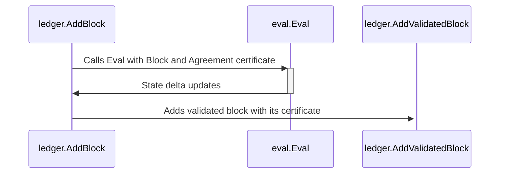
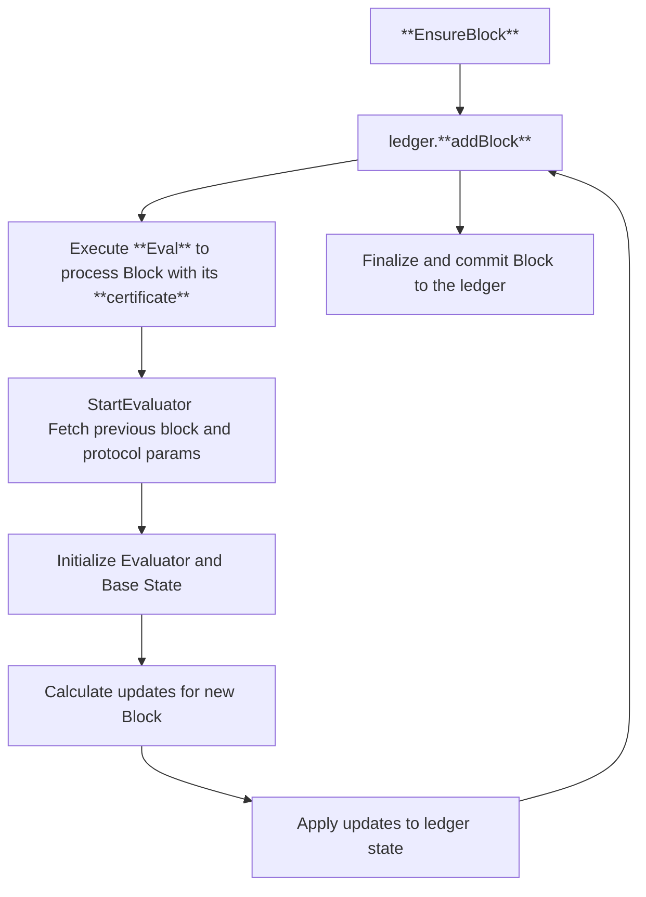

import ledgerImg from '@images/ledger_definition.png';

# Ledger Overview

The following is a non-normative overview of the Ledger component. In here we attempt to aid implementers and readers attempting to understand the component as well as bridge the gap between formal specification and the [reference implementation](https://github.com/algorand/go-algorand).
Whenever possible, we illustrate how specific subcomponents may be implemented, providing design patterns from the reference implementation. However, implementers are encouraged to come up with their own according to their language of preference.

Besides of the actual [Ledger](ledger.md) as an ordered sequence of [Blocks](ledger.md#blocks), several subcomponents are defined that aid in lookup, commitment, validation and assembly of said blocks and their corresponding certificates. Some constructs are built to speedup lookup of specific fields in these blocks for a given [round](ledger.md#round), or to get the state implicitly defined by an aggregate of their history up to a certain round. These are usuaully called _Trackers_, and we cover their usage and some implementation details in the [corresponding section](#trackers).

We also include the [_Transaction Pool_](#transaction-pool), a queue of transactions that plays a key role in the assembly of a new block, the [_Transaction Tail_](#transaction-tail) used for efficient deduplication and a dive on the new [_Rewards_](#rewards) system.

# A comment on blocks and block fields

Blocks are data structures that store information about state transitions in the blockchain. Each block consists of a header and a body.

- The header contains metadata such as details about the block itself, the current round, various hashes, rewards, etc. See the corresponding section in the [Algorand Ledger Formal Specification](ledger.md#blocks).
- The body holds transaction data and account updates.

Since multiple accounts can propose blocks, the block proposal chosen amongst all observed ones in a given round, is that which minimizes a priority function (described in detail in the [Algorand Byzantine Fault Tolerance Specification](abft.md)), making it essential to track the proposer. The Ledger package includes functions to effectively manage and interact with blocks.

We now provide, for each field in a block, a brief explanation and example values when applicable.\
For a formal specification of these fields, please refer to the [Ledger Formal Specification](ledger.md).

## Block Header Fields

Note that a Ledger may be minimally defined by a sequence of headers linked by the `prevhash` field, as
the header contains a cryptographic commitment to the contents of the `payset`. The following diagram illustrates this minimal Ledger:

<Image src={ledgerImg} alt='Minimal definition of the ledger' />

- Round\
  A 64-bit unsigned integer value that identifies the block's round.
  The genesis block is round 0. For all other cases, it must be equal to the round of the previous block plus one (that is, they must be sequential and monotonically increasing).
- Genesis Identifier and Genesis Hash\
  A string and a 32 byte array respectively.
  They ensure the block belongs to the correct blockchain.
  These match the genesis information of the chain's state.\
  E.g. for `mainnet` they should be: `mainnet-v1.0` and `wGHE2Pwdvd7S12BL5FaOP20EGYesN73ktiC1qzkkit8=` (base 64 encoding of the 32-byte array), whereas for `testnet` they should be: `testnet-v1.0` and `SGO1GKSzyE7IEPItTxCByw9x8FmnrCDexi9/cOUJOiI=` respectively.
- Upgrade State\
  Tracks the protocol upgrade State Machine. Also contains a link to the currently active version of the specs.

  - currentProtocol\
    A link to the commit in the [Algorand Formal Specification repository](https://github.com/algorandfoundation/specs) of the currently active protocol version.
  - nextProtocol\
    A link to the commit in the [Algorand Formal Specification repository](https://github.com/algorandfoundation/specs) of a new protocol version being voted on.
  - nextProtocolApprovals\
    An `uint64` integer that represents the vote count for a next protocol upgrade. Set to 0 unless a vote is ongoing.
  - nextProtocolSwitchOn\
    Round number at which the next protocol would be adopted. Set to 0 unless a vote is ongoing.
  - nextProtocolVoteBefore\
    Round number before which a vote for the next protocol version should be issued and computed. Set to 0 unless a vote is ongoing.

- Upgrade Vote\
  Represents the vote of a block proposer with regards to a new protocol version. It contains two fields:
  - upgradeApprove\
    A boolean flag that indicates an affirmative vote for the new protocol version. Usually set to `false` unless a protocol upgrade vote is ongoing.
  - upgradeDelay\
    Delay in rounds between approval of a new protocol version and its execution. Usually set to 0 unless an upgrade vote is ongoing.
- Timestamp\
  A a 64-bit signed integer. The timestamp is purely informational
  and states when a block was first proposed, expressed in the number of seconds
  since 00:00:00 Thursday, 1 January 1970 (UTC).\

  The difference between consecutive timestamps may not be greater than $t_{\delta}$ (defined in the [Formal Ledger Spec.](https://github.com/CoinFabrik/algorand-specs/blob/main/dev/ledger.md#ledger-parameters)).

> [!NOTE]
> In the reference implementation, this check is performed during block assembly. See the [MakeBlock(.)](https://github.com/algorand/go-algorand/blob/b6e5bcadf0ad3861d4805c51cbf3f695c38a93b7/data/bookkeeping/block.go#L543) function.

- Seed\
   A 32 byte array holding a random value used for cryptographic processes, including proposer selection.\
  The seed calculation algorithm (defined in the [ABFT Formal Spec.](abft.md#seed)) defines implicitly
  a sequence of seeds that alternate according to the seed lookup constant, and some round specific
  computations (that depend, amongst other things, on VRF calculations performed by the block proposer
  and the period in which the commited block is assembled). To see an example of a chain of valid seed computations, you may refer to the non-normative [Algorand Byzantine Fault Tolerance Overview](abft-overview.md#seed-calculation-overview).

- Reward Updates\
  A structure representing the reward state.\
  This is a currently disabled system just kept in place for legacy reasons. See the [section](#rewards) below for more details.
  It contains the following fields:

  - FeeSink\
    32 byte array holding a constant address.\
    For mainnet should be: `Y76M3MSY6DKBRHBL7C3NNDXGS5IIMQVQVUAB6MP4XEMMGVF2QWNPL226CA`. This is conceptually the address where all transaction fees are transfered.
  - RewardsPool\
    32 byte array holding a constant address.\
    For mainnet should be: `737777777777777777777777777777777777777777777777777UFEJ2CI`.
  - RewardsLevel\
    64-bit unsigned integer holding how many MicroAlgos have been distributed to each participant account since genesis.
  - RewardsRate\
    64-bit unsigned integer indicating the amount of new
    MicroAlgos added to the participation stake from rewards at the next round. Currently set to 0 for every block.
  - RewardsResidue\
    64-bit unsigned integer holding the leftover MicroAlgos after the
    distribution of $\frac{RewardsRate}{RewardUnits}$ for every reward unit in
    the next round.
  - RewardsRecalculationRound\
    64-bit unsigned integer holding the round at which the $RewardsRate$ will be
    recalculated.

- Transaction Commitment\
  Cryptographic commitments (hashes) to the block's transaction sequence. Internally it uses a [Merkle Tree](crypto.md#merkle-tree) and commits to the root of said tree. There is both a native [SHA512/256](crypto.md#sha512256) representation, and a [SHA256](crypto.md#sha256) hash.\
  [Link to reference implementation](https://github.com/algorand/go-algorand/blob/b6e5bcadf0ad3861d4805c51cbf3f695c38a93b7/data/bookkeeping/block.go#L591).

- Previous Hash\
  Cryptographic hash of the previous block header, linking blocks into a chain.
  For the genesis block, this is set to 0.

- Transaction Counter\
  64-bit unsigned integer indicating the next transaction to be committed
  after this block. It could start in 0 or 1000 at _genesis_ depending on the
  `AppForbidLowResources` consensus parameter.

- Proposer\
  Address of the account that proposed this block.

- Fees Collected\
  Total transaction fees collected in the block expressed in MicroAlgos.

- Proposer Payout\
  Actual amount in MicroAlgos paid to the proposer, including fees and
  potential bonuses.
  Subject to eligibility criteria and protocol limits. See the [rewards section](#rewards) for more details.

- Bonus Incentive\
  Potential extra reward for the proposer expressed in MicroAlgos.
  Subject to change during upgrades and to decrease slightly every million rounds.

- Participation Updates\
  A structure with two optional fields:

  - Expired Participation Accounts\
    List of account addresses whose participation keys expire at the end of this round.
    Limited to 32 accounts.

  - Absent Participation Accounts\
    List of online accounts addresses that should be converted to offline
    because they are not proposing blocks.
    Limited to 32 accounts.

## Genesis Block

In `data/bookkeping/genesis` there is the definition of the _Genesis_ object which defines an Algorand universe. This is defined by the initial account states (GenesisAllocation), the initial consensus protocol (GenesisProto), and the schema of the ledger.

There is also a _GenesisBalances_ type that contains the information needed to generate a new Ledger. It has Balances(map with the account data for each address), FeeSink(address where fees are stored), RewardsPool(where rewards are stored) and Timestamp(the time when the object is created).

This genesis block is necessary when loading the ledger.

## Block Verification

After the block is generated or a block is received from the network, a series of checks are done to verify the integrity of the block.

- Validate that all transactions are `Alive` (can be applied) for the round
- Validate that the payset has a good signature and the underlying transactions are properly constructed.
- Validate all transactions' signatures

# A comment on transactions and transaction fields

$\newcommand \GenesisID {\mathrm{GenesisID}}$
$\newcommand \GenesisHash {\mathrm{GenesisHash}}$
$\newcommand \RekeyTo {\mathrm{RekeyTo}}$

In this section we aim to clarify the transaction types. For the less immediately obvious we provide further explanation. For every transaction we provide an usage example, as well as invalid values when applicable.

The reference implementation of the transactions described can be found [here](https://github.com/algorand/go-algorand/blob/b6e5bcadf0ad3861d4805c51cbf3f695c38a93b7/data/transactions/transaction.go#L87-L109).

Each transaction represents a transition between two account states. The hash of all the fields of the transaction (including transaction-specific fields) is called $Hash(Tx)$

For a formal definition of all the fields, refer to the [Transactions section](https://github.com/algorandfoundation/specs/blob/master/dev/ledger.md#transactions) in the formal specification document.

Generally speaking, a transaction contains:

- The [_transaction type_](https://github.com/algorand/go-algorand/blob/b6e5bcadf0ad3861d4805c51cbf3f695c38a93b7/protocol/txntype.go#L28-L55): a short string (at most [7 characters](https://github.com/algorand/go-algorand/blob/b6e5bcadf0ad3861d4805c51cbf3f695c38a93b7/protocol/txntype.go#L26-L27)) that represents the type of the transaction: `pay`, `keyreg`, `acfg`, `axfer`, `afrz`, `appl`, `hb`, `stpf`.

> [!NOTE]
> In the case of the [go-algorand implementation](https://github.com/algorand/go-algorand/blob/b6e5bcadf0ad3861d4805c51cbf3f695c38a93b7/protocol/txntype.go#L54), the `unknown` transaction type signals an error.

- A `Header`, containing:
  - Sender\
    A [use case](https://github.com/algorand/go-algorand/blob/b6e5bcadf0ad3861d4805c51cbf3f695c38a93b7/data/transactions/transaction.go#L266-L278) is to check who signed the transaction. Any valid address may be used in this field.
  - Fee\
    The amount paid by the _sender_ to execute the transaction. Here is a [use case](https://github.com/algorand/go-algorand/blob/b6e5bcadf0ad3861d4805c51cbf3f695c38a93b7/data/transactions/verify/txn.go#L224) that calculates the total fee of a transaction group.
  - _First_ valid round $\mathsf{r_1}$ and _last_ valid round $\mathsf{r_2}$\
    The difference $\mathsf{r_1 - r_2}$ cannot be higher than 1000 in [the consensus v7](https://github.com/algorand/go-algorand/blob/b6e5bcadf0ad3861d4805c51cbf3f695c38a93b7/config/consensus.go#L938). Furthermore, $\mathsf{r_1}$ should be a round in the future when this transaction is sent.
  - Note (Optional)\
    Contains arbitrary data bytes. The size should be lower than the maximum allowed size (e.g. a string `Hello Algorand!`).
  - *Genesis identifier* (Optional)\
    A [use case](https://github.com/algorand/go-algorand/blob/b6e5bcadf0ad3861d4805c51cbf3f695c38a93b7/data/transactions/transaction.go#L307) is to check that the transaction targets a given network (e.g. `mainnet-v1.0`).
  - _Genesis hash_\
    Has the same functionality as the genesis _identifier_ (e.g. `wGHE2Pwdvd7S12BL5FaOP20EGYesN73ktiC1qzkkit8=`).
  - _Group_ (Optional)\
    A hash that specifies the hash of the transaction group if the transaction is part of one.
  - _Lease_ $x$ (Optional)\
    32-byte array that enforces mutual exclusion of transactions. If this field is set, it acquires a lease $x_S = (Sender, Lease)$ valid until the _last_ valid round $r_2$ passes. While the transaction maintains the lease no other transaction with the same lease can be confirmed. A [use case](https://github.com/algorand/go-algorand/blob/fcad0bbcc035a8d253cac08e4f90c9c813c40668/ledger/store/trackerdb/data.go#L844-L868) here is where the leases are added to the transaction tail (e.g. \[1 0 0 0 0 0 0 0 0 0 0 0 0 0 0 0 0 0 0 0 0 0 0 0 0 0 0 0 0 0 0 0\]). \
    An use case of a lease could be a batch of transactions with the same lease sent to the network when we only want one of those to be properly executed.
  - _Rekey to_\
    An _address_ (32-byte). If nonzero, the transaction will set the sender account's [spending key](partkey.md#root-keys) to this value. Therefore, any other transactions sent by the Sender account will now have to be signed by the corresponding secret spending/root key of the _address_.

## Transaction type examples

### Key Registration Transaction

_[Implementation reference](https://github.com/algorand/go-algorand/blob/b6e5bcadf0ad3861d4805c51cbf3f695c38a93b7/data/transactions/keyreg.go#L26-L36)_

```go
KeyregTxnFields {
    VotePK:          [1, 0, 0, ... , 0],
    SelectionPK:     [2, 0, 0, ... , 0],
    VoteKeyDilution: DefaultKeyDilution,  // 10000 in consensus v7
    VoteFirst:       10,
    VoteLast:        10010,
}
```

The example transaction above allows the participation key infrastructure to vote from round 10 to round 10010. This transaction can only be executed before round 10.

### Payment Transaction

_[Implementation reference](https://github.com/algorand/go-algorand/blob/b6e5bcadf0ad3861d4805c51cbf3f695c38a93b7/data/transactions/payment.go#L27-L38)_

```go
PaymentTxnFields {
	Receiver: 0x01 ,
	Amount: 100,
}
```

The example transaction above sends 100 microAlgos from the _Sender_ of the transaction to the receiver.

### Asset Config Transaction

_[Implementation reference](https://github.com/algorand/go-algorand/blob/b6e5bcadf0ad3861d4805c51cbf3f695c38a93b7/data/transactions/asset.go#L25-L35)_

In this transaction type the absence of definition for certain fields changes its behavior fundamentally.

- If the field `ConfigAsset` is not set, the transaction is the creation of a new asset with the given `AssetParams`.
- If the field `AssetParams` is not set, the transaction is the destruction of the asset with the given `ConfigAsset`.

#### Asset creation

```go
AssetConfigTxnFields {
    AssetParams: AssetParams {
       Total:         3000000,
       DefaultFrozen: false,
       Manager:       sender,
    },
},
```

The example transaction above creates a new asset with 3.000.000 units, the _sender_ as the manager and not frozen by default.

#### Asset destruction

```go
AssetConfigTxnFields {
	ConfigAsset: 1000,
},
```

The example transaction above destroys the asset with ID 1000.

#### Asset modification

```go
AssetConfigTxnFields {
	ConfigAsset: 1000,
    AssetParams: AssetParams {
       Manager: newManagerAddress,
    },
},
```

The example transaction above changes the manager of the asset with ID 1000 to the `newManagerAddress`.

### Asset Transfer Transaction

```go
AssetTransferTxnFields {
	XferAsset: 1000,
	AssetAmount: 20,
	AssetReceiver: receiver,
}
```

The example transaction above sends 20 units of the asset with ID `1000` belonging to the `sender` to the `receiver` address.

### Asset Freeze Transaction

```go
AssetFreezeTxnFields {
	FreezeAccount: [freeze]
	FreezeAsset: 1000
	AssetFrozen: true
}
```

The example transaction above freezes 1000 units of the asset with ID `1000` to the account `[freeze]`.

### Application Call Transaction

_[Implementation reference](https://github.com/algorand/go-algorand/blob/b6e5bcadf0ad3861d4805c51cbf3f695c38a93b7/data/transactions/application.go#L96-L170)_

For a more in-depth explanation about application calls, refer to the [AVM overview](avm-overview.md) and [AVM Formal Spec.](avm.md)

```go
ApplicationCallTxnFields {
    ApplicationID:     0,
    ApprovalProgram:   []byte{0x05},
    ClearStateProgram: []byte{0x05},
    ApplicationArgs: [][]byte{
       []byte("write"),
    },
    ExtraProgramPages: 0,
},
```

This transaction creates a new application. Each `ApplicationCall` transaction will execute the bytecode in `ApprovalProgram`, except when the `OnCompletion` field of the transaction is `ClearStateOC` (in that case, the bytecode in `ClearStateProgram` is executed). This program does not request more pages (this is needed if the program is larger than the value `MaxAppProgramLen` defined in the [consensus settings](https://github.com/algorand/go-algorand/blob/b6e5bcadf0ad3861d4805c51cbf3f695c38a93b7/config/consensus.go#L1286)). The program has access during the execution to the argument `write`, the first element in `ApplicationArgs`.

### State Proof Transaction

_[Implementation reference](https://github.com/algorand/go-algorand/blob/b6e5bcadf0ad3861d4805c51cbf3f695c38a93b7/data/transactions/stateproof.go#L28)_

For a more in-depth explanation about how State Proofs work, please refer to the [Algorand Cryptographic Primitive Specification](crypto.md#state-proofs).

```go
StateProofTxnFields: StateProofTxnFields {
  StateProofType: 0,
  StateProof:     StateProof{},
  Message: Message {
	  BlockHeadersCommitment: nil,
	  VotersCommitment:       nil,
	  LnProvenWeight:         0,
	  FirstAttestedRound:     257,
	  LastAttestedRound:      512,
	},
}
```

### Heartbeat Transaction

_[Implementation reference](https://github.com/algorand/go-algorand/blob/b6e5bcadf0ad3861d4805c51cbf3f695c38a93b7/data/transactions/heartbeat.go#L28-L49)_

```go
HeartbeatTxnFields {
	HbAddress: sender
    HbProof: HeartbeatProof {
       Sig: [64]byte{0x01},
    },
    HbSeed: Seed{0x02},
    HbVoteID: OneTimeSignatureVerifier{0x03},
    HbKeyDilution: 10,
},
```

This transaction tries to prove the account in `HbAddress` is online. `HbProof` is a signature of a specific block's seed using `HbAddress`'s [participation key](partkey.md#votingparticipation-keys).\
The last three fields (`HbSeed`, `HbVoteID` and `HbKeyDilution`) are included to allow early, concurrent check of the `HbProof`:

- The `HbSeed` is the block seed for the first valid block of the transaction. This is the value signed with `HbAddress`'s participation key.

- The `HbVoteID` should be the `HbAddress` account's current `VoteID`.

- The `HbKeyDilution` should be the `HbAddress` account's current `KeyDilution`.

# Ledger Trackers

The Ledger comes with a set of auxiliary constructs called _Trackers_.
Trackers are state machines that consume the blockchain as input, and evolve accordingly.
They are logically stateless: that is, they can reconstruct their state by consuming
all blocks from the beginning of the blockchain. As an optimization,
the current implementation allows trackers to store persistent state, so that they can
reconstruct their state quickly, without having to browse through every block from _genesis_.
They are used extensively in the codebase to maintain a read-efficient view of
several dimensions of the Ledger.

## Ledger Tracker API

An individual tracker exposes tracker-specific APIs for accessing the
state maintained by that tracker.\
[Link to reference implementation](https://github.com/algorand/go-algorand/blob/df0613a04432494d0f437433dd1efd02481db838/ledger/tracker.go#L156-L169).

Trackers have access to the ledger through a restricted API defined by
`ledgerForTracker`. This allows trackers to access the ledger's SQLite
database, to query for blocks, etc.

Conversely, the ledger accesses trackers through the `ledgerTracker`
interface:

- `loadFromDisk(ledgerForTracker)` initializes the state of the tracker.
  The tracker can use the `ledgerForTracker` argument to load persistent
  state (e.g., for the accounts database). The tracker can also query
  for recent blocks if it's state depends only on recent blocks
  (e.g., for the tracker that keeps track of the recently committed
  transactions).

- `newBlock(rnd, delta)` notifies the tracker about a new block being added to
  the ledger. `delta` describes the changes made by this block; this
  will be described in more details under [block evaluation](#block-evaluation-function) later.

- `committedUpTo(rnd)` tells the tracker that all blocks up to and
  including `rnd` are written to persistent storage. This call is
  important for trackers that store persistent state themselves, since
  the tracker must be able to restore its state correctly after a crash,
  and may need to answer queries about older blocks after a crash if
  some recent non-committed blocks are lost.

- `close()` frees up any resources held by this tracker.

The current implementation serializes all updates to the trackers with a reader-writer
lock.

The following is a list of the main trackers and their specific attributions:

- **Account tracker**\
  Used to track account state up to a specific round. Introduces the following functions:

  - `Lookup(round, address)` uses the account tracker to look up the
    state of the account `address` as of `round`.

  - `AllBalances(round)` uses the account tracker to return the set
    of all account states as of `round`. This is likely to be large,
    so it's intended for debug purposes only.

  - `Totals(round)` returns the totals of accounts for a specific `round`. Useful when querying for total account balance when computing [sortition](crypto.md#cryptographic-sortition).

- **Recent transactions Tracker**\
  Interacts with the [$TxTail$](#transaction-tail) to check quickly for a specific transaction commitment. It is able to look up transactions that have been part of a recent block by `txid`.

- **State Proof Verification Tracker**\
  Tracks the context required to verify State Proofs. More details on the relevance of this context can be found [here](crypto.md#state-proof-validity).

- **Voters Tracker**\
  Maintains the [vector commitment](crypto.md#vector-commitment) for the most recent commitments to online accounts for [State Proofs](crypto.md#state-proofs).
  This is not entirely a ledger tracker, as it only represents account updates, however it maintains the same interface.

- **catchpointTracker**\
  Keeps track of the catchpoint process. Refer to the [Algorand Infrastructure Overview](infrastructure-overview.md#node-catchup) for details on this special function of a node.

# Rewards

Algorand has had two reward distribution systems.

The first was based on the amount of Algos a given account held and was
distributed regardless of whether the account was "online" or "offline".
Currently, this system is disabled, and is kept only for legacy and retro-compatibility reasons.\
The `reward-rate` is set to zero in every block, therefore zeroing out reward allocation.\
[Link to reference implementation](https://github.com/algorand/go-algorand/blob/a81d54fb36c16c2f2f44cc5d153f358105a63317/data/bookkeeping/block.go#L337).

The new system grants a reward to the block proposer, meaning the account
must be marked as _online_ and participating in consensus.
To be eligible for these rewards the account should
send a key registration transaction without the `Nonparticipation` field set to true
and with a `fee` field value higher or equal to the `GoOnlineFee` consensus value (currently
set to 2 Algos).

Reward distribution is added in the finalizing stage of block creation (both in the old and the new system).

Links to reference implementation: [CalculateTotals(.)](https://github.com/algorand/go-algorand/blob/b6e5bcadf0ad3861d4805c51cbf3f695c38a93b7/ledger/eval/cow.go#L373) is the old (disabled) system, and [performPayout(.)](https://github.com/algorand/go-algorand/blob/b6e5bcadf0ad3861d4805c51cbf3f695c38a93b7/ledger/eval/eval.go#L1564) is the new incentive program.

## Staking Rewards

Algorand rewards block proposers who successfully add blocks to the blockchain,
provided they meet the minimum staking threshold.

Participants in consensus, known as validators or stakers, verify transactions
and propose new blocks. When a staker successfully proposes a block that gets
added to the chain, they earn rewards if they meet the eligibility criteria.

There are two ways to control malicious actors in this system: _Absenteeism_ control and
the issuance of periodical _Challenges_ to verify registered proposer status.

### Absenteeism

The probability of proposing blocks depends on the number of Algos
an account has in staking. The more Algos an account has, the more frequently
it should probabilistically propose blocks.

An account is considered absent when it exceeds $badLuckMultiplier$ (see the [Algorand Ledger Specification](ledger.md#parameters)) times the period in which it was statistically expected to propose.\
However, it is not immediately penalized; instead, it has a grace period of $\delta_b$ (the "balance lookback" constant defined in the [Algorand Byzantine Fault Tolerance Specification](abft.md#parameters)) additional blocks. During this time, if it is selected according to the
consensus protocol, it can still propose blocks.

If it successfully proposes blocks during this period, the account will be
considered _online_ again but will lose the right to receive rewards until
it registers a new [participation key](partkey.md#votingparticipation-keys) in the consensus protocol.

When finishing a block, an extra check is performed to assert the block proposer's eligibility for rewards.

<!-- Code embedded from https://github.com/algorand/go-algorand/blob/b6e5bcadf0ad3861d4805c51cbf3f695c38a93b7/ledger/ledgercore/validatedBlock.go#L86-L95 -->

```go
// FinishBlock completes the block and returns a proposable block.
func (ub UnfinishedBlock) FinishBlock(s committee.Seed, proposer basics.Address, eligible bool) bookkeeping.Block {
	// Look up the given proposer's balance by the end of this block
	propData, ok := ub.finalAccounts[proposer]
	// This proposer has closed their account and is not eligible for rewards
	if !ok || propData.MicroAlgos.IsZero() {
		eligible = false
	}
	return ub.blk.WithProposer(s, proposer, eligible)
}
```

In the embedded snippet taken from the reference implementation, an "almost finished" block is taken. The block is valid and has been built by `block assembly`, save for the single check performed in this function.
We take the final state of the proposer's account from the built block, and check that:

1. the proposer has not closed their account, and
2. their balance is not zero after observing the state changes made by the block being finished.

Eligibility is then returned through the `eligible` flag. Everything else inside the already constructed block remains the same.

### Challenges

Since a lower number of staked Algos results in a lower probability of
proposing blocks, the period can be very long. This could allow nodes with
low uptime, which negatively impact the consensus system, to participate
without penalty.

To combat this scenario, the network generates random challenges periodically.
Every [$\delta_c$ rounds](ledger.md#parameters) (currently set at 1000), a randomly selected
portion (roughly $\frac{1}{32}$, defined by the first 5 bits of the participant's address coinciding with the first 5 bits of the challenge round's [block seed](ledger.md#blocks)) of all online accounts are challenged. They must issue a
[heartbeat transaction](ledger.md#heartbeat-transaction) within the grace period (given by the interval $[r - \delta_{c_0}, r - \delta_{c_1}]$), or they
will be subject to suspension. With the current consensus parameters, nodes
can be statistically expected to be challenged daily. When suspended, accounts must issue a [keyreg transaction](ledger.md#key-registration-transaction) with the `GoOnlineFee` in order to receive block payouts again, so it becomes unprofitable for these low-stake nodes to operate with poor uptimes.

The challenge system operates locally without pushing information to the blocks
because it only uses the round number and the header of that round. Therefore,
it does not need to push information to the blockchain until the grace period
ends.

When the grace period expires, a protocol player proposing may push a list of accounts that failed the challenge to the block under the `AbsentParticipationAccounts` field.\
[Link to reference implementation](https://github.com/algorand/go-algorand/blob/b6e5bcadf0ad3861d4805c51cbf3f695c38a93b7/ledger/eval/eval.go#L1647).

### Heartbeat

The heartbeat service runs in parallel with the rest of the node once per block,
obtaining a list of accounts registered on the node that are being challenged
by the network. For each challenged account, it prepares a heartbeat transaction.

A Heartbeat transaction contains a signature `HbProof` of the blockseed
`HbSeed` of the transaction's `FirstValid` block under the participation
key of the account `HbAddress` in question. Note that the account being
heartbeat for is not the `Sender` of the transaction, which can be any address.
Signing a recent block seed makes it more difficult to pre-sign heartbeats that
another machine might send on your behalf. See the [Algorand Ledger Spec.](ledger.md#heartbeat-transaction) for the full semantics of this type of transaction.

It is relatively easy for a bad actor to emit Heartbeats for its accounts
without actually participating. However, there is no financial incentive to
do so. Pretending to be operational when offline does not earn block payouts.
Furthermore, running a server to monitor the blockchain to notice challenges
and gather the recent blockseed is not significantly cheaper than simply
running a functional node.

# Transaction Tail

The _Transaction Tail_ (refered throughout simply as $TxTail$) is a data structure responsible for deduplication and recent history lookups. It can be thought of as a rolling window of _recent_ transactions and block headers observed in a reduced history of rounds, optimized for lookup and retrieval.

[Link to reference implementation](https://github.com/algorand/go-algorand/blob/55011f93fddb181c643f8e3f3d3391b62832e7cd/ledger/txtail.go#L46).

It utilizes the following fields:

- `recentLeaseMap` is a map of `round -> (TXLease -> round)`; it saves the transaction leases by round in which they were observed, and the mapping contained as value uses `TXLease` as keys to store the round in which said lease expires.

- `blockHeaderData` contains the recent block header data. The expected availability range is $[Latest - MaxTxnLife, Latest]$, allowing $MaxTxnLife + 1$ (1001 with current parameters) rounds of lookback.

- `lastValidMap` is a mapping of `round -> (txid -> uint16)`; this allows looking up all of the transactions that expire in a given round. Inside the mapping kept as value, `txid`'s are mapped into 16 bit unsigned integers that represent the difference between the transaction's `lastValid` field and the round in which it was confirmed (note that `lastValid > confirmationRound` for all confirmed transactions).

- `lowWaterMark` is an unsigned 64 bit integer that represents a round number such that for any transactions where their `lastValid` field is `lastValid < lowWaterMark`, we can quickly assert that its not present in the $TxTail$.

The core functionality of the tail is a duplication check. The `checkDuplicate(.)` function in pseudocode works in the following way:

\begin{algorithm}
\caption{\texttt{checkDup($tx_r$, firstValid, lastValid, txid, txlease)}}
\begin{algorithmic}[1]

\If {\texttt{lastValid} $<$ \texttt{$TxTail$.lowWaterMark}}
\State \Return \texttt{txid is not in $TxTail$}
\EndIf

\If {\texttt{txlease} $\neq \emptyset$}
\State \texttt{firstChecked} $\gets$ \texttt{firstValid}
\State \texttt{lastChecked} $\gets$ \texttt{lastValid}

    \For {$r$ in [\texttt{firstChecked}, \texttt{lastChecked}]}
        \If {\texttt{txlease} $\in$ \texttt{recentLeaseMap[$tx_r$].txleases} $\land$ \texttt{currentRound} $\leq$ \texttt{txlease.expiration}}
            \State \Return \texttt{lease} is a duplicate
        \EndIf
    \EndFor

\EndIf

\If {\texttt{txid} $\in$ \texttt{txTail.lastValidMap[lastValid].txids}}
\State \Return \texttt{txid} is a duplicate transaction
\EndIf

\State \Return \texttt{nil}
\end{algorithmic}
\end{algorithm}

The algorithm receives four fields of a transaction: the transaction round $tx_r$, the transaction validity round fields `firstValid` and `lastValid`, the transaction identifier `txid`, and a `txlease` in case it is present.\
An early check is performed, where the `lowWatermark` field is used to quickly discard transactions that would be too far back in history and already purged out from the $TxTail$.\
In case a `txlease` is defined, the `recentLeaseMap` field is used to deduplicate by lease.\
After checking for the lease, the `lastValidMap` is used and the transaction is deduplicated through a lookup of `txid` by its `lastValid` round.\
If the transaction is not found on the tail, we can assume it is not a duplicate, as otherwise the validity interval would be too far back in the past for the transaction to be confirmed anyways.

# Transaction Pool

The _Transaction Pool_ ($TP$) is a Ledger component that maintains a queue of received transactions. For a succint formal definition of this construct, you may refer to the normative [Algorand Ledger Specification](ledger.md#transaction-pool). Here we attempt to present a more implementer-oriented definition of the construct, and take a page on the [reference implementation](https://github.com/algorand/go-algorand/blob/b6e5bcadf0ad3861d4805c51cbf3f695c38a93b7/data/pools/transactionPool.go#L52) in order to provide some clarification as to how it could be constructed and operated in a node.

The $TP$ implementation makes use of two distinct queues in order to aid the processes of pruning already observed transactions and block commitment. These are the _remembered_ and _pending_ queues, which we call $TP_{rq}$ and $TP_{pq}$.

Given a properly signed and well formed transaction group $t \in TP_{pq}$, we say that $t$ is _remembered_ when it is pushed into $TP_{rq}$ (only if its fees are sufficiently high and its state changes are consistent with the prior transactions in the $TP_{rq}$).

> [!NOTE]
> In the reference implementation, the $TP_{rq}$ is implemented as a two dimensional array, where each entry is an array of well formed signed transactions. As an added optimization and used throughout, a key-value store mapping (where keys are [transaction IDs](ledger.md#transaction) and values are the actual signed transactions) is maintained. Its contents reiterate those of the queue, and it adds some small pushing and deletion computational costs whenever the queue is updated, but provides _O(1)_ enqueued transaction lookup by ID. The $TP_{pq}$ is an optimization: it keeps groups of transactions ready for the next block assembly process. Given a multithreaded architecture and somehow tight deadlines, this allows for the remembered transaction queue $TP_{rq}$ to be pruned when observing a new block commitment in parallel to a new block being assembled.

The following is an abstracted away list of minimal functionalities that the $TP$ should be able to perform:

- `Prioritization(.)`, some kind of algorithm to prioritize which transactions get remembered and which ones get discarded, especially in scenarios where the $TP$ is congested (that is, receiving transactions faster than they can be processed and de-enqueued into a block or observed in a commited block and pruned). It could be as simple as a "first come, first serve" ordering. In the current implementation, a thresholded fee prioritization algorithm is employed.

- `Ingestion(.)` takes new transaction groups that will be _remembered_, that is, enqueued in the $TP_{rq}$. It also performs the required checks to ensure all groups are valid in themselves, and valid in the context of transactions already present in the $TP_{rq}$. When transactions are succesfully ingested, they are also added to any blocks currently being built by an active `Block Evaluator` (if there is one).

- `Update(.)`, performed on observation of a new block being commited. Here transactions $txn$ that:

  - have been already commited in a block (modelled by the `OnNewBlock(.)` function), or
  - whose [`LastValid`](ledger.md#transactions) field is such that $r > txn.LastValid$ (where $r$ is the current round), are pruned. Also fee prioritisation variables are updated.

- `BlockAssembly(.)`, to construct a new block's [`payset`](ledger.md#blocks) out of valid transaction groups dequeued out of the $TP$ before a deadline. A (pending) `Block Evaluator` processes transactions while the `BlockAssembly(.)` function interacts with it, stopping whenever the required time constraints are reached.

## Transaction Pool parameters and constants

Here we present a list of some relevant parameters that govern the behavior of the $TP$. Whenever we talk about "giving up", this means wrapping up the block being assembled, and computing all `payset` dependant metadata. In the case that there are leftover transactions in the $TP_{pq}$, the $TP$ saves them for the next block assembly.

- $txPoolSize$, a [consensus parameter](infrastructure-overview.md#node-configuration-values) that denotes the maximum size of the transaction pool queue. If it is full, any incoming transactions that are valid candidates to be enqueued are dropped. Set to 75000 in the current implementation.

- $feeThresholdMultiplier$, a dynamic parameter updated whenever a new block is observed. In normal $TP$ functioning, its 0. It grows whenever there is congestion in the queues, increasing the threshold fee for transactions to be accepted into the Pool. See the [update](#update) and [fee prioritization](#fee-prioritization) sections below.

- $expFeeFactor$, a [consensus parameter](infrastructure-overview.md#node-configuration-values) ($TxPoolExponentialIncreaseFactor$) factor used to spike up fee requirements according to the amount of full blocks pending in terms of $TP$ congestion. Currently set to 2 as a default in the consensus parameters.

- $feePerByte$, a dynamically computed parameter that represents the current minimum microAlgos per byte a transaction needs to pay in order to get into the pool. If the $TP$ is not under heavy load, the parameter is well below the $minTxnFee$, and this value dominates the threshold. In normal conditions, it is set to 0.

- $\delta_{assemblyDeadline}$, a [consensus parameter](infrastructure-overview.md#node-configuration-values) that provdes a deadline for the `BlockAssembly(.)` process to stop building a `payset`. Currently set to $\delta_{assemblyDeadline} = ProposalAssemblyTime = 0.5 \ seconds$.

- $\epsilon_{assemblyWait}$, extra time the `BlockAssembly(.)` algorithm waits past the deadline,
  before giving up. Set to 150 ms. in the [reference implementation](https://github.com/algorand/go-algorand).

- $expiredHistory$, a multiplier for the number of rounds with history of the count of expired transactions that we keep (this being $expiredHistory * MaxTxnLife$, which is $10 * 1000 = 10000$ with the current values). Keeping this history is useful for dynamically adjusting prioritisation according to fee structures (as it helps us detect congestion if we are letting too many enqueued transactions expire before being commited into a block). Currently set to 10.

- $\delta_{nb}$, a time constant that determines how long to wait for processing a new block that appears to be commited in the Ledger (used in the `Ingestion(.)` function). Currently set to 1 second.

The following two time constants are used to project an estimate of the time it would take to properly finish a block after 'giving up' on building a `payset`. These are used in conjunction with the $\delta_{assemblyDeadline}$ and $\epsilon_{assemblyWait}$ to enforce finalization of a block being built for a proposal.

- $generateBlockBaseDuration$, currently set to 2 ms.
- $generateBlockTransactionDuration$, currently set to 2155 ns.

## Fee Prioritization

When the $TP$ is congested, a fee prioritization algorithm is used to decide which transactions get enqueued and which get rejected.

The parameter $FeePerByte$ is dynamically calculated depending on the amount of pending blocks to be
evaluated.
The following function `computeFeePerByte()` illustrates how this computation works:

\begin{algorithm}
\caption{computeFeePerByte Function}
\begin{algorithmic}[1]
\Function{computeFeePerByte()}{}
\State \textit{feePerByte} := \textit{feeThresholdMultiplier}
\If{$\textit{feePerByte} = 0 \land \textit{TP.numPendingWholeBlocks} > 1 $}
\State \textit{feePerByte} := 1
\EndIf

    \For{\texttt{i} := 0 \textbf{ to } \texttt{$TP$.numPendingWholeBlocks}}
        \State $\textit{feePerByte} := \textit{feePerByte} \times \textit{TP.expFeeFactor}$
    \EndFor
    \State \Return \textit{feePerByte}

\EndFunction
\end{algorithmic}
\end{algorithm}

[Link to reference implementation](https://github.com/algorand/go-algorand/blob/b6e5bcadf0ad3861d4805c51cbf3f695c38a93b7/data/pools/transactionPool.go#L328).

The `computeFeePerByte()` function sets the $feePerByte$ to be equal to the $feeThresholdMultiplier$. This value is zero if there is no congestion in the transaction pool. Now, if there is any number of pending whole blocks enqueued in the $TP_{pq}$, the $feePerByte$ is set to 1. This is in order for the multiplication that follows to accumulate.\
Then, for each one of these whole blocks, we multiply the $expFeeFactor$ by the $feePerByte$ value.\
The resulting $feePerByte$ is then:

$$
feePerByte = max\{1, feeThresholdMultiplier\} * expFeeFactor^{TP.NumPendingBlocks}
$$

The $numPendingWholeBlocks$ is an unsigned integer that represents the number of uncommited full blocks present in the $TP_{pq}$.

## Update

The `Update()` functionality is triggered whenever a new block has been confirmed.
When processing a new block commitment, the $TP$ will get rid of all transactions that have been already commited, or whose `lastValid` field is invalidated.

[Link to reference implementation](https://github.com/algorand/go-algorand/blob/b6e5bcadf0ad3861d4805c51cbf3f695c38a93b7/data/pools/transactionPool.go#L532).

The update of fee prioritisation depends on the number of pending whole blocks enqueued.
The state of the $TP$ is updated as follows:

\begin{algorithm}
\caption{Update Function}
\begin{algorithmic}[1]
\Function{Update(newBlock b, StateDelta sd)}{}

\If{$TP_{pq}$ is empty or is outdated}
\State \textbf{switch} $TP$.numPendingWholeBlocks \textbf{:}
\State \hspace{1em} \textbf{Case} \texttt{0:}
\State \hspace{2em} $feeThresholdMultiplier := feeThresholdMultiplier / expFeeFactor$
\State \hspace{1em} \textbf{Case} \texttt{1:}
\State \Comment{intentionally left blank to maintain the value of \textit{feeThresholdMultiplier}}
\State \hspace{1em} \textbf{Case} \texttt{default:}
\State \hspace{2em} \textbf{If} $feeThresholdMultiplier = 0$
\State \hspace{3em} $feeThresholdMultiplier := 1$
\State \hspace{2em} \textbf{Else}
\State \hspace{3em} $feeThresholdMultiplier := feeThresholdMultiplier \times expFeeFactor$
\EndIf
\State $TP.prune(b, sd)$

\EndFunction
\end{algorithmic}
\end{algorithm}

The algorithm above performs an update to the $feeThresholdMultiplier$ if it detects that the pending queue is empty (there are no leftover transactions from the last assembly process) or outdated (the leftover transactions, assembled into full blocks, are from a round $r_p$ such that $r \geq r_p$, where $r$ is the current round).\
If the number of whole pending blocks is 0, we diminish the $feeThresholdMultiplier$ dividing it by the $expFeeFactor$. This could be because we experienced congestion for a certain period of time, but it is now over. If it continues to be so, eventually the $feeThresholdMultiplier$ quickly becomes marginal and tends to 0.\
If the number of whole pending blocks is 1, the $feeThresholdMultiplier$ is maintained at its current value.\
Otherwise ($numPendingWholeBlocks > 1$), the $feeThresholdMultiplier$ is set to 1 in case it was 0 (we are experiencing a sudden spike in congestion), and is multiplied by the $expFeeFactor$ in case it already had a value.\
Finally and after updating the fee prioritization mechanism, the $TP$ is pruned of transactions observed inside the commited block, and of transactions whose `lastValid` field is lower than the current round $r$ (which coincides with that of the block $b$ that was just observed).

## Ingestion

This function is responsible for selecting which transactions groups should be evaluated by
the pending [Block Evaluator](#block-commitment-and-the-block-evaluator) for inclusion in the next block and which ones should be postponed for later evaluation. When transactions are postponed, the system
ensures that their lifespan is sufficient for future execution; otherwise, they
are marked for removal if they exceed their validity period. Additionally, the
Transaction Pool verifies that the transaction fee meets the required threshold
to be eligible for execution.

[Link to reference implementation](https://github.com/algorand/go-algorand/blob/b6e5bcadf0ad3861d4805c51cbf3f695c38a93b7/data/pools/transactionPool.go#L440).

The following pseudocode snippet shows how the ingestion functionality could work.

\begin{algorithm}
\caption{Ingest Function}
\begin{algorithmic}[1]
\Function{ingest(txnGroup $tx$)}{}
\State ...
\If{$\textit{pendingBlockEvaluator} \ \textbf{is} \ nil$}
\State \Return no pending block evaluator
\EndIf

    \If{$\textit{recompute} \ \textbf{is} \ false $}
        \State \textit{latest} := \textit{Ledger.getLatestRound()}
        \State \textit{waitExpires} := \textit{Now() + $\delta_{nb}$}

        \While{$\textit{pendingBlockEvaluator.Round()} \leq \textit{latest} \land Now() < waitExpires$}
            \State give time to the $pendingBlockEvaluator$ to catch up
        \EndWhile
        \If{$\neg$checkSufficientFee($tx$)}
            \State \Return $tx$ discarded
        \EndIf
    \EndIf
    \State $\textit{$TP$.addToPendingBlockEvaluator(tx)}$
    \State ...

\EndFunction
\end{algorithmic}
\end{algorithm}

This algorithm needs a pending `Block Evaluator` already constructed and ready to ingest transaction groups. The `recompute` flag is used to check that the latest block has been processed by `Update()`. If not, a waiting scheme is introduced, governed by the $\delta_{nb}$ parameter (mentioned [above](#transaction-pool-parameters-and-constants)). The wait may be stopped early if the pending block evaluator catches up to the current round. Once caught up, a preliminary check is done to ensure the transaction group candidate $tx$ is properly funded (according to the fee prioritization algorithm described [above](#fee-prioritization)).\
At the end, an attempt to add the $tx$ to the pending block evaluator is performed. This functionally enqueues the transaction group in the $TP$ after evaluating it and performing all necessary checks.

## Block Assembly

The $TP$ is responsible of filling out the payset inside a block. We call this process `BlockAssembly(.)`.
The `BlockAssembly(.)` is a timed algorithm that works to control the pending block evaluator and stops ingestion once the required time constraints have been met. It accounts for various desynchronizations in between the $TP.round$ perceived current round (given by the `pendingBlockEvaluator`'s current round being assembled, which in turn depends on the amount of calls to the `Update()` function).\
The following pseudocode models how `BlockAssembly(.)` works on a high level:

\begin{algorithm}
\caption{AssembleBlock}
\begin{algorithmic}[1]
\Function{AssembleBlock($r$)}{}

\If{$TP.round < r-2$}
\State \Return assembleEmptyBlock($r$)
\EndIf

\If{$r < TP.round$}
\State \Return nil
\EndIf\\

\State $deadline := roundStartTime() + \delta_{assemblyDeadline}$

\State Wait until $deadline \ \lor \ (TP.round = r \ \land \ pendingBlockEvaluator$ is done)\\

\If{$pendingBlockEvaluator$ is not done}

    \If{$TP.round > r$}
        \State \Return nil \Comment{$r$ is behind $TP.round$}
    \EndIf

    \State $deadline := deadline + \epsilon_{assemblyWait}$
    \State Wait until $deadline \ \lor \ (TP.round = r \ \land \ pendingBlockEvaluator$ is done)\\

    \If{$pendingBlockEvaluator$ is not done}
        \State \Return assembleEmptyBlock($r$) \Comment{ran out of time}
    \EndIf

\If{$TP.round > r$}
\Comment requested round is behind transaction pool round
\State \Return nil\\
\hspace{2.6em} \textbf{else} \textbf{if} \ $TP.round = r - 1$
\State \Return assembleEmptyBlock($r$) \\
\hspace{2.6em} \textbf{else} \textbf{if} $TP.round < r$
\State \textbf{return} nil
\EndIf
\EndIf\\

\State \Return $pendingBlockEvaluator.block$

\EndFunction
\end{algorithmic}
\end{algorithm}

[Link to reference implementation](https://github.com/algorand/go-algorand/blob/b6e5bcadf0ad3861d4805c51cbf3f695c38a93b7/data/pools/transactionPool.go#L860).

The algorithm takes as input the round $r$ for which a block will be assembled. It
starts by checking the round the $TP$ is currently perceiving (which coincides with whatever the $pendingBlockEvaluator$ may be building). If this round is too far behind $r$, an _empty block_ is assembled and output. If on the contrary the $TP$ is ahead of the requested round $r$, the $TP$ has nothing to do as it appears to be ahead of the network.\
We then wait for the deadline, $\delta_{assemblyDeadline}$, to finish. Before this time is done, the $pendingBlockEvaluator$ should signal it has finished assemblying a block in the background (by way of `Ingestion()`) and it is caught up to the round $r$.\
If that is not the case, we go through another series of checks. In the rare case that the $TP$ got ahead, again it should abort until the network is caught up. Otherwise we wait an extra $\epsilon_{assemblyWait}$ time.\
After the extra wait, we perform a series of very similar checks, with the caveat that this time, if we are too far behind, there is no more time to wait and the $TP$ exits.\
Once done with the waiting algorithm, and if we got to the end without returning an empty block or a null value, the $pendingBlockEvaluator$ returns the assembled block.

# Block commitment and the Block Evaluator

[Link to the reference implementation's entrypoint for block commitment](https://github.com/algorand/go-algorand/blob/b6e5bcadf0ad3861d4805c51cbf3f695c38a93b7/ledger/eval/eval.go#L2060).

Block commitment is the process by which a valid block is added to the Ledger.

In order to commit, verify, and assemble blocks, a structure called a `Block Evaluator` is utilized. A `Block Evaluator` is capable of evaluating transactions in a block's body one by one (or add transactions into an already existing unfinished `payset`), keep track of state changes produced by them, and assert if a block is invalid because one of its transactions is invalid in the context of the block (or discard the transaction and keep adding others in an assembly scenario).\
[Link to reference implementation](https://github.com/algorand/go-algorand/blob/b6e5bcadf0ad3861d4805c51cbf3f695c38a93b7/ledger/eval/eval.go#L672).

After a block has been certificated, the ledger is in charge of succesfully adding the block to the blockchain. The basic flow of the block addition process is:



The evaluation of the block is done after the certificate has been computed. The Ledger will then validate the block, add it, and apply the changes produced as `State Deltas` in the validation process to the Ledger state. The block is then finalized and committed to the Ledger.



The `StartEvaluator` function initializes and returns the `Block Evaluator`, which is responsible for processing the block and updating the Ledger state. The evaluator fetches the previous block and protocol parameters to ensure consistency and correctness.

[Link to reference implementation](https://github.com/algorand/go-algorand/blob/b6e5bcadf0ad3861d4805c51cbf3f695c38a93b7/ledger/eval/eval.go#L718).

The minimal interface for a `BlockEvaluator` could be divided into three main functions:

- Construct a new block, based on a pool of potential transactions $TP_{rq}$ that will be valid. This starts by creating the `BlockEvaluator` object with a `StartEvaluator()` function as referenced above. Then it ingests a series of transactions, keeping track of state changes. Lastly it finalizes the block, deferring the setup of a proposer to this last stage.

- Validate a block. Under the hood, it executes the same logic as evaluation.
  [Link to reference implementation](https://github.com/algorand/go-algorand/blob/b6e5bcadf0ad3861d4805c51cbf3f695c38a93b7/ledger/ledger.go#L978).

- Evaluate a block to produce a `State Delta` describing the changes that this block implies for the Ledger and all of the trackers.

## State Delta

A _State Delta_ is a representation of a change of state in the ledger, from one round to the immediate next. It is a data structure to efficiently update all state trackers after block commitment,
and facilitate block assembly and validation by recording only modified parts of the state. For a formal definition of this object, refer to the [Algorand Ledger Specification](ledger.md#state-deltas).

[Link to reference implementation](https://github.com/algorand/go-algorand/blob/a81d54fb36c16c2f2f44cc5d153f358105a63317/ledger/ledgercore/statedelta.go#L92).

In its current implementation, a _State Delta_ contains the following fields:

- A set of [`Account State Deltas`](ledger.md#account-state) that represent how accounts impacted by the `State Delta` were modified.

- `KVMods`, a mapping `(string -> KvValueDelta)` of modified [Key Value Store](ledger.md#keyvalue-stores) entries.

- `Txids`, a mapping `(txid -> uint)`. Holds new transaction ID's (useful for loading the $TxTail$ and for updating the transaction counter), mapped to their `LastValid` fields.

- `Txleases`, a mapping `(TxLease -> uint64)`, new transaction leases for the $TxTail$ mapped to their expiration rounds.

- `Creatables`, a mapping holding all new 'creatable' entities' data (Applications and Assets). Valid for creations as well as deletions.

- `*Hdr`, a read only view of the new block header.

- `StateProofNext`, represents a modification on the `StateProofNextRound` field in the block header. If the block contains
  a valid state proof transaction, this field will contain the next round for a state proof.
  otherwise it will be set to 0.

- `PrevTimestamp`, an integer that holds the previous block timestamp.

- `AccountTotals`, the account totals reflecting the changes in this `StateDelta`.

# Appendix

## Copy On Write implementation strategy

<!-- Code embedded from https://github.com/algorand/go-algorand/blob/b6e5bcadf0ad3861d4805c51cbf3f695c38a93b7/ledger/eval/cow.go#L33-L40 -->

```go
//   ___________________
// < cow = Copy On Write >
//   -------------------
//          \   ^__^
//           \  (oo)\_______
//              (__)\       )\/\
//                  ||----w |
//                  ||     ||
```

Copy On Write (COW) is an optimization strategy used to efficiently handle modifications to data structures. The core idea behind COW is to delay the copying of an object until it is modified, ensuring that multiple processes can share the same object until a write operation is necessary.

The COW structure is part of the [Block Evaluator](#block-commitment-and-the-block-evaluator).

In the reference implementation, the `roundCowState` structure implements COW by managing [State Deltas](#state-delta). It only creates copies of the state when modifications are needed, thereby optimizing memory usage and performance during state transitions in the blockchain.

[Link to reference implementation](https://github.com/algorand/go-algorand/blob/b6e5bcadf0ad3861d4805c51cbf3f695c38a93b7/ledger/eval/cow.go#L76).
