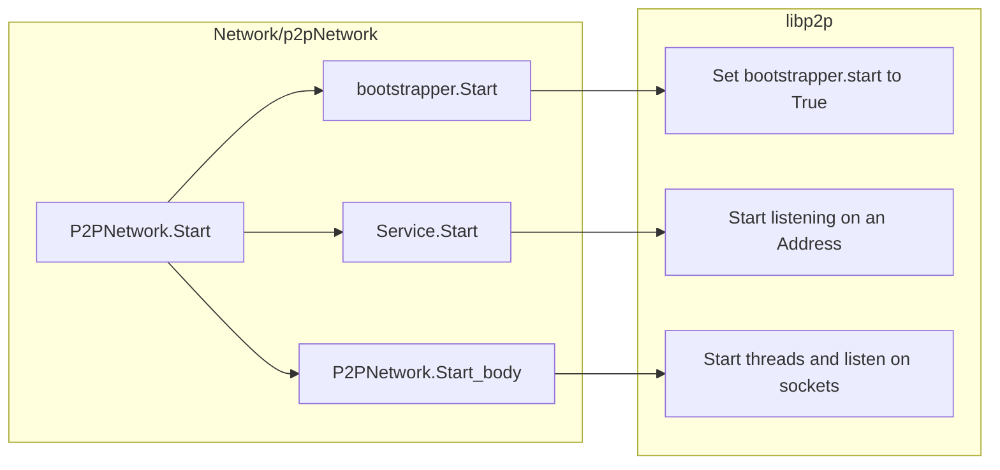
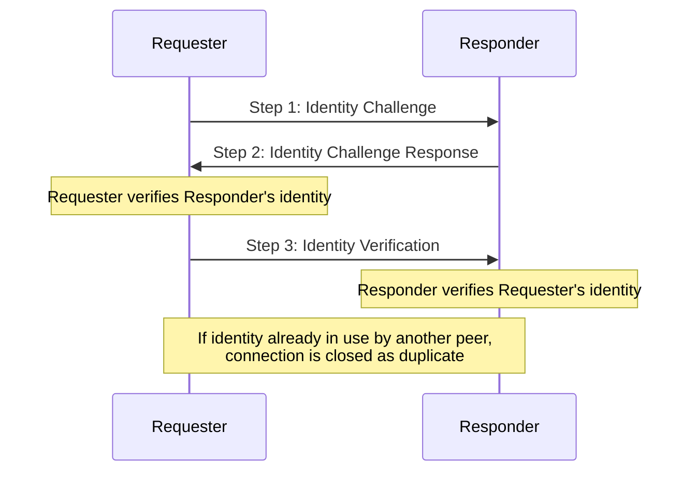
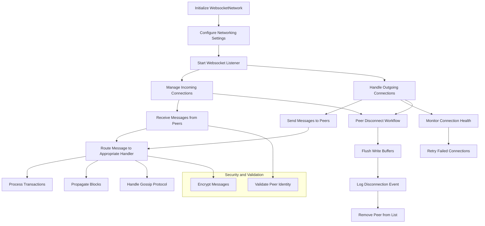

> [!NOTE]
> The information contained in this document is non-normative.

# Algorand Network Layer Overview

This is a non-normative overview of the Algorand Network Layer, responsible for handling connections and message transport between nodes. The purpose of this document is to provide a detailed overview of all the necessary components and their interactions, aiding the reader's understanding of the infrastructure, and providing implementators with a solid foundation to instrument networking.
The basis for everything that follows is the official Algorand Node written in Go.

There are currently two independant network implementations:
a legacy one based in a mesh of websockets, and a newer
P2P implementation that leverages the libp2p networking
library. There is also a third hybrid option, that instantiates
the constructs to keep both versions running in parallel and
interoperates in between them accordingly.

We first go over some constructs that are general to both implementations, defining the notation used throughout, and then dive deeper into each one, their components and interactions. When sensible, we include implementation-specific notes in order to hint at possible desirable patterns or optimizations, although the impact of these may vary according to the language of choice.

# Notation and data structures

## Peer

We define a $Peer$ as a generic network actor. This construct provides a way to refer indistinctly and keep track of all neighboors with inbound or outbound connections, that may relay or broadcast messages. Each of these represent a fully operational Algorand node with a working Network Layer.\
A specific $Peer_t$, with $t \in \{ws, p2p, h\}$ is a peer whose Network Layer implements a specific type of network.

A $Peer$ has all the necesary contents to communicate with the node it represents (the HTTP client, the URL that represents the node, and a lot of metadata necessary to maintain an active connection).\
[Link to reference implementation](https://github.com/algorand/go-algorand/blob/df0613a04432494d0f437433dd1efd02481db838/network/wsPeer.go#L177).

## Protocol Tags

A protocol tag (from now on simply $tag$) is a short 2 byte string that marks a type of message. These also should not contain
a comma as lists of tags are modeled by comma separated tag handles.

Protocol tags play a key role in routing messages to appropriate handlers, as well
as incorporating priority notions. Conceptually, they determine the purpose of an incoming data packet inside the overarching protocol.

Possible values for the $tag$ type are

- `"AV"` for Agreement Vote (a protocol vote; see the [ABFT Spec.](abft.md#votes)).
- `"MI"` for Message of Interest.
- `"MS"` for Message Digest Skip.
- `"NP"` for Network Priority Response.
- `"NI"` for Network ID Verification.
- `"PP"` for Proposal Payload (see proposals in the [ABFT Spec.](abft.md#proposals)).
- `"SP"` for State Proof Signature (see [here](crypto.md#signature-format)).
- `"TS"` for Topic Message Response.
- `"TX"` for Transaction (see the [Ledger Spec.](ledger.md#transactions)).
- `"UE"` for Unicast Catchup Request. Messages used to request blocks by a $Peer$ when serving blocks for the catchup service. For more information on this service you may refer to the [Algorand Infrastructure Overview](infrastructure-overview.md#node-catchup).
- `"VB"` for Vote Bundle (a protocol bundle; see the [ABFT Spec.](abft.md#bundles)).

- `"pi"` for Ping. Removed in 3.2.1. Included for completeness.
- `"pj"` for Ping Reply. Removed in 3.2.1. Included for completeness.

`AgreementVoteTag` and`ProposalPayloadTag` (`"AV"` and `"PP"` respectively) are the only ones considered of "high priority". This means they impact internal ordering in the broadcast queue, as they get discriminated by a priority function.\
[Link to reference implementation](https://github.com/algorand/go-algorand/blob/ce9b2b0870043ef9d89be9ccf5cda0c42e3af70c/network/gossipNode.go#L140C6-L140C21).

Messages tagged with `AV` or `PP` get pushed into a separate high priority queue.
[Link to reference implementation](https://github.com/algorand/go-algorand/blob/ce9b2b0870043ef9d89be9ccf5cda0c42e3af70c/network/wsNetwork.go#L388).

Every single $tag$ has a corresponding set of handlers that are described in detail in the [Message Handlers section](#message-handlers) below.

## Messages (incoming and outgoing)

Algorand nodes communicating inside the Network Layer exchange _messages_. A _message_ is a data structure with a payload (a set of bytes) and metadata that serves to authenticate, route, and interpret the message being received or sent out.

We define a deserializable object _incoming message_ $M*$, as an object that represents a message arriving from some peer in the network.\
An incoming message $M*$ provides the following fields:

- `Sender`, a clearly identified $Peer$ indicating the sending party.

- `ProtocolTag`, a tag (see [above](#protocol-tags)), used to univocally identify the type of message and route to the correct message handler to produce an outgoing message.

- `payload`, an array of bytes representing the content of the message. See the [constants section](#constants) for details on size constraints.

- `network`, the type of network the message originated from ([websocket](#websocket-network-definition) or [p2p](#p2p-network-definition)).

- `received`, a 64-bit integer representing time of reception of this message in nanoseconds since Epoch.

After an incoming message $M*$ is received, and the appropriate message handler has processed it, an outgoing message is produced.

We define a deserializable object incoming message $M*$, as an object that represents a message arriving from some peer in the network.

An incoming message $*M$ provides the following fields

- `sender Peer`
- `tag protocol.Tag`
- `data []byte`
- `err error`
- `net GossipNode`\
  A $GossipNode$ abstract typed network definition.

- `protocolTag`, a tag (see [above](#protocol-tags)). Similarly to incoming messages, it marks how the receiving $Peer$ (in case of outgoing action) should interpret and handle the produced message.

- `payload`, an array of bytes representing the content of the message. See the [constants section](#constants) for details on size constraints.

- `topics`, a list of key-value pairs of the form `string -> bytes[]` for topics that this message serves. Used in certain specific scenarios (mostly for the catchup service). The possible topic keys are:

  - General purpose:
    `"RequestHash"`, to respond to requests for specific topics.
    `"Error"`, used for passing an error message on a specific topic request.
  - For the Block Service:
    - `"roundKey"`, the block round-number topic-key in the request.
    - `"requestDataType"`, the data-type topic-key in the request (e.g. block, cert, block+cert).
    - `"blockData"`, for serving block data.
    - `"certData"`, for serving block certificate data.
    - `"blockAndCert"`, for block and certificate data requests.
    - `"latest"`, for serving the latest round.

- `disconnectReason`, only when the `Action` calls for a `Disconnect` as a `ForwardingPolicy`. An enumeration on the reasons to disconnect from a given $Peer$ (the sender of the message) may be found right below.


A $ForwardingPolicy$ is defined as an enumeration, and it indicates what action should be taken for a given outgoing message $*M$. For clarity of
It may take any of the following values:

- `Ignore`, to discard the message (don't forward).

- `Disconnect`, to disconnect from the $Peer$ that sent the message $M*$ that, when processed, returned this response.

- `Broadcast`, to forward this message to everyone (except the original sender).

- `Respond`, to reply to the sender directly.

- `Accept`, to accept for further processing after successful validation.

When an incoming message $M*$ is received, a handler function is called according to its type. It will process the message according to the `protocolTag` field, and then will produce an outbound message $*M$ with information on how to proceed further.

A message handler function $MessageHandler(M* \ inMsg)$ is then defined as a function that
takes an incoming message as input and transforms it into an outgoing message.

$$
MessageHandler(*M) = M*
$$

From now on we define $MH_t$ to denote a handler function, with the subscript $t$ being used
to identify the specific handler function used (according to the input inbound message `protocolTag`).

Similarly to handler functions, we define $MessageValidatorHandler$ functions as functions that perform syncrhonous validation of a message before processing it in the same way as
regular $MessageHandler$ functions. We denote $MessageValidatorHandler$ functions as $M^v_h$.
The prototype of message validator handlers is similar to regular handlers.

> [!NOTE]
> The reference implementation defines a helper function, `Propagate(msg IncomingMessage)`, which represents the very common case of a message handler re-propagating an incoming message. Internally it creates an outgoing message, with the same data as the received message and the action to `Broadcast`.
>
> ```go
> func Propagate(msg IncomingMessage) OutgoingMessage {
> 	return OutgoingMessage{Action: Broadcast, Tag: msg.Tag, Payload: msg.Data, Topics: nil}
> }
> ```

# Parameters

## Constants

### Phonebook

| Name                      | Value                 | Description                                                                                                   | Link to implementation                                                                                                                              |
| ------------------------- | --------------------- | ------------------------------------------------------------------------------------------------------------- | --------------------------------------------------------------------------------------------------------------------------------------------------- |
| `getAllAddresses`         | 2147483647 (MaxInt32) | How many addresses the phonebook actually has                                                                 | [getAllAddresses](https://github.com/algorand/go-algorand/blob/df0613a04432494d0f437433dd1efd02481db838/network/p2p/peerstore/peerstore.go#L36)     |
| `PhoneBookEntryRelayRole` | 1                     | Used for all the relays that are provided either via the algobootstrap SRV record or via a configuration file | [PhoneBookEntryRelayRole](https://github.com/algorand/go-algorand/blob/df0613a04432494d0f437433dd1efd02481db838/network/phonebook/phonebook.go#L40) |
| `PhoneBookEntryArchival`  | 2                     | Used for all the archival nodes that are provided via the archive SRV record                                  | [PhoneBookEntryArchival](https://github.com/algorand/go-algorand/blob/df0613a04432494d0f437433dd1efd02481db838/network/phonebook/phonebook.go#L43)  |

### Performance monitoring

| Name                              | Value        | Description                     | Link to implementation                                                                                                                              |
| --------------------------------- | ------------ | ------------------------------- | --------------------------------------------------------------------------------------------------------------------------------------------------- |
| `pmPresyncTime`                   | 10 (seconds) | Used for performance monitoring | [pmPresyncTime](https://github.com/algorand/go-algorand/blob/b7b3e5e3c9a83cbd6bd038f4f1856039d941b958/network/connPerfMon.go#L40)                   |
| `pmSyncIdleTime`                  | 2 (seconds)  | Used for performance monitoring | [pmSyncIdleTime](https://github.com/algorand/go-algorand/blob/b7b3e5e3c9a83cbd6bd038f4f1856039d941b958/network/connPerfMon.go#L41)                  |
| `pmSyncMaxTime`                   | 25 (seconds) | Used for performance monitoring | [pmSyncMaxTime](https://github.com/algorand/go-algorand/blob/b7b3e5e3c9a83cbd6bd038f4f1856039d941b958/network/connPerfMon.go#L42)                   |
| `pmAccumulationTime`              | 60 (seconds) | Used for performance monitoring | [pmAccumulationTime](https://github.com/algorand/go-algorand/blob/b7b3e5e3c9a83cbd6bd038f4f1856039d941b958/network/connPerfMon.go#L43)              |
| `pmAccumulationTimeRange`         | 30 (seconds) | Used for performance monitoring | [pmAccumulationTimeRange](https://github.com/algorand/go-algorand/blob/b7b3e5e3c9a83cbd6bd038f4f1856039d941b958/network/connPerfMon.go#L44)         |
| `pmAccumulationIdlingTime`        | 2 (seconds)  | Used for performance monitoring | [pmAccumulationIdlingTime](https://github.com/algorand/go-algorand/blob/b7b3e5e3c9a83cbd6bd038f4f1856039d941b958/network/connPerfMon.go#L45)        |
| `pmMaxMessageWaitTime`            | 15 (seconds) | Used for performance monitoring | [pmMaxMessageWaitTime](https://github.com/algorand/go-algorand/blob/b7b3e5e3c9a83cbd6bd038f4f1856039d941b958/network/connPerfMon.go#L46)            |
| `pmUndeliveredMessagePenaltyTime` | 5 (seconds)  | Used for performance monitoring | [pmUndeliveredMessagePenaltyTime](https://github.com/algorand/go-algorand/blob/b7b3e5e3c9a83cbd6bd038f4f1856039d941b958/network/connPerfMon.go#L47) |
| `pmDesiredMessegeDelayThreshold`  | 50 (seconds) | Used for performance monitoring | [pmDesiredMessegeDelayThreshold](https://github.com/algorand/go-algorand/blob/b7b3e5e3c9a83cbd6bd038f4f1856039d941b958/network/connPerfMon.go#L48)  |
| `pmMessageBucketDuration`         | 1 (seconds)  | Used for performance monitoring | [pmMessageBucketDuration](https://github.com/algorand/go-algorand/blob/b7b3e5e3c9a83cbd6bd038f4f1856039d941b958/network/connPerfMon.go#L49)         |

### Message sizes

| Name                        |       Value       | Description                                      | Link to implementation                                                                                                                    |
| --------------------------- | :---------------: | ------------------------------------------------ | ----------------------------------------------------------------------------------------------------------------------------------------- |
| AgreementVoteTagMaxSize     |       1228        | Maximum size of an `AgreementVoteTag` message    | [AgreementVoteTagMaxSize](https://github.com/algorand/go-algorand/blob/df0613a04432494d0f437433dd1efd02481db838/protocol/tags.go#L54)     |
| MsgOfInterestTagMaxSize     |        45         | Maximum size of a `MsgOfInterestTag` message     | [MsgOfInterestTagMaxSize](https://github.com/algorand/go-algorand/blob/df0613a04432494d0f437433dd1efd02481db838/protocol/tags.go#L57)     |
| MsgDigestSkipTagMaxSize     |        69         | Maximum size of a `MsgDigestSkipTag` message     | [MsgDigestSkipTagMaxSize](https://github.com/algorand/go-algorand/blob/df0613a04432494d0f437433dd1efd02481db838/protocol/tags.go#L60)     |
| NetPrioResponseTagMaxSize   |        850        | Maximum size of a `NetPrioResponseTag` message   | [NetPrioResponseTagMaxSize](https://github.com/algorand/go-algorand/blob/df0613a04432494d0f437433dd1efd02481db838/protocol/tags.go#L63)   |
| NetIDVerificationTagMaxSize |        215        | Maximum size of a `NetIDVerificationTag` message | [NetIDVerificationTagMaxSize](https://github.com/algorand/go-algorand/blob/df0613a04432494d0f437433dd1efd02481db838/protocol/tags.go#L66) |
| ProposalPayloadTagMaxSize   |      5250313      | Maximum size of a `ProposalPayloadTag` message   | [ProposalPayloadTagMaxSize](https://github.com/algorand/go-algorand/blob/df0613a04432494d0f437433dd1efd02481db838/protocol/tags.go#L70)   |
| StateProofSigTagMaxSize     |       6378        | Maximum size of a `StateProofSigTag` message     | [StateProofSigTagMaxSize](https://github.com/algorand/go-algorand/blob/df0613a04432494d0f437433dd1efd02481db838/protocol/tags.go#L73)     |
| TopicMsgRespTagMaxSize      | 6 \* 1024 \* 1024 | Maximum size of a `TopicMsgRespTag` message      | [TopicMsgRespTagMaxSize](https://github.com/algorand/go-algorand/blob/df0613a04432494d0f437433dd1efd02481db838/protocol/tags.go#L79)      |
| TxnTagMaxSize               |     5_000_000     | Maximum size of a `TxnTag` message               | [TxnTagMaxSize](https://github.com/algorand/go-algorand/blob/df0613a04432494d0f437433dd1efd02481db838/protocol/tags.go#L97)               |
| UniEnsBlockReqTagMaxSize    |        67         | Maximum size of a `UniEnsBlockReqTag` message    | [UniEnsBlockReqTagMaxSize](https://github.com/algorand/go-algorand/blob/df0613a04432494d0f437433dd1efd02481db838/protocol/tags.go#L100)   |
| VoteBundleTagMaxSize        | 6 \* 1024 \* 1024 | Maximum size of a `VoteBundleTag` message        | [VoteBundleTagMaxSize](https://github.com/algorand/go-algorand/blob/df0613a04432494d0f437433dd1efd02481db838/protocol/tags.go#L104)       |
| MaxMessageLength            | 6 \* 1024 \* 1024 | Maximum lenght of a message                      | [MaxMessageLength](https://github.com/algorand/go-algorand/blob/df0613a04432494d0f437433dd1efd02481db838/network/wsPeer.go#L45)           |
| averageMessageLength        |     2 \* 1024     | Average lenght of a message (base allocation)    | [averageMessageLength](https://github.com/algorand/go-algorand/blob/df0613a04432494d0f437433dd1efd02481db838/network/wsPeer.go#L46)       |

# -------------------------

# Message Handlers

Each incoming message is deferred to the correct message handler given its $tag$.


The message handler will then process the message
and decide on a $ForwardingPolicy$. See the definition of this data type for further details.


The handler contains the logic for handling incoming messages and managing a $readBuffer$. It provides a routine ($messageHandlerThread$) for reading incoming messages and calling handlers.

```go
type msgHandler struct {
   ctx        context.Context
   log        logging.Logger
   config     config.Local
   readBuffer chan IncomingMessage
   Multiplexer
}
```

[Link to reference implementation]()


Multiplexer sorts incoming messages by $tag$ value and passes them to the relevant message handler for that type of message. These are the handlers defined throughout the node code and registered using the `RegisterHandler()` function.

- AV for Agreement Vote
  - [Handler's implementation starting point](https://github.com/algorand/go-algorand/blob/0bc3d7e4750db8f98c5dd66f3377147532021c62/agreement/gossip/network.go#L99)
  - [Handler's registration](https://github.com/algorand/go-algorand/blob/0bc3d7e4750db8f98c5dd66f3377147532021c62/agreement/gossip/network.go#L89)
- MI for Message of Interest
  - [Context](https://github.com/algorand/go-algorand/blob/0bc3d7e4750db8f98c5dd66f3377147532021c62/network/wsPeer.go#L633)
  - [Handler's implementation](https://github.com/algorand/go-algorand/blob/0bc3d7e4750db8f98c5dd66f3377147532021c62/network/wsPeer.go#L714)
- MS for Message Digest Skip, it is hardcoded
  - [Context](https://github.com/algorand/go-algorand/blob/0bc3d7e4750db8f98c5dd66f3377147532021c62/network/wsPeer.go#L669)
  - [Handler's implementation](https://github.com/algorand/go-algorand/blob/0bc3d7e4750db8f98c5dd66f3377147532021c62/network/wsPeer.go#L760)
- NP for Net Priority Response
  - [Handler's implementation](https://github.com/algorand/go-algorand/blob/0bc3d7e4750db8f98c5dd66f3377147532021c62/network/netprio.go#L35)
  - [Handler's registration](https://github.com/algorand/go-algorand/blob/0bc3d7e4750db8f98c5dd66f3377147532021c62/network/wsNetwork.go#L710)
- NI for Net ID Verification
  - [Handler's implementation](https://github.com/algorand/go-algorand/blob/0bc3d7e4750db8f98c5dd66f3377147532021c62/network/netidentity.go#L405)
  - [Handler's registration](https://github.com/algorand/go-algorand/blob/0bc3d7e4750db8f98c5dd66f3377147532021c62/network/wsNetwork.go#L702)
- PP ProposalPayloadTag
  - [Handler's implementation](https://github.com/algorand/go-algorand/blob/0bc3d7e4750db8f98c5dd66f3377147532021c62/agreement/gossip/network.go#L103)
  - [Handler's registration](https://github.com/algorand/go-algorand/blob/0bc3d7e4750db8f98c5dd66f3377147532021c62/agreement/gossip/network.go#L89)
- SP for State Proof Sig
  - [Handler's implementation](https://github.com/algorand/go-algorand/blob/0bc3d7e4750db8f98c5dd66f3377147532021c62/stateproof/builder.go#L312)
  - [Handler's registration](https://github.com/algorand/go-algorand/blob/0bc3d7e4750db8f98c5dd66f3377147532021c62/stateproof/worker.go#L116)
- TS Topic Message Response
  - [Harcoded implementation](https://github.com/algorand/go-algorand/blob/0bc3d7e4750db8f98c5dd66f3377147532021c62/network/wsPeer.go#L641)
- TX Transaction
  - [Handler's implementation](https://github.com/algorand/go-algorand/blob/0bc3d7e4750db8f98c5dd66f3377147532021c62/data/txHandler.go#L735)
  - [Handler's registration](https://github.com/algorand/go-algorand/blob/0bc3d7e4750db8f98c5dd66f3377147532021c62/data/txHandler.go#L262)
- UE Uni Catchup Req
  - [Handler's implementation](https://github.com/algorand/go-algorand/blob/0bc3d7e4750db8f98c5dd66f3377147532021c62/rpcs/blockService.go#L293)
  - [Handler's registration](https://github.com/algorand/go-algorand/blob/0bc3d7e4750db8f98c5dd66f3377147532021c62/rpcs/blockService.go#L169)
- VB VoteBundleTag
  - [Handler's implementation](https://github.com/algorand/go-algorand/blob/0bc3d7e4750db8f98c5dd66f3377147532021c62/agreement/gossip/network.go#L110)
  - [Handler's registration](https://github.com/algorand/go-algorand/blob/0bc3d7e4750db8f98c5dd66f3377147532021c62/agreement/gossip/network.go#L89)
- Unrecognized Tag case
  - [Context](https://github.com/algorand/go-algorand/blob/0bc3d7e4750db8f98c5dd66f3377147532021c62/network/wsPeer.go#L679)

The message handler then outputs an outgoing message. This is very similarly a wrapper for data
to be handled according to the specified output action, with the following fields:

- Action: The $ForwardingPolicy$ specifies how to propagate the message.
- Tag: Analogous to incoming messages.
- Payload: content for the outgoing message.
- Topics: topics this message is subscribed to (refer to pubsub for more details).
- reason: a $disconnectReason$ used when the Action is to disconnect from peer
- OnRelease: A callback executed once the message is sent or discarded.

## Notify() - single entry point

Notify is the entrypoint for an incoming message processing. A call to Notify is made when an outgoing connection is being monitored. In this call, the incoming message detail is send.

Notify will forward this notification to the current stage processing function.

This function is used in [wsPeer](https://github.com/algorand/go-algorand/blob/7e562c35b02289ca95114b4b3a20a7dc2df79018/network/wsPeer.go#L626) and [p2p service](https://github.com/algorand/go-algorand/blob/7e562c35b02289ca95114b4b3a20a7dc2df79018/network/p2p/p2p.go#L187).

```
performanceMonitorMutex.lock()
	if we are not monitoring that message sender or tag:
		return
	switch base on stage:
		case pmStagePresync:
			pnotifyPresync(msg)
		case pmStageSync:
			notifySync(msg)
		case pmStageAccumulate:
			notifyAccumulate(msg)
		case pmStageStopping:
			notifyStopping(msg)
		default: // pmStageStopped
performanceMonitorMutex.unlock()
```

# Node Types

# Startup and initialization

## Bootstrapping and general functioning


Bootstrapping mechanism.


When setting up an [Algorand full node](https://github.com/algorand/go-algorand/blob/62f9082d8b5214940369d0f46ea367037ccb2833/node/node.go#L181), depending on which network configuration set is selected, it will start a new P2PNetwork, a WebSocketNetwork or an HybridNetwork.

[NewP2PNetwork](https://github.com/algorand/go-algorand/blob/62f9082d8b5214940369d0f46ea367037ccb2833/network/p2pNetwork.go#L203) creates a Peerstore and add phonebook addresses to them. This information will be used to instantiate the bootstrapper. After an HTTPServer is made, the network gets set up it returns an instance of GossipNode that uses the p2p.Service.

[NewWebsocketNetwork](https://github.com/algorand/go-algorand/blob/62f9082d8b5214940369d0f46ea367037ccb2833/network/wsNetwork.go#L2236) constructs a websocket network node and returns it as a GossipNode interface implementation.

When starting executing the agreement protocol, [`Network.Start()`](https://github.com/algorand/go-algorand/blob/62f9082d8b5214940369d0f46ea367037ccb2833/agreement/service.go#L137) is called given a set of parameters.

[`Network.start()`](https://github.com/algorand/go-algorand/blob/62f9082d8b5214940369d0f46ea367037ccb2833/netdeploy/network.go#L299) starts the network ensuring primary relay nodes starts first. It gets the IP:PORT for those relay nodes.

$relayAddress$ is initially empty and will hold the address of the first relay.
$relayNameToAddress$ is a map to store relay directory names and their corresponding addresses.

Example for p2pNetwork



## Start Relays:

- Iterates over each directory in n.cfg.RelayDirs.
- Constructs the full path for the node.
- Creates a NodeController for each node.
- Uses NodeController to start the node with specific arguments (binDir, redirectOutput, n.nodeExitCallback, initial relayAddress).
- Updates relayAddress with the address of the started relay.
- Start Remaining Nodes:

Calls n.startNodes, passing binDir, the map of relay names to addresses, and redirectOutput.


### Phonebook

Data structures and constants related to the phonebook needed to start connection with peers. **MakePhonebook**, the function in charge of creating a new phonebook is called when creating a [new web socket network](https://github.com/algorand/go-algorand/blob/7e562c35b02289ca95114b4b3a20a7dc2df79018/network/wsNetwork.go#L2230)

The phonebook interface has the following methods

- **GetAddresses(N)** returns up to N addresses, but may return fewer
- **UpdateRetryAfter** updates the retry-after field for the entries matching the given address
- **GetConnectionWaitTime** calculates and returns the wait time to prevent exceeding connectionsRateLimitingCount updates the provisional connection time. Returns true if the addr was in the phonebook
- **ReplacePeerList** merges a set of addresses with the one passed in for networkName
  - New entries in dnsAddresses are being added
  - Existing items that aren't included in dnsAddresses are being removed
  - Matching entries don't change
- **AddPersistentPeers** stores addresses of peers which are persistent

The AddressData structure has the following fields and methods:

- **retryAfter(time.Time)** is the time to wait before retrying to connect to the address.

- **recentConnectionTimes([]time.Time)** is the log of connection times used to observe the maximum connections to the address in a given time window.

- **networkNames(map[string]bool)** lists the networks to which the given address belongs.

- **role(PhoneBookEntryRoles)** is the role that this address serves(relay or archival).

- **persistent(bool)** is set true for peers whose record should not be removed for the peer list

Finally, the phonebookImpl has the following parameters:

- **connectionsRateLimitingCount** uint
- **connectionsRateLimitingWindow** time.Duration
- **data** map[string]addressData

# Addressing

## P2P Specific Addressing Rules

libp2p relies on Peer IDs in order to correctly identify peers.


Peer public keys are visible and may be transformed to multiaddresses usable
to route messages.

Peer private keys are used to sign messages and are kept as secrets by the node.


`GetPrivKey` is a function that manages loading and creation of private keys. It prioritizes, in this order:

- 1.  user supplied path to privKey
- 2.  default path to privKey
- 3.  generating a new privKey.
      If a new privateKey is generated and we want to saved it, its default path will be DefaultPrivKeyPath if cfg.P2PPersistPeerID is set to True.

Note: implementation-wise, Peer IDs are cast-able to string types and are used
as plain strings in packages where importing libp2p packages may not be needed.


### Multiaddress (libp2p)

It is a convention for encoding multiple layers of addressing information into a single “future-proof” path structure. It allows overlay of protocol and allows many layers of addressing to be combined and used together.

When exchanging addresses, peers send a multiaddr containing both their network address and peer id.

#### Format

When listening to an address that we want to connect, we are going to find this patter `/ip4/%s/tcp/%s` ip:port

Source:

- [libp2p's official documentation](https://docs.libp2p.io/concepts/fundamentals/addressing/)
- [libp2p's specs](https://github.com/libp2p/specs/blob/master/addressing/README.md#the-p2p-multiaddr)

Note: Relay nodes may not have a peer list.

#### Host pattern

- `^[-a-zA-Z0-9.]+:\\d+$`

#### Valid URL examples

- `localhost:123`
- `http://localhost:123`
- `ws://localhost:9999`
- `wss://localhost:443`
- `https://localhost:123`
- `https://somewhere.tld`
- `http://127.0.0.1:123`
- `//somewhere.tld`
- `//somewhere.tld:4601`
- `http://[::]:123`
- `1.2.3.4:123`
- `[::]:123`
- `r2-devnet.devnet.algodev.network:4560`
- `::11.22.33.44:123`

#### Valid multiaddress examples

- `/ip4/127.0.0.1/tcp/8080`
- `/ip6/::1/tcp/8080`
- `/ip4/192.168.1.1/udp/9999/quic`
- `/ip4/192.168.1.1/tcp/8180/p2p/Qmewz5ZHN1AAGTarRbMupNPbZRfg3p5jUGoJ3JYEatJVVk`
- `/ip4/192.255.2.8/tcp/8180/ws`

[source](https://github.com/algorand/go-algorand/blob/92e0e009da2af6828aecede9d9547fa3e7724aa7/network/addr/addr_test.go#L36).

# Network Identity

$\newcommand \Identity {\mathrm{Identity}}$
$\newcommand \Ws {\mathrm{Ws}}$
$\newcommand \Ptp {\mathrm{P2P}}$
$\newcommand \IdT {\mathrm{IdentityTracker}}$
$\newcommand \PK {\mathrm{PublicKey}}$

To avoid having duplicated connection between peers, the node keeps track of the $\Identity$ of each connected peer. The method is different for each type of network.

[The majority of the reference implementation is here](https://github.com/algorand/go-algorand/blob/df0613a04432494d0f437433dd1efd02481db838/network/netidentity.go), and the rest is in each network's reference implementation.

## WebSocket Network Identity Challenge

> [!NOTE]
> This method is optional, and is enabled by setting the configuration value "PublicAddress" to match the node's public endpoint address stored in other peers' phonebooks (like `r-aa.algorand-mainnet.network:4160`).

In the $\Ws$ network, the identity is verified with a 3-way handshake between two peers. The following graph shows an overview of how it works.



The challenge consists in three steps:

1. Identity Challenge: when a request is made to start a gossip connection, an `identityChallengeSigned` message is added to HTTP request headers,containing:
   - A 32 byte random challenge.
   - The requester's $\Identity$ $\PK$.
   - The PublicAddress of the intended recipient.
   - Signature on the above by the requester's $\PK$.
2. Identity Challenge Response: when responding to the gossip connection request, if the identity challenge is valid, an `identityChallengeResponseSigned` message is added to the HTTP response headers, containing:
   - The original 32 byte random challenge from Message 1.
   - A new "response" 32 byte random challenge.
   - The responder's $\Identity$ $\PK$.
   - Signature on the above by the responder's $\PK$.
3. Identity Verification: if the `identityChallengeResponse` is valid, the requester sends a `NetIDVerificationTag` message over websockets to verify it owns its $\PK$, with:
   - Signature on the response challenge from Message 2, using the requester's $\PK$.

In the steps 2 and 3, the peer that verified the identity tries to add the other one to its $\IdT$, referencing the peer with their $\Identity$ $\PK$

In this challenge, the $\Identity$ Challenge signer is derived from a random seed, as seen in [this implementation](https://github.com/algorand/go-algorand/blob/df0613a04432494d0f437433dd1efd02481db838/network/netidentity.go#L156-L196).

Link to reference implementation of this challenge in the [`tryConnect` function](https://github.com/algorand/go-algorand/blob/df0613a04432494d0f437433dd1efd02481db838/network/wsNetwork.go#L2021-L2206) and [`ServeHTTP` function](https://github.com/algorand/go-algorand/blob/df0613a04432494d0f437433dd1efd02481db838/network/wsNetwork.go#L992-L1091).

## P2P Network Identity Challenge

In the $\Ptp$ network, when a request is made to start a gossip connection, instead of running an $\Identity$ Challenge, it extracts the peer's raw $\PK$ from the `libp2p`'s $ID$ as an unique identifier for the peer. In this case there is not $\IdT$, as libp2p handles it.

[_Link to reference implementation._](https://github.com/algorand/go-algorand/blob/5bffa0ee8c6d3039955da7bd6ed6764a1294d815/network/p2pNetwork.go#L783-L792)

## Hybrid Network Identity Challenge

In the $Hybrid$ network, the tracking of peers works with the $\Identity$ Challenge as the $\Ws$ network, but using the `libp2p`'s ID private key as the $\Identity$ Challenge signer. In this case there is an $\IdT$, as we need to keep track of the identities for the $\Ws$ part of the network.

[_Link to reference implementation._](https://github.com/algorand/go-algorand/blob/df0613a04432494d0f437433dd1efd02481db838/network/hybridNetwork.go#L42-L69)

# Network Definitions


We define the general $GossipNode$ interface, a set of functions that must be explicitly implemented by any Network Layer implementations in order for them to provide all required functionalities.

- `Address() -> (string, bool)`\
  Generally it computes the address of the caller node inside the specified network
  structure, and a boolean on whether the node is connected or not.

- `Broadcast(tag protocol.Tag, data []byte, wait bool, except Peer)`\
  Sends a packet of data and protocol tag to all connected peers. Conceptually it only
  excludes itself, although it could exclude any peer making use of the except
  parameter.\
  The `wait` flag is used to block the call and therefore allow for synchronous message sending.

- `Relay(tag protocol.Tag, data []byte, wait bool, except Peer)`\
  Similar to `Broadcast(.)`, but conceptually it excludes a specific $Peer$, which should be
  the original sender of the data.

- `Disconnect(badnode Peer)`\
  Disconnects from the given $Peer$.


- `RequestConnectOutgoing(replace bool, quit CancellationChannel)`\
  Asks the system to actually connect to peers.`replace` optionally drops existing connections before making new ones. `quit` allows for cancellation.

- `GetPeers(options ...PeerOption) -> []Peer`\ Get a list of $Peer$ we could potentially send a direct message to.
  Note that the function is variadic, there might be any number of $PeerOption$ values passed as arguments. The function will concatenate all requested peers from the chosen sources into a single list.

- `Start()`\
  Starts a network implementation, initializing all necessary data structures, connections and listeners.
  It is called by the Agreement service (more information in the Agreement spec.).

- `Stop()`\
  Closes all connections and garbage collects.

- `RegisterHandlers(dispatch []TaggedMessageHandler)`\
  Adds to the set of given message handlers.

- `ClearHandlers()`\
  Deregisters all the existing message handlers.

- `RegisterValidatorHandlers(dispatch []TaggedMessageValidatorHandler)`\
  Adds to the set of given message validation handlers. Validation handlers differ from regular message handlers in that they perform synchronous validation on a network level.

- `ClearValidatorHandlers()`\
  Deregisters all the existing message validator handlers.

- `GetHTTPClient(address string) -> http.Client`\
  Returns an http client with a suitable connection for the network Transport that would also limit the number of outgoing connections.

- `OnNetworkAdvance()`\
  Notifies the network library that the agreement protocol was able to make notable progress. This is the only indication that we haven't formed a clique, where all incoming messages arrive very quickly, but might be missing some votes. The usage of this call is expected to have similar characteristics as with a watchdog timer.

- `GetGenesisID() -> string`\
  Returns the network-specific `genesisID`, a string indicating the kind of network this instantation is connected to.

- `peerRemoteClose(peer Peer_{ws}, reason disconnectReason)`\
  Called from a wsPeer to report that it has closed.

A `PeerOption` takes a value from the following enumeration

- `PeersConnectedOut`
  Specifies all peers with outgoing connections

- `PeersConnectedIn`
  specifies all peers with inbound connections

- `PeersPhonebookRelays`
  specifies all relays in the phonebook

- `PeersPhonebookArchivalNodes`
  specifies all archival nodes (relay or p2p)

## Websocket Network Definition

The classic implementations uses a websocket network for agreement and other relevant messages.

Here is a schematic overview of the network implementation



We denote $N_{ws}$ to refer to the specific object that models a working Websocket Network.\
The object has access to the following fields.

- listener net.Listener
- server http.Server
- router \*mux.Router

- `scheme: string`
  A string that takes one of two values: `"http"` or `"https"`

- upgrader websocket.Upgrader

- config config.Local

- log logging.Logger

- wg sync.WaitGroup

- `peers []*wsPeer`
  A list of Websocket Peer references.
  All peers in the list have either an inbound
  or outbound connection to the node.

- broadcaster msgBroadcaster

- handler msgHandler

- phonebook phonebook.Phonebook

- GenesisID string

- NetworkID protocol.NetworkID

- RandomID string

- `tryConnectAddrs map[string]int64` keeps a record of pending outgoing connections to avoid starting duplicate connection attempts.

- `incomingMsgFilter *messageFilter`
  message filter to remove duplicate incoming messages from different peers

- `relayMessages bool`
  True if this node should relay messages from other nodes. Nominally true for relays and false otherwise.

- prioScheme NetPrioScheme
- prioTracker \*prioTracker

- `identityScheme  identityChallengeScheme`
  Identity challenge scheme for creating challenges and responding

- identityTracker identityTracker

- `lastNetworkAdvance time.Time`
  contains the last timestamp where the agreement protocol was able to make a notable progress.
  It is used as a watchdog to help detect connectivity issues (such as cliques).
- nodeInfo NodeInfo

- `wantTXGossip Uint32`\
  A flag taking one of three values:
  `0` represents unkown, `1` is affirmative and
  `2` is negative. If true, the node will
  receive and process incoming transaction messages (messages where the field $tag = "TX"$).

### Websocket Peer definition

The following is a $Peer_{ws}$ data structure that holds all fields necessary by a
Websocket Peer in order to function.


```go
type wsPeer struct {
	// lastPacketTime contains the UnixNano at the last time a successful communication was made with the peer.
	// "successful communication" above refers to either reading from or writing to a connection without receiving any
	// error.
	lastPacketTime atomic.Int64

	// outstandingTopicRequests is an atomic counter for the number of outstanding block requests we've made out to this peer
	// if a peer sends more blocks than we've requested, we'll disconnect from it.
	outstandingTopicRequests atomic.Int64

	// intermittentOutgoingMessageEnqueueTime contains the UnixNano of the message's enqueue time that is currently being written to the
	// peer, or zero if no message is being written.
	intermittentOutgoingMessageEnqueueTime atomic.Int64

	// Nonce used to uniquely identify requests
	requestNonce atomic.Uint64

	// duplicateFilterCount counts how many times the remote peer has sent us a message hash
	// to filter that it had already sent before.
	duplicateFilterCount atomic.Uint64

	txMessageCount, miMessageCount, ppMessageCount, avMessageCount, unkMessageCount atomic.Uint64

	// wsPeerCore
	//The core data fields in a WsPeer
	{
		net           GossipNode
		netCtx        context.Context
		log           logging.Logger
		readBuffer    chan<- IncomingMessage
		rootURL       string
		originAddress string // incoming connection remote host
		client        *http.Client
	}

	// conn will be *websocket.Conn (except in testing)
	conn wsPeerWebsocketConn

	// we started this connection; otherwise it was inbound
	outgoing bool

	closing chan struct{}

	sendBufferHighPrio chan sendMessages
	sendBufferBulk     chan sendMessages

	wg sync.WaitGroup

	didSignalClose atomic.Int32
	didInnerClose  atomic.Int32

	TelemetryGUID string
	InstanceName  string

	incomingMsgFilter *messageFilter
	outgoingMsgFilter *messageFilter

	processed chan struct{}

	// Hint about position in wn.peers.  Definitely valid if the peer
	// is present in wn.peers.
	peerIndex int

	// the peer's identity key which it uses for identityChallenge exchanges
	identity         crypto.PublicKey
	identityVerified atomic.Uint32
	// the identityChallenge is recorded to the peer so it may verify its identity at a later time
	identityChallenge identityChallengeValue

	// Challenge sent to the peer on an incoming connection
	prioChallenge string

	prioAddress basics.Address
	prioWeight  uint64

	// createTime is the time at which the connection was established with the peer.
	createTime time.Time

	// peer version ( this is one of the version supported by the current node and listed in SupportedProtocolVersions )
	version string

	// peer features derived from the peer version
	features peerFeatureFlag

	// responseChannels used by the client to wait on the response of the request
	responseChannels map[uint64]chan *Response

	// responseChannelsMutex guards the operations of responseChannels
	responseChannelsMutex deadlock.RWMutex

	// sendMessageTag is a map of allowed message to send to a peer. We don't use any synchronization on this map, and the
	// only guarantee is that it's being accessed only during startup and/or by the sending loop go routine.
	sendMessageTag map[protocol.Tag]bool

	// messagesOfInterestGeneration is this node's messagesOfInterest version that we have seen to this peer.
	messagesOfInterestGeneration atomic.Uint32

	// connMonitor used to measure the relative performance of the connection
	// compared to the other outgoing connections. Incoming connections would have this
	// field set to nil.
	connMonitor *connectionPerformanceMonitor

	// peerMessageDelay is calculated by the connection monitor; it's the relative average per-message delay.
	peerMessageDelay int64

	// throttledOutgoingConnection determines if this outgoing connection will be throttled based on it's
	// performance or not. Throttled connections are more likely to be short-lived connections.
	throttledOutgoingConnection bool

	// clientDataStore is a generic key/value store used to store client-side data entries associated with a particular peer.
	// Locked by clientDataStoreMu.
	clientDataStore map[string]interface{}

	// clientDataStoreMu synchronizes access to clientDataStore
	clientDataStoreMu deadlock.Mutex

	// closers is a slice of functions to run when the peer is closed
	closers []func()

	// peerType defines the peer's underlying connection type
	// used for separate p2p vs ws metrics
	peerType peerType
}
```


### Connection management


The function called [`RejectingLimitListener`](https://github.com/algorand/go-algorand/blob/master/network/limitlistener/rejectingLimitListener.go) limits connections if there are already `n` connections happening from the provided Listener.

Disconnect reasons are modeled as a finite set of strings.


A Peer can legitimately choose to disconnect from any other Peers for any of the following
reasons:

- disconnectReasonNone

- disconnectBadData = "BadData", when the peer is serving wrongfuly constructed data
- disconnectReadError = "ReadError"
- disconnectWriteError = "WriteError"
- disconnectIdleConn = "IdleConnection", peer has been idle for an X amount of time

- disconnectSlowConn = "SlowConnection", peer connection is slow

- disconnectLeastPerformingPeer = "LeastPerformingPeer", the peer is the worst performing
  of the peer set
- disconnectCliqueResolve = "CliqueResolving", am 'isolated' clique has formed
- disconnectRequestReceived = "DisconnectRequest"
- disconnectStaleWrite = "DisconnectStaleWrite"
- disconnectDuplicateConnection = "DuplicateConnection", the peer connection is already present.
- disconnectBadIdentityData = "BadIdentityData", the peer's address is misconstrued
- disconnectUnexpectedTopicResp = "UnexpectedTopicResp", the peer has gossiped a non-normative
topic.


### Connection performance monitor

The connection performance monitor is responsible for keeping up to date data on all peer connections.

It implements Notify(.), a function that acts as the single entrypoint of an _incoming message_.


The data structure contains the following fields:

The `connectionPerformanceMonitor` struct is designed to monitor and analyze the performance of connections by keeping track of various metrics such as message arrival times, delays, and stages of monitoring.

- `monitoredConnections`: Maps the connections being monitored. Messages from unmonitored connections are ignored.
- `monitoredMessageTags`: Maps the message tags of interest. Typically, non-broadcast-type messages are monitored.
- `stage`: The current performance monitoring stage.
- `peerLastMsgTime`: Maps the last received message time for each peer.
- `lastIncomingMsgTime`: Timestamp of the last received message from any peer.
- `stageStartTime`: Timestamp when the current stage started.
- `pendingMessagesBuckets`: Array of message buckets for messages not received from all peers within `pmMaxMessageWaitTime`.
- `connectionDelay`: Total delay sustained by each peer during monitoring stages and average delay afterward (in nanoseconds).
- `firstMessageCount`: Maps peers to their accumulated first messages count.
- `msgCount`: Total number of accumulated messages.
- `accumulationTime`: Duration for message accumulation, randomized to prevent cross-node synchronization.

### The Peers Heap and Prioritization


We define a special heap structure, Peersheap, as an ordered heap of peer entries.
This structure is used in the websocket version of the network.
The priority function defines an ordered relation between peer entries.


The priority heap implements a `heap interface` with the following functions:

- `Push(x interface{})` adds new peer to the heap
- `Pop()` deletes the peer from the heap and returns it
- `Len()` returns the length of the heap
- `Swap(i, j int)` given two indexes, it exchanges the two peers accordingly
- `Less(i, j int)` compares two entries in terms of priority
- `checkPrioPeers(wn *WebsocketNetwork, wp *wsPeer)` checks the priority of a given entry (by peer address). A priority peer should always get outgoing broadcast messages.
  Specific peer prioritization is currently not used. This is the current implementation of the function:

```go
func checkPrioPeers(wn *WebsocketNetwork, wp *wsPeer) bool {
	pp := wn.config.PriorityPeers
	if pp == nil {
		return false
	}

	addr := wp.OriginAddress()
	if addr == "" {
		return false
	}

	return pp[addr]
}

```


### Multiplexer


A Multiplexer is employed to route messages to their respective handlers according
to protocol tags.


A Multiplexer has the following two fields

- `msgHandlers immutable map[Tag]MessageHandler`
- `msgValidatorHandlers immutable map[Tag]MessageValidatorHandler`

> [!NOTE]
> These are implemented as atomic references in the Go Implementation, to avoid data races when accessing them. They are loaded on network initialization and never modified again until garbage collection and irreversible node stoppage.

The multiplexer may atomically retrieve a given message handler (or its synchronous
validated alternative) from the mappings given a tag, through the use of atomic getters.

The interface of a multiplexer provides methods to get handlers, register them
(this is done in setup time as the handlers mappings must be immutable), and
a special $Handle(.)$ function to route a particular incomingMessage $M*$ to its
respective Handler and then produce an OutgoingMessage $*M$.


## P2P Network Definition

> [!NOTE]
> Currently in experimental mode

It's the implementation of the GossipNode interface to manage peer-to-peer communication. It structs has the following fields:


### P2P Peer Definition


### Capabilities

With direct P2P network support, the notion of capabilities acquires importance.

For a given node, the available network capabilities are:

- Archival, identified with the string `archival`, that holds the entire history of
  the blockchain (as do Relay nodes).

- Catchpoint storing, identified with the string `catchpointStoring`, capable of
  providing a catchpoint for fast catchup to nodes entering the network.

- Gossip capable nodes, identified with the string `gossip`, that function as
permissionless relay nodes; able to perform network level validation of messages, and efficiently route them to peers.


[Link to reference implementation](https://github.com/algorand/go-algorand/blob/ce9b2b0870043ef9d89be9ccf5cda0c42e3af70c/network/p2p/capabilities.go)

A CapabilitiesDiscovery object provides an interface and implementation in order
to advertise their own capabilities, as well as keep track of peers by advertised
capability. The provided functionalities are:

- AdvertiseCapabilities(.), to periodically advertise to the network the provision of a given
capability.


- PeersForCapability(.), to get a peer.AddrInfo slice of peers providing a given capability.

### DHT


A distributed hash table (DHT) is a distributed system for mapping keys to values. In IPFS, the DHT is used as the fundamental component of the content routing system and acts like a cross between a catalog and a navigation system. It maps what the user is looking for to the peer that is storing the matching content.


Algorand makes use of the IpfsDHT implementation in the dht libp2p-go package.


## Hybrid Network Definition

> Currently in experimental mode, as it includes Direct P2P functionalities

A Hybrid Network is an implementation of the Algorand Network Layer that runs both
a P2P and a Websocket Network simultaneously, and allows for interoperation of
both kinds.

Conceptually, all functions and implementations tend to work as a switch statement to select the appropriate version of the desired network according to parameters in the sender $Peer$ of the incoming message.

# Appendix A: Algorand Forked Packages Used

- Gorilla for the Websocket network


