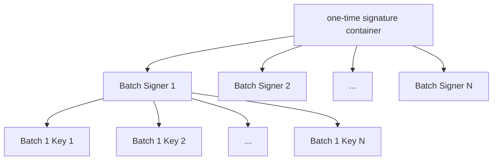

# Algorand Key Specification

## Overview

An algorand node interacts with three types of cryptographic keys:

- _root keys_, a key pair (public and private) used to control the access to funds and sign transactions for a particular account.
  These key pairs are also known as spending keys.

- _voting keys_ (aka. _participation keys_) a set of keys used for consensus authentication, i.e. identify an
  account inside the [ABFT protocol](abft.md). Algorand uses a hierarchical (two\-level) signature scheme that
  ensures forward security,
  which will be detailed in the next section.

- _VRF selection keys_, keys used for proving membership of selection. See the [Algorand Cryptography Specification](crypto.md#verifiable-random-function).

An agreement vote message (see [Network Overview](network-overview.md) for a detailed description of such messages) is valid only when it contains a proper VRF proof $\pi$ and
is signed with the correct voting key.

## Root Keys

Root keys are used to identify ownership of an account. An algorand node only interacts with
the public key of a root key. The public key of a root key is also used as the account
address. Root keys are used to sign transaction messages as well as delegating the
voting authentication using _voting keys_. A link between a _root key_ and a _voting key_ is established with the submittal of a `keyreg` transaction (see here in the [Algorand Ledger Specification](ledger.md#transactions)).\
In the event that a specific account was rekeyed, it would use the rekeyed key in lieu of the root key. See the [Algorand Ledger Specification](ledger.md#transactions) for more details on rekeying transactions.

## Voting/Participation Keys

A $player$ or user (as defined in the [Algorand Byzantine Fault Tolerance Protocol Specification](abft.md)) is an actor who will take part in the Algorand consensus. In this section we delve into the key infrastructure of an active $player$.

For a $player$ to participate in consensus, it needs to have an account (that is, a set of _root_ or _spending keys_ as defined [above](#root-keys)), and a _participation key_ associated with it.\
A key registration (`keyreg`) transaction is issued by a user in order to signal their intent on participating in consensus. For the full anatomy of a `keyreg` transaction see the [Algorand Ledger Specification](ledger.md#key-registration-transaction-1).

Once a key registration has been commited, and after a period of balance lookback ($\delta_b$, as defined in the [ABFT document](abft.md#parameters)) rounds has transcurred, the account is considered to be a protocol participant, and eligible to take part as a proposer or in the many subsequent rounds of voting that comprise the Algorand consensus mechanism.

$\newcommand \KeyDilution {\mathrm{KeyDilution}}$
$\newcommand \Batch {\mathrm{Batch}}$
$\newcommand \Offset {\mathrm{Offset}}$

### Algorand's Two\-level Ephemeral Signature Scheme for Authentication

For a protocol participant with their [voting keys](#votingparticipation-keys) registered in a given node, a collection of ephemeral sub-keys are created.

An ephemeral sub-key is a key pair that produces a one\-time signature
for messages. It must be deleted after use to ensure forward security.
Algorand's ephemeral sub-keys
use the [Ed25519 public-key signature system](https://ed25519.cr.yp.to/). See also the [Algorand Cryptography Specification](crypto.md).

Algorand uses a two\-level ephemeral signature scheme.
Instead of signing voting messages directly, Algorand accounts use their
registered _voting keys_ to sign an intermediate ephemeral sub-key.
This intermediate ephemeral sub-key signs a batch of leaf-level ephemeral
sub-keys. Hence, each intermediate ephemeral sub-key is associated with a
batch number ($\Batch$), and each leaf ephemeral sub-key is associate with both a
batch number (of its parent key) and an offset ($\Offset$, denotes its offset
within a batch). A voting message is signed hierarchically:
the voting keys root key $\rightarrow$ batch sub\-key $\rightarrow$ leaf sub-key
$\rightarrow$ [agreement voting message](abft.md#votes) (more details on this process in [One-time
Signature](#one-time-signature) below).

Each leaf-level ephemeral sub-key is used for voting on a single agreement round,
and will be deleted afterward. Once a batch of leaf-level ephemeral sub-keys runs out,
a new batch is generated. Algorand allows users to set the number of leaf-level ephemeral
sub-keys per batch, $\KeyDilution$. Currently the default $\KeyDilution$ value is $10,000$.\
[Link to reference implementation](https://github.com/algorand/go-algorand/blob/b6e5bcadf0ad3861d4805c51cbf3f695c38a93b7/config/consensus.go#L941).

An Algorand account can change its $\KeyDilution$ via
key registration transactions (see
the [Algorand Ledger Specification](https://github.com/algorandfoundation/specs/blob/master/dev/ledger.md)).

The following diagram shows the tree structure as described above for the voting signature scheme:

### One-time Signature

$\newcommand \SubKeyPK {\mathrm{SubKeyPK}}$
$\newcommand \OneTimeSignatureSubkeyOffsetID {\mathrm{OneTimeSignatureSubkeyOffsetID}}$
$\newcommand \OneTimeSignature {\mathrm{OneTimeSignature}}$
$\newcommand \Sig {\mathrm{Sig}}$
$\newcommand \PK {\mathrm{PK}}$
$\newcommand \PKSigOld {\mathrm{PKSigOld}}$
$\newcommand \PKTwo {\mathrm{PK2}}$
$\newcommand \PKOneSig {\mathrm{PK1Sig}}$
$\newcommand \PKTwoSig {\mathrm{PK2Sig}}$

$OneTimeSignatureSubkeyBatchID$ identifies an intermediate level ephemeral sub-key of
a batch. $OneTimeSignatureSubkeyBatchID$ is signed by the _voting key's_ _root key_. It has the following
fields:

- $SubKeyPK$, the public key of this sub-key.

- $Batch$, batch number of this sub-key.

$OneTimeSignatureSubkeyOffsetID$ identifies a leaf-level ephemeral sub-key. $OneTimeSignatureSubkeyOffsetID$
is signed with a batch sub-key. It has the following fields:

- $SubKeyPK$, the public key of this sub-key.

- $Batch$, batch number of this sub-key.

- $Offset$, offset of this sub-key in current batch.

Finally, $OneTimeSignature$ is a cryptographic signature used in voting
messages between Algorand users. It contains the following fields:

- $Sig$, a signature of message under $\PK$

- $PK$, the public key of the message signer, is part of a leaf-level ephemeral subkey.

- $PK2$, the public key of the current batch.

- $PK1Sig$, a signature of $OneTimeSignatureSubkeyOffsetID$ under $\PKTwo$.

- $PK2Sig$, a signature of $OneTimeSignatureSubkeyBatchID$ under
  the _voting keys_.

> [!NOTE]
> There is an extra field called $PKSigOld$ that is deprecated. It is still included in the $OneTimeSignature$ definition only for compability reasons.

[Link to reference implementation](https://github.com/algorand/go-algorand/blob/b6e5bcadf0ad3861d4805c51cbf3f695c38a93b7/crypto/onetimesig.go#L36).

## VRF Selection Keys

$\newcommand \unauthenticatedVote {\mathrm{unauthenticatedVote}}$
$\newcommand \UnauthenticatedCredential {\mathrm{UnauthenticatedCredential}}$
$\newcommand \Sender {\mathrm{Sender}}$
$\newcommand \Round {\mathrm{Round}}$
$\newcommand \Period {\mathrm{Period}}$
$\newcommand \Step {\mathrm{Step}}$
$\newcommand \Proposal {\mathrm{Proposal}}$
$\newcommand \VrfOut {\mathrm{VrfOut}}$
$\newcommand \Credential {\mathrm{Credential}}$
$\newcommand \Cred {\mathrm{Cred}}$
$\newcommand \Weight {\mathrm{Weight}}$
$\newcommand \DomainSeparationEnabled {\mathrm{DomainSeparationEnabled}}$
$\newcommand \Hashable {\mathrm{Hashable}}$
$\newcommand \Vote {\mathrm{Vote}}$

To check the validity of a voting message, its _VRF selection key_
needs to be verified. Algorand uses Verifiable Random Function (VRF) to
generate selection keys (more details in
[crypto specification](https://github.com/algorandfoundation/specs/blob/master/dev/crypto.md)).

More specifically, an unverified vote ($\unauthenticatedVote$) has the
following fields:

- _Raw Vote_ $\mathrm{R}$, an inner struct contains $Sender$, $Round$, $Period$,
  $Step$, and $Proposal$.

- _Unverified Credential_ $Cred$. $Cred$ contains
  a single field $Proof$, which is a VRF proof.

- _Signature_ $Sig$, one-time signature of the vote.

[Link to reference implementation](https://github.com/algorand/go-algorand/blob/b6e5bcadf0ad3861d4805c51cbf3f695c38a93b7/agreement/vote.go#L42).

Once receiving an unverified vote ($unauthenticatedVote$) from the network,
an Algorand node verifies its VRF selection key by checking the validity
of the VRF Proof (in $\Cred$), the committee membership parameters that
it is conditioned on, and the voter's voting stake.
If verified, the result of this verification is
wrapped in a $\Credential$ struct, containing the following fields:

- $UnauthenticatedCredential$, the unverified
  selection key from the VRF proof.

- $Weight$, the weight of the vote.

- $Vrf_{out}$, the cached output of VRF verification (see the [Algorand Cryptographic Primitive Specification](crypto.md#verifiable-random-function)).

- $DomainSeparationEnabled$, Domain separation
  flag, now must be true by the protocol.

- $Hashable$, the original credential.

And this verified credential is wrapped in a $Vote$ struct with _Raw Vote_
($\mathrm{R}$), _Verified Credential_ ($Credential$), and _Signature_ ($Sig$).

[Link to reference implementation](https://github.com/algorand/go-algorand/blob/b6e5bcadf0ad3861d4805c51cbf3f695c38a93b7/agreement/vote.go#L50).

## Algorand State Proof Keys

### Algorand's Committable Ephemeral Keys Scheme - Merkle Signature Scheme

Algorand achieves [forward security](https://en.wikipedia.org/wiki/Forward_secrecy) using a Merkle Signature Scheme. This scheme consists of using a different ephemeral key for each round in which it will be used. The scheme uses vector commitment to generate commitment to those keys.
The private key must be deleted after the round passes in order the completely achieve forward secrecy.
This is analogous to the scheme discussed in a [previous section](#algorands-two-level-ephemeral-signature-scheme-for-authentication).

The Merkle scheme uses the Falcon scheme (see the [Algorand Cryptographic Specification](crypto.md#falcon)) as the underlying digital signature algorithm.

In order to bound verification paths on the tree, the tree's depth is bound to 16. Hence, the maximum number of keys which can be created is at most $2^{16}$.

[Link to reference implementation](https://github.com/algorand/go-algorand/blob/b6e5bcadf0ad3861d4805c51cbf3f695c38a93b7/crypto/merklesignature/merkleSignatureScheme.go).

#### Public Commitment

The scheme generates multiple keys for the entire participation period. Given $FirstValidRound$, $LastValidRound$ and a $keyLifeTime$, a key is generated for each round $r$ that holds:

$$
 FirstValidRound \leq r \leq LastValidRound \land \\ r \mod keyLifeTime = 0
$$

Currently, $keyLifeTime$ is set to 256.

After generating the public keys, the scheme creates a vector commitment using the keys as leaves.
Leaf hashing is done in the following manner:

$$
leaf_{i} = hash("KP" || schemeId || r || P_{k_{i}}), \text{for each corresponding round.}
$$

where:

- $schemeId$ is a 16-bit, little-endian constant integer with value of 0

- Round $r$ is a 64-bit, little-endian integer representing the start round for which the key $P_{k_{i}}$ is valid.
  The key would be valid for all rounds in $[r,...,r + keyLifeTime - 1]$

- $P_{k_{i}}$ is a 14,344-bit string representing the Falcon ephemeral public key.

- hash: is the SUBSET-SUM hash function as defined in the [Algorand Cryptographic Primitives Specification](Crypto.md).

#### Signatures

A Signature in this scheme consists of the following elements:

- $Signature$ is a signature generated by the [Falcon scheme](crypto.md#falcon).

- $VerifyingKey$ is a Falcon ephemeral public key.

- $VectorIndex$ is an index of the ephemeral public key leaf in the vector commitment.

- $Proof$ is an array of size $n$ ($n \leq 16$ since the number of keys is bounded) which contains hash results ($digest_{0},...,digest_{n}$). Proof is used as a Merkle verification path on the ephemeral public key.
  When the committer gives an n-depth authentication path for index $VectorIndex$, the verifier must write $VectorIndex$ as an n-bit number and read it from MSB to LSB to determine the leaf-to-root path.

When a signature is to be hashed, it must be serialized into a binary string according to the following format:

$$
SignatureBitString = (schemeId || \\ Signature || VerifyingKey || VectorIndex || Proof)
$$

where:

- $schemeId$ is a 16-bit, little-endian constant integer with value of 0.

- $Signature$ is a 12,304-bit string representing a Falcon signature in a CT format.

- $VerifyingKey$ is a 14,344-bit string.

- $VectorIndex$ is a 64-bit, little-endian integer

- $Proof$ is constructed in the following way:
  $$
  Proof = (n || digest_{0} || ... || digest_{15}),\ if \ \ n = 16,\\
  $$

$$
Proof = (n || zeroDigest_{0} || ... || \\zeroDigest_{d-1} || digest_{0} || ... || digest_{n-1}), \ otherwise
$$

where:

- $n$ is a 8-bit string.

- $digest_{i}$ is a 512-bit string representing a sumhash result.

- $zeroDigest$ is a constant 512-bit string with the value 0.

- $d$ = $16 - n$

#### Verifying Signatures

A signature $s$ for a message $m$ at round $r$ is valid under the public commitment $pk$ and $keyLifeTime$ if:

- The falcon signature $s.Signature$ is valid for the message $m$ under the public key $s.VerifyingKey$

- The proof $s.Proof$ is a valid vector commitment proof for the entry $leaf$ at index $s.VectorIndex$ with respect to
  the vector commitment root $pk$ where $leaf$ and $Round$ are such that:

  $$
  leaf := "KP" || schemeId || Round || s.VerifyingKey, \\
  $$

  $$
    Round :=  r - ( r \mod keyLifeTime).
  $$
